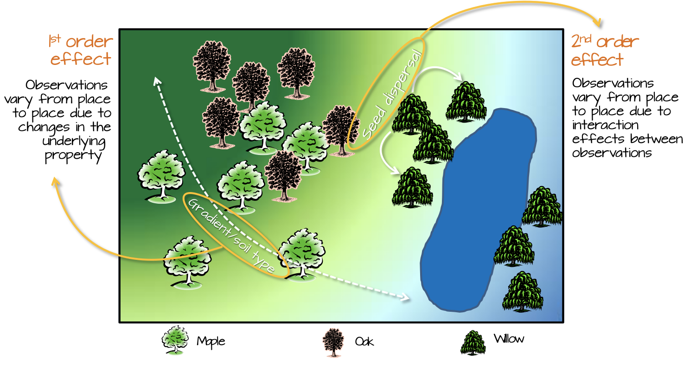

```{r setup, include=FALSE}
knitr::opts_chunk$set(fig.path="figures/01_point_patterns/")
```

Exploration of spatial point pattern analyses. Can we use them for this project?

Useful resources:

-   [Intro to GIS and Spatial Analysis](https://mgimond.github.io/Spatial/index.html)

-   [Introduction to point pattern analysis for ecologists](https://rpubs.com/hughes/295880)

-   [Analysing spatial point patterns in R](https://darrylmcleod.com/wp-content/uploads/2016/06/Analysing-spatial-point-patterns-in-R.pdf)

-   [A method for analysing replicated point patterns in ecology](https://onlinelibrary.wiley.com/doi/abs/10.1111/2041-210X.12335)

-   [A comparison of methods for the statistical analysis of spatial point patterns in plant ecology](http://link.springer.com/10.1007/s11258-006-9133-4)

-   [Spatial Dynamics in Model Plant Communities: What Do We Really Know?](http://doi.org/10.1086/376575)

-   [Statistical challenges in spatial analysis of plant ecology data](https://doi.org/10.1016/j.spasta.2020.100418)

## The options are:

### Average nearest neighbour
Which gives you a measure of how clustered points are but it's pretty simple

### K and L functions (Ripley's K)
For each point it draws circles around the point at varying radii and then counts the number of points inside each circle. Then it takes the average number of points in each circle and divides it by the overall density (total number of points in the study area). K is then plotted and compared to what it would look like if the pattern was random. The L function is the same as K but made linear for easier plotting.

This measure is no good for us because it gives you one number - we need a measure of density/connectivity for each trap location. I think you can build a model that looks at how the pattern of one tree species is dependent on the pattern of another tree species - there's an example in one of the above resources that looks at how the pattern of ant's nests is related to the pattern of a plant species they eat. Which is cool, but not what we want.

### Summed basal area
I think for each trap you would sum the DBH of every tree within a 100m radius. [See wikipedia](https://en.wikipedia.org/wiki/Basal_area). Summed basal area is a common way of describing stand density - a measure of tree biomass in an area. This method wouldn't take into account the distance between each tree and trap - within a radius of e.g. 100 m, the trees would be weighted according to how big they are but not how close they are.

### Kernel density estimations
These are actually *not* distance based analyses. They compute a localized density for subsets of the study area and the sub-regions overlap one another providing a moving sub-region window. This moving window is defined by a kernel. A kernel not only defines the shape and size of the window, but it can also weight the points following a kernel function. Gaussian distribution functions are often used - weight is assigned to points that are inversely proportional to their distances to the kernel window centre.

Then, you can model the relationship between the distribution of points and some underlying covariate (like elevation or something) using a poisson point process model (similar to a logged linear regression model -logistic regression).

So this isn't appropriate for us but I made a 'descriptive' density plot of trees using the spatstat package because it looks cool. Colours are density and circles are trees with size = DBH. I did look into extracting the density value at each co-ordinate where there is a trap thinking that I could do a lm(proportion_abscised ~ density) but I think this is probably wrong? 

```{r, warning=FALSE, message=FALSE}
library("tidyverse"); theme_set(theme_bw(base_size=10))
library("spatstat")
library("knitr")

load(here::here("data", "clean", "treeData.RData"))
```

```{r density-maps, warning=FALSE}
# take a subset of one year and one species to play with
dplyr::filter(bci, 
		(SP4 == "CORB" & year == 2015)) -> CORB_2015

# create point pattern dataset
CORB_2015_ppp <- ppp(CORB_2015[,"gx"],CORB_2015[,"gy"], owin(c(0,1000),c(0,500)), marks = CORB_2015$dbh)
unitname(CORB_2015_ppp) <- c("meter","meter")

# plot point pattern data
plot(CORB_2015_ppp, maxsize=25)

# get tree density
CORB_2015_density <- density(CORB_2015_ppp, weights = CORB_2015_ppp$marks) 

# coloured by density
plot(CORB_2015_density, main="Cordia bicolor, 2015", add=FALSE, las=1,legend=FALSE)
plot.ppp(CORB_2015_ppp, add=TRUE, maxsize=25, cols="white")

# contour lines for density
plot.ppp(CORB_2015_ppp, main="Cordia bicolor, 2015", add=FALSE, maxsize=25, legend=TRUE)
contour(CORB_2015_density, add=TRUE)

```

After doing much reading and messing around with spatial point patterns I think that I can't actually use them for the question I want to answer.

I want a distance based analysis as the interest lies in how the points are distributed relative to one another (a second-order property of the point pattern) as opposed to how the points are distributed relative to the study extent (the overall pattern in space, a first-order or density based analysis).

<!-- -->

Image is from [here](https://mgimond.github.io/Spatial/chp11-0.html#first-and-second-order-effects)
