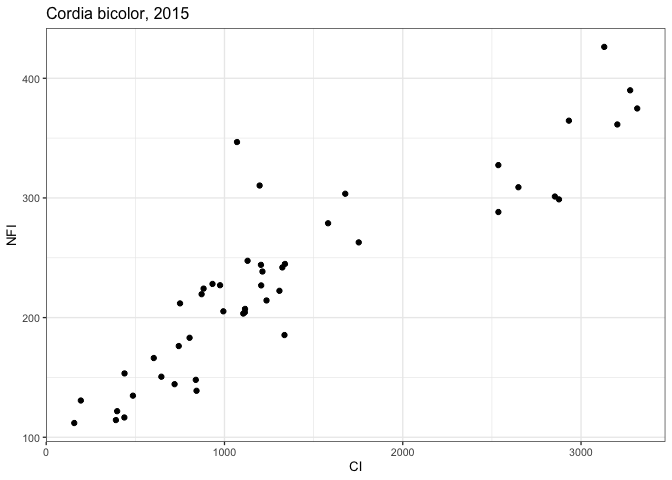
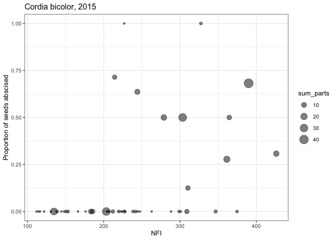
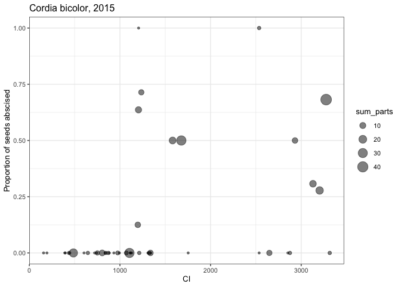

Connectivity
================
Eleanor Jackson
06 May, 2021

We are going to use “connectivity” as a measure of conspecific density
at each trap location. I’m going to try two different measures of
connectivity, **Hanski’s Connectivity Index (CI)** [(Hanski
1994)](https://www.jstor.org/stable/5591) and the **Conspecific
neighbourhood fecundity index (NFI)** [(Jones & Comita
2008)](https://royalsocietypublishing.org/doi/10.1098/rspb.2008.0894#d3e405).

They differ in that Hanski’s CI includes an exponential function. CI
also needs the average dispersal distance of our pre-dispersal seed
predators to scale distances, which I’m just going to take as 50m for
now.

I had to alter these equations a little. NFI uses the yearly mean total
fruit set per tree to weight individuals - we don’t have this, so I just
used DBH, which assumes that larger individuals produce more fruit [(see
here)](https://www.jstor.org/stable/2389015).

**Hanski’s Connectivity Index**  

*C**I* = ∑*e**x**p*(− *α* *d**i**s**t*<sub>*j**i*</sub>)*A*<sub>*j*</sub>

**Conspecific neighbourhood fecundity index**  

$$NFI = \\sum \\frac {A\_j}{dist\_{ij}}$$

*j* = conspecific tree within a 100 m radius of the trap  
*dist* = distance between trap i and tree j  
*α* = 1/ avg. dispersal ability  
*A* = DBH of tree j  

Note that [LaTeX math won’t render in
github](https://github.com/rstudio/rmarkdown/issues/806)

``` r
library("tidyverse"); theme_set(theme_bw(base_size=10))
library("knitr")
library("here")
library("rdist")
library("parallel")

load(here::here("data", "clean", "trapData.RData"))
load(here::here("data", "clean", "treeData.RData"))
trapDat$year <- as.character(trapDat$year)
```

## Calculate euclidean distances

We will create a pairwise matrix with the rdist package to calculate the
distance between each tree/trap combo.

``` r
calculate_dist <- function (species, yr) {
    # subset tree data
    bd <- dplyr::filter(bci, (bci[,"SP4"]==species) & (bci[,"year"]==yr))

    # subset trap data
    td <- dplyr::filter(trapDat, (trapDat[,"SP4"]==species) & 
        (trapDat[,"year"]==yr) )

    # create distance matrix using x and y co-ordinates
    dists <- cdist(bd[,c("gx", "gy")], td[,c("X", "Y")], metric="euclidean")
    dists.df <- as.data.frame(dists)

    # label col names with trap IDs
    colnames(dists.df) <- unlist(td$trap)

    # bind with the bci data
    cbind(bd, dists.df)
}

#for now just apply function to one year and one species
bci_dists <- calculate_dist("CORB", "2015")
```

## Conspecific neighbourhood fecundity index

Lets start by calculating NFI.

``` r
# function to calculate NFI
calculate_NFI <- function (trap) {
  bci_dists %>%
    group_by(treeID, year) %>% 
    mutate(a = dbh / eval(parse(text=trap))) %>% # divide dbh by dist
    ungroup() %>%
    dplyr::select(year, SP4, trap, a) %>%
    group_by(year, SP4) %>%
    summarise(trap = paste(trap), NFI = sum(a), .groups = "drop") # sum over all trees to = 1 value per trap
}

# create list of trap IDs to pass through the function
trap.list <- select(bci_dists,contains("trap_")) %>% colnames()

# apply function to each trap and parallelize
NFIdat <- mclapply(trap.list, calculate_NFI, mc.cores = 4)

# bind output into one dataframe
NFIdat_b <- bind_rows(NFIdat)

head(NFIdat_b) #take a look at NFI values
```

    ## # A tibble: 6 x 4
    ##   year  SP4   trap       NFI
    ##   <chr> <chr> <chr>    <dbl>
    ## 1 2015  CORB  trap_134  244.
    ## 2 2015  CORB  trap_136  203.
    ## 3 2015  CORB  trap_130  222.
    ## 4 2015  CORB  trap_131  204.
    ## 5 2015  CORB  trap_132  227.
    ## 6 2015  CORB  trap_302  212.

``` r
# merge with trap data
trapConnect <- left_join(NFIdat_b, trapDat,  
    by = c("trap", "year", "SP4"))
```

## Hanski’s Connectivity index

Now on to CI using the same format.

``` r
# function to calculate CI
calculate_CI <- function (trap) {
    bci_dists %>%
    group_by(treeID, year) %>% 
    mutate(a = dbh * exp( (-0.02) * eval(parse(text=trap)) ) ) %>% 
    ungroup() %>%
    dplyr::select(year, SP4, trap, a) %>%
    group_by(year, SP4) %>%
    summarise(trap = paste(trap), CI = sum(a), .groups = "drop")
}

# apply function to each trap and parallelize
CIdat <- mclapply(trap.list, calculate_CI, mc.cores = 4)

# bind output into one dataframe
CIdat_b <- bind_rows(CIdat)

head(CIdat_b) #take a look at CI values
```

    ## # A tibble: 6 x 4
    ##   year  SP4   trap        CI
    ##   <chr> <chr> <chr>    <dbl>
    ## 1 2015  CORB  trap_134 1205.
    ## 2 2015  CORB  trap_136 1105.
    ## 3 2015  CORB  trap_130 1308.
    ## 4 2015  CORB  trap_131 1114.
    ## 5 2015  CORB  trap_132 1206.
    ## 6 2015  CORB  trap_302  751.

## Lets see if NFI and CI correlate

``` r
# merge together into one big dataset
trapConnect <- left_join(trapConnect, CIdat_b, by = c("trap", "year", "SP4"))

ggplot(trapConnect) +
    geom_point(aes(x = CI, y = NFI)) +
  ggtitle("Cordia bicolor, 2015")
```

<!-- -->

They do, but less so towards larger values which makes sense when you
look at the equations. Interesting wedge shape going on. Let’s see what
the connectivity looks like when plotted against proportion\_abscised.
I’m going to scale the size of the points with the sum of parts found in
the trap.

``` r
ggplot() +
  geom_point(data = subset(trapConnect, SP4 == "CORB"), 
             aes(x = NFI, y = proportion_abscised, size = sum_parts), alpha = 0.5) + 
  ylab("Proportion of seeds abscised") +
  ggtitle("Cordia bicolor, 2015")
```

<!-- -->

``` r
ggplot() +
  geom_point(data = subset(trapConnect, SP4 == "CORB"), 
             aes(x = CI, y = proportion_abscised, size = sum_parts), alpha = 0.5) + 
  ylab("Proportion of seeds abscised") +
  ggtitle("Cordia bicolor, 2015")
```

<!-- -->

Lots of zeros!
