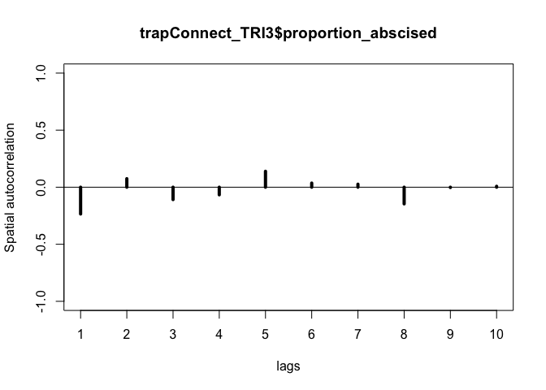
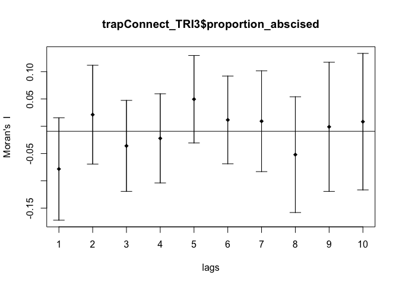
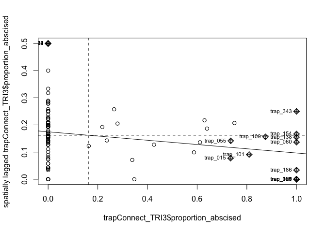
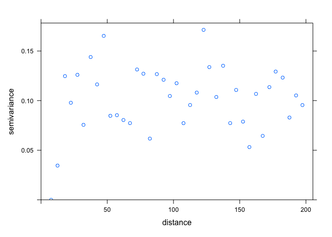
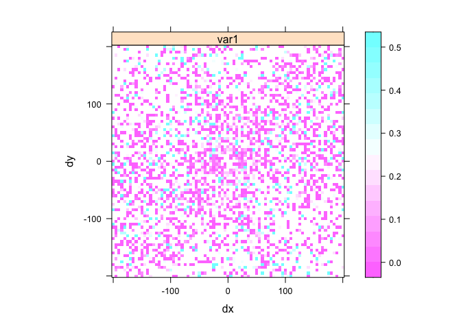

Testing for spatial autocorrelation
================
Eleanor Jackson
06 May, 2021

This is a quick investigation into spatial autocorrelation - can we
detect it in our data? What methods are generally used for detecting
spatial autocorrelation?

``` r
library("tidyverse"); theme_set(theme_bw(base_size=10))
library("knitr")
library("spdep")
library("sf")
library("gstat")
library("here")

load(here::here("data", "clean", "trapConnect.RData"))

# take a subset of one year and one species to play with
# turn X and Y coordinates into a geometry
dplyr::filter(trapConnect, 
        (SP4 == "TRI3" & year == 2015)) %>%
    sf::st_as_sf(coords = c("X", "Y")) -> trapConnect_TRI3
```

## Correlograms

A correlogram is probably the simplest way to look at spatial
autocorrelation. The plot shows the correlation coefficient for the
series lagged (in distance) by one delay at a time. e.g. at lag one
you’re looking at the correlation between a point and it’s nearest
neighbour. At lag two you’re looking at the correlation between a point
and it’s second nearest neighbour.

Values close to 1 indicate clustering while values close to -1 indicate
dispersion. A random arrangement would give a value that is close to 0.

``` r
# detect nearest neighbours within a 100 m radius
nn  <-  dnearneigh(trapConnect_TRI3, 0, 100, row.names = trapConnect_TRI3$trap) 

plot(
    spdep::sp.correlogram(neighbours = nn, var = trapConnect_TRI3$proportion_abscised, 
        order = 10, method = "corr", zero.policy = TRUE, style="W")
)
```

<!-- -->

## Moran’s I

We can look at the correlogram in combination with Moran’s I, which is a
global indicator of spatial autocorrelation for the dataset. A Moran’s I
of zero indicates no spatial correlation, -1 indicates negative spatial
autocorrelation and +1 indicates positive spatial autocorrelation.

``` r
plot(
    spdep::sp.correlogram(neighbours = nn, var = trapConnect_TRI3$proportion_abscised, 
        order = 10, method = "I", zero.policy = TRUE, style="W")
)
```

<!-- -->

Here, Moran’s I is close to zero, and there is no pattern in the
autocorrelations (i.e. no consistent upward or downward pattern as you
travel across the x-axis).

You can test for significance of Moran’s I using Monte Carlo simulation.
The function will return the distribution of Moran’s I values we could
expect to get under the null hypothesis that proportion\_abscised is
randomly distributed across the traps. We then compare the observed
Moran’s I value to this distribution.

``` r
# add spatial weights
lw <- spdep::nb2listw(nn, style="W", zero.policy = TRUE) 

# permutation test for Moran's I
MI  <-  spdep::moran.mc(trapConnect_TRI3$proportion_abscised, lw, nsim=599, zero.policy = TRUE) 
MI
```

    ## 
    ##  Monte-Carlo simulation of Moran I
    ## 
    ## data:  trapConnect_TRI3$proportion_abscised 
    ## weights: lw  
    ## number of simulations + 1: 600 
    ## 
    ## statistic = -0.078301, observed rank = 20, p-value = 0.9667
    ## alternative hypothesis: greater

``` r
plot(MI) 
```

<!-- -->

In the plot, the observed Moran’s I (vertical line) is lower than
predicted by the simulated distribution but still relatively close to
zero. We also have a fairly large p-value, this suggests there is no
evidence of spatial autocorrelation.

We can also do a Moran scatterplot.

``` r
spdep::moran.plot(trapConnect_TRI3$proportion_abscised, lw)
```

<!-- -->

This shows proportion\_abscised against its spatially lagged values.
There’s a line showing the linear relationship between the data and the
lag and the dashed vertical lines mark Moran’s I. Traps which have a
strong effect on the linear trend have been labelled.

## Semivariogram

A semivariogram is another kind of graphical representation of spatial
autocorrelation. Here, the x axis represents the distance between traps
and each point represents a pair of observations. The distance at which
the semivariogram stops increasing and flattens out is the range. Traps
which are closer together than this distance are spatially
autocorrelated.

``` r
plot(
    gstat::variogram(proportion_abscised ~ 1, data = trapConnect_TRI3, 
        width = 5, cutoff = 200) 
)
```

<!-- -->

Looking at this, I’d say the range was \~15 meters. But the data doesn’t
look like it shows much autocorrelation - the y axis is quite narrow.

You can also visualise it as a map, I think the colour scale represents
proportion\_abscised.

``` r
plot(
    gstat::variogram(proportion_abscised ~ 1, data = trapConnect_TRI3, 
        map = TRUE, width = 5, cutoff = 200)
)
```

<!-- -->

## Apply to more species

So how do I get an idea of spatial autocorrelation for the whole
dataset? All the work I did above was to do with a single species in a
single year. Let’s write some functions.

``` r
# I have to rewrite the variogram function because the data isn't the first argument
my_variogram <- function(data) {
    gstat::variogram(data = data, proportion_abscised ~ 1, width=5, cutoff = 100)
}

make_variogram <- function(data, species) {
    dplyr::filter(data, SP4 == species) %>%
    sf::st_as_sf(coords = c("X", "Y")) -> df_sf
    split(x = df_sf, f = df_sf$year, drop = TRUE) -> dfs
    purrr::map(dfs, .f = my_variogram) -> vgrams
    dplyr::bind_rows(vgrams, .id = "year")
}

# create an indexed sp list of 4 sp
sp_list <- list("TRI3"= "TRI3", "JACC" ="JACC", "FARO"="FARO", "ALSB"="ALSB")

# run the function
map_dfr(.x = sp_list, .f = make_variogram, .id = "SP4", data = trapConnect) -> output

# try plotting
ggplot(output, aes(x = dist, y = gamma)) +
    geom_point() +
    facet_wrap("SP4", ncol = 2) +
    scale_x_continuous(minor_breaks= seq(0, 100, 5))
```

<!-- -->

``` r
# coloured by year
ggplot(output, aes(x = dist, y = gamma)) +
    geom_path(aes(colour = year))+
    facet_wrap("SP4", ncol=2) +
    scale_x_continuous(minor_breaks= seq(0, 100, 5))
```

<!-- -->

Looking at these plots, I think we can say that there isn’t any evidence
of spatial autocorrelation, or if there is, it is only in effect over
very small distances. There is no real increase and/or flattening out of
semivariance, but this isn’t a very nice way of displaying it. Is there
some simple value or plot I can make that we put in the supplementary?
This might not be practical or useful if we have to look at \~40 species
x 31 years.
