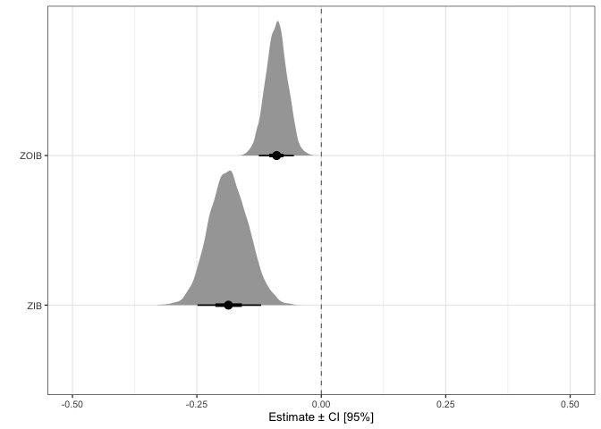
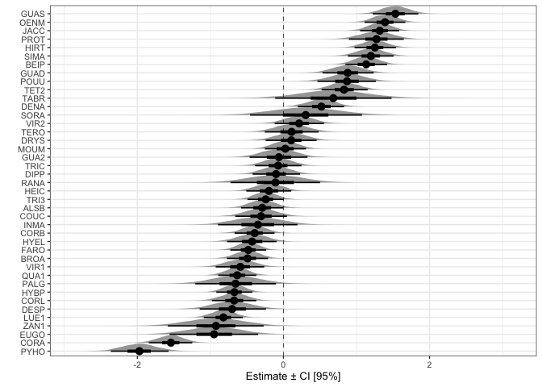
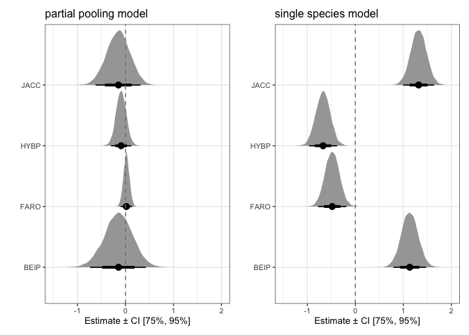
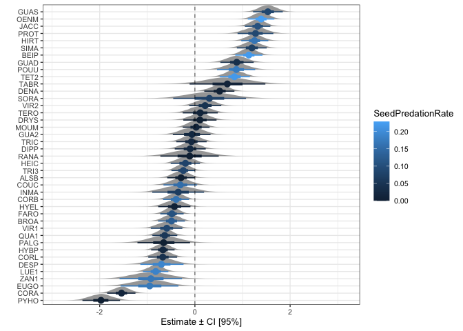
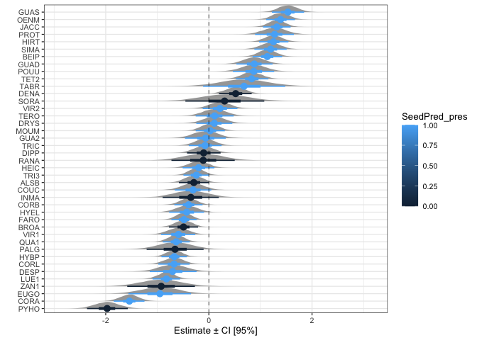

Explore results from partial pooling models
================
Eleanor Jackson
22 April, 2021

A partial pooling model has species as a random effect. I fit a ZOIB and
a ZIB

``` r
library("tidyverse"); theme_set(theme_bw(base_size=10))
library("broom.mixed")
library("brms")
library("ggdist")
library("loo")
library("patchwork")

load("../../output/models/full_mods/mods_full.RData")
part_pool_models <- all_models
```

Compare the results of both models

``` r
part_pool_models %>%
  mutate(posterior = map(fit, ~brms::posterior_samples(.x, pars = c("b_CI_pred.sc")))) %>%
  select(model, posterior) %>%
  unnest(posterior) %>% 
  pivot_longer(b_CI_pred.sc, names_to="mu" ) %>%
  ggplot(aes(x = as.factor(model), y = as.numeric(value))) +
  coord_flip() +
  labs(y = "Estimate ± CI [95%]", x = "") +
  geom_hline(yintercept = 0, linetype = 2, size = 0.25)  +
  scale_y_continuous(limits = c(-0.5, 0.5)) +
  ggdist::stat_halfeye(.width = c(.90, .5), normalize = "xy", limits = c(-3, 3))
```

<!-- -->

Both models estimate a negative correlation between connectivity and
proportion of seeds prematurely abscised.

We can compare which model is better with leave-one-out cross validation
(loo).

``` r
# can only run this on the cluster - don't have enough memory - crashes macbook
zib_loo <- add_criterion(part_pool_models$fit[[1]], "loo", moment_match = TRUE)
zoib_loo <- add_criterion(part_pool_models$fit[[2]], "loo", moment_match = TRUE)
comp <- loo_compare(zib_loo, zoib_loo)
print(comp)
loo(zib_loo)
loo(zoib_loo) # zoib looks better!
```

Let’s take a look at the species random effects.

``` r
part_pool_models %>%
  filter(model == "ZOIB") %>%
  mutate(posterior = map(fit, ~brms::posterior_samples(.x))) %>%
  select(model, posterior) %>%
  unnest(posterior) %>% 
  select(contains("r_SP4[")) %>% 
  pivot_longer(cols = contains("r_SP4["), names_to = "SP4") %>% 
  mutate(SP4 = as.character(SP4)) %>%
  mutate(SP4 = gsub("r_SP4[", "", SP4, fixed = TRUE)) %>%
  mutate(SP4 = gsub(",Intercept]", "", SP4, fixed = TRUE)) -> part_pool_plot_dat

ggplot(part_pool_plot_dat, aes(x = reorder(SP4, value), y = as.numeric(value))) +
  ggdist::stat_halfeye(.width = c(.90, .5), normalize = "xy", limits = c(-3, 3)) +
  coord_flip() +
  labs(y = "Estimate ± CI [95%]", x = "") +
  geom_hline(yintercept = 0, linetype = 2, size = 0.25)
```

<!-- -->

``` r
load("../../output/models/mods_4sp.RData")
single_sp_models <- all_models

single_sp_models %>%
  filter(model == "ZOIB") %>%
  mutate(posterior = map(fit, ~brms::posterior_samples(.x, pars = c("b_CI_pred.sc")))) %>%
  select(SP4, model, posterior) %>%
  unnest(posterior) %>% 
  pivot_longer(b_CI_pred.sc, names_to="mu" ) %>%
  ggplot(aes(y = SP4, x = value)) +
  stat_halfeye(.width=c(0.75, 0.95), normalize = "xy", limits = c(-3, 3)) +
  geom_vline(xintercept= 0, linetype=2, colour="grey50") +
  labs(x="Estimate ± CI [75%, 95%]", y="") +
  ggtitle("partial pooling model") +
  xlim(c(-1.5, 2)) -> p1

part_pool_plot_dat %>%
  filter(SP4 == "JACC" | SP4 == "HYBP" | SP4 == "FARO"| SP4 == "BEIP" ) %>%
  ggplot(aes(y = SP4, x = value)) +
  ggdist::stat_halfeye(.width=c(0.75, 0.95), normalize = "xy", limits = c(-3, 3)) +
  geom_vline(xintercept= 0, linetype=2, colour="grey50") +
  labs(x="Estimate ± CI [75%, 95%]", y="") +
  ggtitle("single species model") +
  xlim(c(-1.5, 2)) -> p2

p1 + p2
```

<!-- -->

Is there a pattern with pre-dispersal predator attack?

``` r
read.csv("../../../premature-fruit-drop/data/raw/TidyTrait.csv") %>% 
  rename(SP4 = Codigo) -> tidytraits

left_join(part_pool_plot_dat, tidytraits, by = "SP4") %>%
  ggplot(aes(x = reorder(SP4, value), y = as.numeric(value), colour = SeedPredationRate)) +
  ggdist::stat_halfeye(.width = c(.90, .5), normalize = "xy", limits = c(-3, 3)) +
  coord_flip() +
  labs(y = "Estimate ± CI [95%]", x = "") +
  geom_hline(yintercept = 0, linetype = 2, size = 0.25)
```

<!-- -->

``` r
left_join(part_pool_plot_dat, tidytraits, by = "SP4") %>%
  ggplot(aes(x = reorder(SP4, value), y = as.numeric(value), colour = SeedPred_pres)) +
  ggdist::stat_halfeye(.width = c(.90, .5), normalize = "xy", limits = c(-3, 3)) +
  coord_flip() +
  labs(y = "Estimate ± CI [95%]", x = "") +
  geom_hline(yintercept = 0, linetype = 2, size = 0.25) 
```

<!-- -->

Doesn’t look like it.

What about year random effects?

``` r
part_pool_models %>%
  filter(model == "ZOIB") %>%
  mutate(posterior = map(fit, ~brms::posterior_samples(.x))) %>%
  select(model, posterior) %>%
  unnest(posterior) %>% 
  select(contains("r_year[")) %>% 
  pivot_longer(cols = contains("r_year["), names_to = "year") %>% 
  mutate(year = as.character(year)) %>%
  mutate(year = gsub("r_year[", "", year, fixed = TRUE)) %>%
  mutate(year = gsub(",Intercept]", "", year, fixed = TRUE)) %>%
  ggplot(aes(x = year, y = value)) +
  ggdist::stat_halfeye(.width = c(.90, .5), normalize = "xy", limits = c(-3, 3)) +
  coord_flip() +
  labs(y = "Estimate ± CI [95%]", x = "") +
  geom_hline(yintercept = 0, linetype = 2, size = 0.25)
```

<!-- -->

Some interesting patterns.. I know that 2016 was an el Nino year. Could
look into rainfall for BCI.
