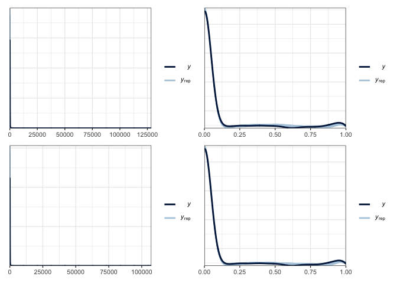
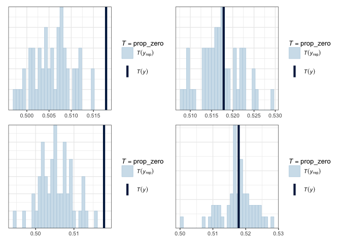
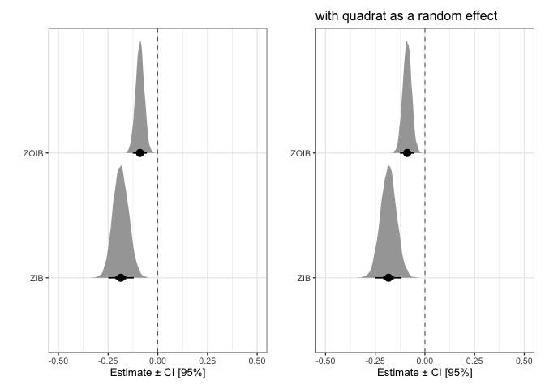
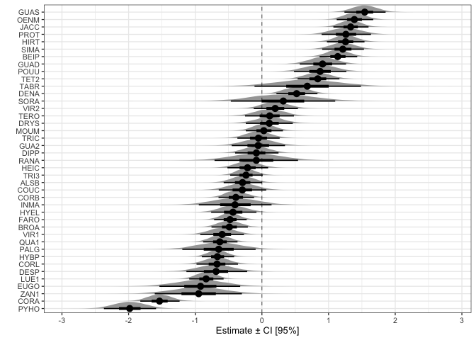
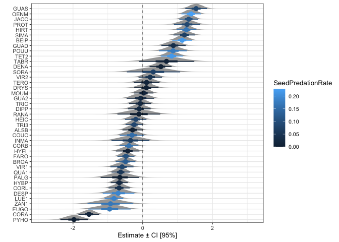
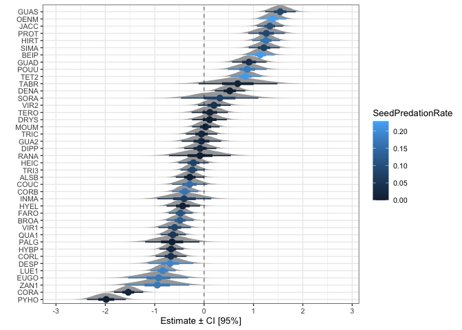
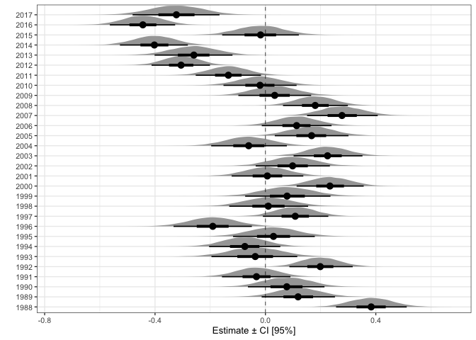
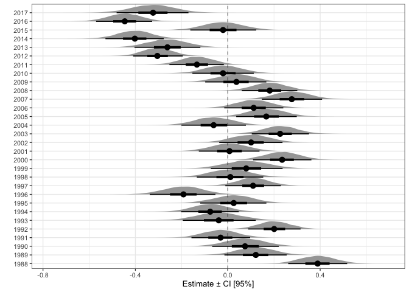

Explore results from partial pooling models
================
Eleanor Jackson
26 April, 2021

``` r
knitr::opts_chunk$set(fig.path="figures/05_partial_pooling_model_results/")
```

My partial pooling models have species as a random effect. My previous
models have been for a single species only. Here I will compare and look
at the output of, 4 partial pooling models: Zero Inflated Binomial (ZIB)
and Zero and One Inflated Beta Binomial (ZOIB) models, with and without
quadrat as a random effect.

``` r
library("tidyverse"); theme_set(theme_bw(base_size=10))
library("broom.mixed")
library("brms")
library("ggdist")
library("loo")
library("patchwork")

load("../../output/models/full_mods/mods_full.RData")
load("../../output/models/full_mods/part_pool_quad_models.RData") # same models as above but with quadrat as a random effect
```

## Posterior predictive checks

Compare our observed data to data predicted by the model. If our model
is a good fit, we should be able to use it to generate a dataset that
resembles the observed data.

``` r
pp_check(part_pool_models$fit[[1]], type = "dens_overlay", nsamples = 50) -> p1
pp_check(part_pool_models$fit[[2]], type = "dens_overlay", nsamples = 50) -> p2
pp_check(part_pool_quad_models$fit[[1]], type = "dens_overlay", nsamples = 50) -> p3
pp_check(part_pool_quad_models$fit[[2]], type = "dens_overlay", nsamples = 50) -> p4

(p1 + p2) / (p3 + p4)
```

<!-- -->

Here, y rep are samples from the posterior distribution and y is the
observed data. The binomial plots aren’t that informative. Let’s look at
how well the models predict the proportion of zeros.

``` r
prop_zero <- function(x) mean(x == 0)
pp_check(part_pool_models$fit[[1]], type = "stat", stat = "prop_zero", nsamples = 50) -> p5
pp_check(part_pool_models$fit[[2]], type = "stat", stat = "prop_zero", nsamples = 50) -> p6
pp_check(part_pool_quad_models$fit[[1]], type = "stat", stat = "prop_zero", nsamples = 50) -> p7
pp_check(part_pool_quad_models$fit[[2]], type = "stat", stat = "prop_zero", nsamples = 50) -> p8

(p5 + p6) / (p7 + p8)
```

    ## `stat_bin()` using `bins = 30`. Pick better value with `binwidth`.
    ## `stat_bin()` using `bins = 30`. Pick better value with `binwidth`.
    ## `stat_bin()` using `bins = 30`. Pick better value with `binwidth`.
    ## `stat_bin()` using `bins = 30`. Pick better value with `binwidth`.

<!-- -->

The ZIB models are predicting a much lower proportion of zeros than are
found in the data, whereas the ZOIB’s look bang-on. Not sure why the
ZIBs look so bad…

## Compare the predictive accuracy of the models using LOO-CV

Leave-one-out cross validation (LOO-CV) works by estimating the
predictive accuracy at each point, using data without that point. We
will estimate elpd\_loo, which is the LOO expected log pointwise
predictive density. The bigger the value, the better we are at
predicting the left out point. Pareto k estimates give an indication of
how ‘influential’ each point is. The higher the value of k, the more
influential the point. Values of k over 0.7 are not good - indicates
potential model misspecification.

``` r
comp <- loo_compare(part_pool_quad_models$fit[[1]], part_pool_quad_models$fit[[2]],
                    part_pool_models$fit[[1]], part_pool_models$fit[[2]])
```

    ## Warning: Not all models have the same y variable. ('yhash' attributes do not
    ## match)

``` r
print(comp, digits = 3)  # [[1]] are ZIB, [[2]] are ZOIB
```

    ##                                elpd_diff  se_diff   
    ## part_pool_quad_models$fit[[2]]      0.000      0.000
    ## part_pool_models$fit[[2]]          -5.618      3.546
    ## part_pool_quad_models$fit[[1]] -16735.250    194.229
    ## part_pool_models$fit[[1]]      -16747.662    194.244

``` r
plot(loo(part_pool_quad_models$fit[[1]]), main = "ZIB w quadrats")
```

<!-- -->

``` r
plot(loo(part_pool_quad_models$fit[[2]]), main = "ZOIB w quadrats")
```

<!-- -->

``` r
plot(loo(part_pool_models$fit[[1]]), main = "ZIB w/o quadrats")
```

<!-- -->

``` r
plot(loo(part_pool_models$fit[[2]]), main = "ZOIB w/o quadrats")
```

<!-- -->

Do the binomial models look weird because of the observation-level
random effects I added to account for overdispersion? Why are there 2
bands?

# Model Results

``` r
part_pool_models %>%
  mutate(posterior = map(fit, ~brms::posterior_samples(.x, pars = c("b_CI_pred.sc")))) %>%
  select(model, posterior) %>%
  unnest(posterior) %>% 
  pivot_longer(b_CI_pred.sc, names_to="mu" ) %>%
  ggplot(aes(x = as.factor(model), y = as.numeric(value))) +
  coord_flip() +
  labs(y = "Estimate ± CI [95%]", x = "") +
  geom_hline(yintercept = 0, linetype = 2, size = 0.25)  +
  scale_y_continuous(limits = c(-0.5, 0.5)) +
  ggdist::stat_halfeye(.width = c(.90, .5), normalize = "xy", limits = c(-3, 3)) -> p9

part_pool_quad_models %>%
  mutate(posterior = map(fit, ~brms::posterior_samples(.x, pars = c("b_CI_pred.sc")))) %>%
  select(model, posterior) %>%
  unnest(posterior) %>% 
  pivot_longer(b_CI_pred.sc, names_to="mu" ) %>%
  ggplot(aes(x = as.factor(model), y = as.numeric(value))) +
  coord_flip() +
  labs(y = "Estimate ± CI [95%]", x = "") +
  geom_hline(yintercept = 0, linetype = 2, size = 0.25)  +
  scale_y_continuous(limits = c(-0.5, 0.5)) +
  ggdist::stat_halfeye(.width = c(.90, .5), normalize = "xy", limits = c(-3, 3)) +
  ggtitle("with quadrat as a random effect") -> p10

p9 + p10
```

<!-- -->

All models estimate a negative correlation between connectivity and
proportion of seeds prematurely abscised - opposite of what we
predicted!

Let’s take a look at the species random effects.

``` r
part_pool_quad_models %>%
  filter(model == "ZOIB") %>%
  mutate(posterior = map(fit, ~brms::posterior_samples(.x))) %>%
  select(model, posterior) %>%
  unnest(posterior) %>% 
  select(contains("r_SP4[")) %>% 
  pivot_longer(cols = contains("r_SP4["), names_to = "SP4") %>% 
  mutate(SP4 = as.character(SP4)) %>%
  mutate(SP4 = gsub("r_SP4[", "", SP4, fixed = TRUE)) %>%
  mutate(SP4 = gsub(",Intercept]", "", SP4, fixed = TRUE)) -> part_pool_plot_dat

ggplot(part_pool_plot_dat, aes(x = reorder(SP4, value), y = as.numeric(value))) +
  ggdist::stat_halfeye(.width = c(.90, .5), normalize = "xy", limits = c(-3, 3)) +
  coord_flip() +
  labs(y = "Estimate ± CI [95%]", x = "") +
  geom_hline(yintercept = 0, linetype = 2, size = 0.25)
```

<!-- -->

Lots of variation, how do they compare to the single-species models?

``` r
load("../../output/models/mods_4sp.RData")
single_sp_models <- all_models

single_sp_models %>%
  filter(model == "ZOIB") %>%
  mutate(posterior = map(fit, ~brms::posterior_samples(.x, pars = c("b_CI_pred.sc")))) %>%
  select(SP4, model, posterior) %>%
  unnest(posterior) %>% 
  pivot_longer(b_CI_pred.sc, names_to="mu" ) %>%
  ggplot(aes(y = SP4, x = value)) +
  stat_halfeye(.width=c(0.75, 0.95), normalize = "xy", limits = c(-3, 3)) +
  geom_vline(xintercept= 0, linetype=2, colour="grey50") +
  labs(x="Estimate ± CI [75%, 95%]", y="") +
  ggtitle("partial pooling model") +
  xlim(c(-1.5, 2)) -> p11

part_pool_plot_dat %>%
  filter(SP4 == "JACC" | SP4 == "HYBP" | SP4 == "FARO"| SP4 == "BEIP" ) %>%
  ggplot(aes(y = SP4, x = value)) +
  ggdist::stat_halfeye(.width=c(0.75, 0.95), normalize = "xy", limits = c(-3, 3)) +
  geom_vline(xintercept= 0, linetype=2, colour="grey50") +
  labs(x="Estimate ± CI [75%, 95%]", y="") +
  ggtitle("single species models") +
  xlim(c(-1.5, 2)) -> p12

p11 + p12
```

<!-- -->

Quite different! I think we expect that they will be pulled toward the
group mean, but how much is too much?
[This](https://towardsdatascience.com/when-mixed-effects-hierarchical-models-fail-pooling-and-uncertainty-77e667823ae8)
is useful.

Is there a pattern with pre-dispersal predator attack?

``` r
read.csv("../../../premature-fruit-drop/data/raw/TidyTrait.csv") %>% 
  rename(SP4 = Codigo) -> tidytraits

left_join(part_pool_plot_dat, tidytraits, by = "SP4") %>%
  ggplot(aes(x = reorder(SP4, value), y = as.numeric(value), colour = SeedPredationRate)) +
  ggdist::stat_halfeye(.width = c(.90, .5), normalize = "xy", limits = c(-3, 3)) +
  coord_flip() +
  labs(y = "Estimate ± CI [95%]", x = "") +
  geom_hline(yintercept = 0, linetype = 2, size = 0.25)
```

<!-- -->

``` r
left_join(part_pool_plot_dat, tidytraits, by = "SP4") %>%
  ggplot(aes(x = reorder(SP4, value), y = as.numeric(value), colour = SeedPred_pres)) +
  ggdist::stat_halfeye(.width = c(.90, .5), normalize = "xy", limits = c(-3, 3)) +
  coord_flip() +
  labs(y = "Estimate ± CI [95%]", x = "") +
  geom_hline(yintercept = 0, linetype = 2, size = 0.25) 
```

<!-- -->

Doesn’t look like it.

What about year random effects?

``` r
part_pool_quad_models %>%
  filter(model == "ZOIB") %>%
  mutate(posterior = map(fit, ~brms::posterior_samples(.x))) %>%
  select(model, posterior) %>%
  unnest(posterior) %>% 
  select(contains("r_year[")) %>% 
  pivot_longer(cols = contains("r_year["), names_to = "year") %>% 
  mutate(year = as.character(year)) %>%
  mutate(year = gsub("r_year[", "", year, fixed = TRUE)) %>%
  mutate(year = gsub(",Intercept]", "", year, fixed = TRUE)) %>%
  ggplot(aes(x = year, y = value)) +
  ggdist::stat_halfeye(.width = c(.90, .5), normalize = "xy", limits = c(-3, 3)) +
  coord_flip() +
  labs(y = "Estimate ± CI [95%]", x = "") +
  geom_hline(yintercept = 0, linetype = 2, size = 0.25)
```

<!-- -->

Some interesting patterns.. I know that 2015/16 was a big el Niño year.
Could look into rainfall for BCI.
