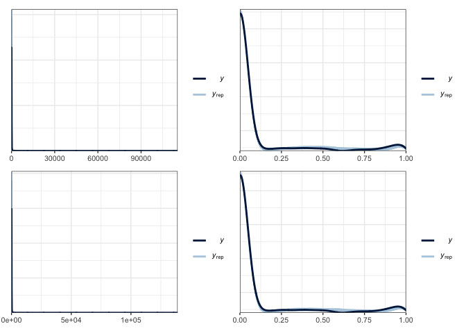
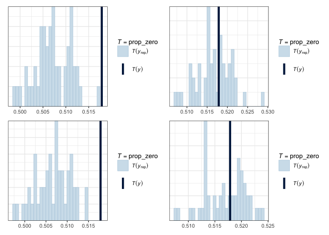
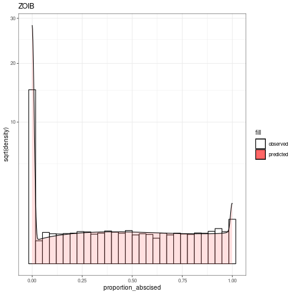
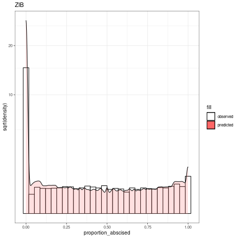
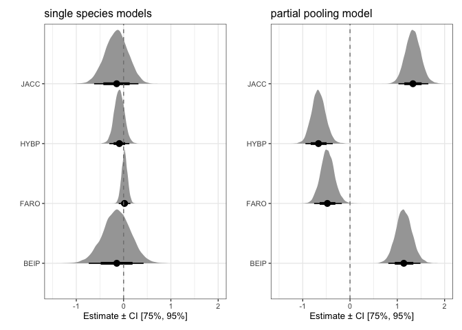
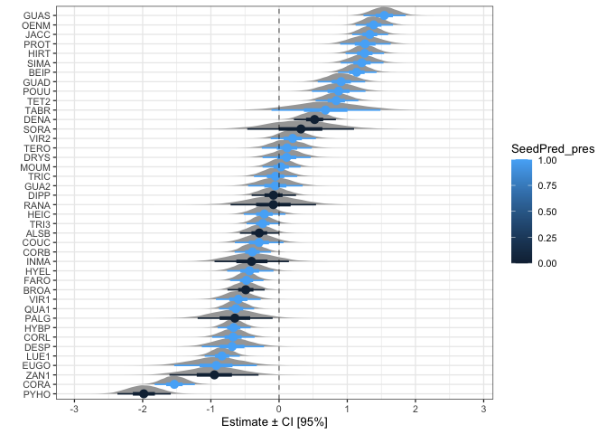
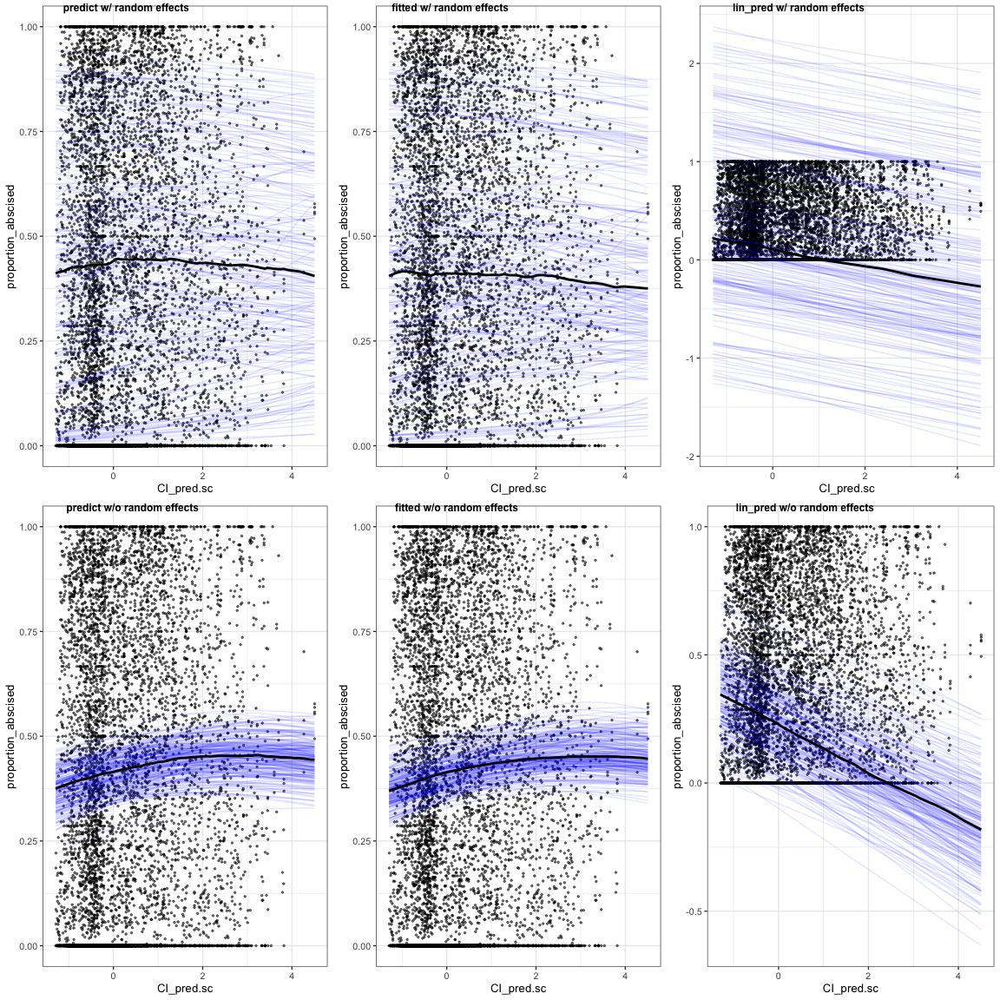

Explore results from partial pooling models
================
Eleanor Jackson
29 April, 2021

My partial pooling models have species as a random effect. My previous
models have been for a single species only. Here I will compare, and
look at the output of, 4 partial pooling models: Zero Inflated Binomial
(ZIB) and Zero and One Inflated Beta Binomial (ZOIB) models, with and
without quadrat as a random effect.

Pooling works a bit like this:

``` r
complete_pooling <- lm(y ~ 1)
      no_pooling <- lm(y ~ group)
 partial_pooling <- lmer(y ~ 1 + (1|group))
```

``` r
library("tidyverse"); theme_set(theme_bw(base_size=10))
library("broom.mixed")
library("brms")
library("ggdist")
library("loo")
library("patchwork")
options(mc.cores = 4)

load("../../output/models/full_mods/mods_full.RData")
part_pool_models
```

    ## # A tibble: 2 x 3
    ##   SP4    model fit      
    ##   <chr>  <chr> <list>   
    ## 1 all_sp ZIB   <brmsfit>
    ## 2 all_sp ZOIB  <brmsfit>

``` r
load("../../output/models/full_mods/part_pool_quad_models.RData")
part_pool_quad_models
```

    ## # A tibble: 2 x 2
    ##   model fit      
    ##   <chr> <list>   
    ## 1 ZIB   <brmsfit>
    ## 2 ZOIB  <brmsfit>

## Posterior predictive checks (PPC)

Compare our observed data to data predicted by the model. If our model
is a good fit, we should be able to use it to generate a dataset that
resembles the observed data.

``` r
pp_check(part_pool_models$fit[[1]], type = "dens_overlay", nsamples = 50) -> p1
pp_check(part_pool_models$fit[[2]], type = "dens_overlay", nsamples = 50) -> p2
pp_check(part_pool_quad_models$fit[[1]], type = "dens_overlay", nsamples = 50) -> p3
pp_check(part_pool_quad_models$fit[[2]], type = "dens_overlay", nsamples = 50) -> p4

(p1 + p2) / (p3 + p4)
```

<!-- -->

Here, y rep are samples from the posterior distribution and y is the
observed data. The binomial plots aren’t that informative. Let’s look at
how well the models predict the proportion of zeros.

``` r
prop_zero <- function(x) mean(x == 0)
pp_check(part_pool_models$fit[[1]], type = "stat", stat = "prop_zero", nsamples = 50) -> p5
pp_check(part_pool_models$fit[[2]], type = "stat", stat = "prop_zero", nsamples = 50) -> p6
pp_check(part_pool_quad_models$fit[[1]], type = "stat", stat = "prop_zero", nsamples = 50) -> p7
pp_check(part_pool_quad_models$fit[[2]], type = "stat", stat = "prop_zero", nsamples = 50) -> p8

(p5 + p6) / (p7 + p8)
```

    ## `stat_bin()` using `bins = 30`. Pick better value with `binwidth`.
    ## `stat_bin()` using `bins = 30`. Pick better value with `binwidth`.
    ## `stat_bin()` using `bins = 30`. Pick better value with `binwidth`.
    ## `stat_bin()` using `bins = 30`. Pick better value with `binwidth`.

<!-- -->

The ZIB models are predicting a much lower proportion of zeros than are
found in the data, whereas the ZOIB’s look bang-on.

So, I think these functions don’t work for binomial models.
`posterior_predict()` will predict values for `abscised_seeds` which
range from 41 to 24031 seeds - rather than the proportion of abscised to
total seeds.

I’m going to try some PPC’s that are [geared towards discrete
outcomes](https://mc-stan.org/bayesplot/reference/PPC-discrete.html) -
namely rootograms. Which are useful for diagnosing problems in count
data models such as overdispersion or excess zeros. They consist of a
histogram of y with the expected counts based on yrep overlaid as a
line. The y-axis represents the square roots of the counts to
approximately adjust for scale differences and thus ease comparison
between observed and expected counts. See
[here](https://doi.org/10.1080/00031305.2016.1173590).

Building them myself rather than using `bayesplot::ppc_rootogram`, to
account for the `posterior_predict()` / binomial problem. I will run
this on the cluster and paste the plots into the markdown beacuse
`posterior_predict()` takes forever on my macbook.

``` r
load("../../data/clean/cleanData.RData") # load trapConnect

# ZOIB
# have to make the tranformations here as I did them in my model-fitting script
yrep_zoib <- trapConnect %>% 
  mutate(CI_pred.sc = scale(CI_pred)) %>%
  filter(sum_parts > 10) %>%
  tidybayes::add_predicted_draws(part_pool_quad_models$fit[[2]], draws = 50)

ggplot(yrep_zoib) +
  geom_histogram(aes(x = proportion_abscised, y=..density.., fill="white"), colour="black") +
  geom_density(aes(x = .prediction, fill="#FF6666"), alpha=.2) + 
  coord_trans(y = "sqrt") +
  scale_fill_identity(guide = "legend", breaks = c("white", "#FF6666"),labels = c("observed", "predicted")) +
  labs(title="ZOIB", y = "sqrt(density)")

# ZIB
yrep_zib <- trapConnect %>% 
  mutate(CI_pred.sc = scale(CI_pred), 
    OLRE = seq_len(nrow(trapConnect)), 
    abscised_seeds = as.integer(abscised_seeds), 
    total_seeds = as.integer(total_seeds) ) %>%
  filter(sum_parts > 10) %>%
  tidybayes::add_predicted_draws(part_pool_quad_models$fit[[1]], allow_new_levels=TRUE, draws = 50)

ggplot(yrep_zib) +
  geom_histogram(aes(x = proportion_abscised, y=..density.., fill="white"), colour="black") +
  geom_density(aes(x = .prediction/total_seeds, fill="#FF6666"), alpha=.2) + 
  coord_trans(y = "sqrt") +
  scale_fill_identity(guide = "legend", breaks = c("white", "#FF6666"),labels = c("observed", "predicted")) +
  labs(title="ZIB", y = "sqrt(density)")
```




Looks like they both over predict zeros, but in the `prop_zero` plots
above they look like they’re doing a pretty good job (the ZOIBs at
least). Maybe just a problem with my hand-made rootograms?
`bayesplot::ppc_rootogram` produces plots with uncertainty intervals
which would be useful, could try and do this somehow…? The ZIB is quite
spiky in the middle, maybe something to do with how I calculated
proportion\_abscised?

## Compare the predictive accuracy of the models using LOO-CV

Leave-one-out cross validation (LOO-CV) works by estimating the
predictive accuracy at each point, using data without that point. We
will estimate elpd\_loo, which is the LOO expected log pointwise
predictive density. The bigger the value, the better we are at
predicting the left out point. Pareto k estimates give an indication of
how ‘influential’ each point is. The higher the value of k, the more
influential the point. Values of k over 0.7 are not good - indicates
potential model misspecification.

``` r
loo(part_pool_quad_models$fit[[1]]) # ZIB w/ quadrat
```

    ## 
    ## Computed from 12000 by 10835 log-likelihood matrix
    ## 
    ##          Estimate    SE
    ## elpd_loo -20076.5 191.2
    ## p_loo      5049.7  49.1
    ## looic     40152.9 382.4
    ## ------
    ## Monte Carlo SE of elpd_loo is NA.
    ## 
    ## Pareto k diagnostic values:
    ##                          Count Pct.    Min. n_eff
    ## (-Inf, 0.5]   (good)     5384  49.7%   204       
    ##  (0.5, 0.7]   (ok)        467   4.3%   38        
    ##    (0.7, 1]   (bad)      4368  40.3%   13        
    ##    (1, Inf)   (very bad)  616   5.7%   4         
    ## See help('pareto-k-diagnostic') for details.

``` r
loo(part_pool_quad_models$fit[[2]]) # ZOIB w/ quadrat
```

    ## 
    ## Computed from 12000 by 10835 log-likelihood matrix
    ## 
    ##          Estimate    SE
    ## elpd_loo  -3341.2  87.5
    ## p_loo       675.6  16.3
    ## looic      6682.4 175.0
    ## ------
    ## Monte Carlo SE of elpd_loo is NA.
    ## 
    ## Pareto k diagnostic values:
    ##                          Count Pct.    Min. n_eff
    ## (-Inf, 0.5]   (good)     10750 99.2%   1053      
    ##  (0.5, 0.7]   (ok)          72  0.7%   183       
    ##    (0.7, 1]   (bad)         13  0.1%   30        
    ##    (1, Inf)   (very bad)     0  0.0%   <NA>      
    ## See help('pareto-k-diagnostic') for details.

``` r
loo(part_pool_models$fit[[1]]) # ZIB w/o quadrat
```

    ## 
    ## Computed from 12000 by 10835 log-likelihood matrix
    ## 
    ##          Estimate    SE
    ## elpd_loo -20088.9 191.3
    ## p_loo      5040.6  48.9
    ## looic     40177.8 382.5
    ## ------
    ## Monte Carlo SE of elpd_loo is NA.
    ## 
    ## Pareto k diagnostic values:
    ##                          Count Pct.    Min. n_eff
    ## (-Inf, 0.5]   (good)     5372  49.6%   204       
    ##  (0.5, 0.7]   (ok)        487   4.5%   37        
    ##    (0.7, 1]   (bad)      4365  40.3%   14        
    ##    (1, Inf)   (very bad)  611   5.6%   5         
    ## See help('pareto-k-diagnostic') for details.

``` r
loo(part_pool_models$fit[[2]]) # ZOIB w/o quadrat
```

    ## 
    ## Computed from 12000 by 10835 log-likelihood matrix
    ## 
    ##          Estimate    SE
    ## elpd_loo  -3346.8  87.6
    ## p_loo       677.4  16.5
    ## looic      6693.7 175.1
    ## ------
    ## Monte Carlo SE of elpd_loo is NA.
    ## 
    ## Pareto k diagnostic values:
    ##                          Count Pct.    Min. n_eff
    ## (-Inf, 0.5]   (good)     10753 99.2%   1483      
    ##  (0.5, 0.7]   (ok)          72  0.7%   125       
    ##    (0.7, 1]   (bad)         10  0.1%   51        
    ##    (1, Inf)   (very bad)     0  0.0%   <NA>      
    ## See help('pareto-k-diagnostic') for details.

``` r
comp <- loo_compare(part_pool_quad_models$fit[[1]], part_pool_quad_models$fit[[2]],
                    part_pool_models$fit[[1]], part_pool_models$fit[[2]])
```

    ## Warning: Not all models have the same y variable. ('yhash' attributes do not
    ## match)

``` r
print(comp, digits = 3)
```

    ##                                elpd_diff  se_diff   
    ## part_pool_quad_models$fit[[2]]      0.000      0.000
    ## part_pool_models$fit[[2]]          -5.618      3.546
    ## part_pool_quad_models$fit[[1]] -16735.250    194.229
    ## part_pool_models$fit[[1]]      -16747.662    194.244

We have quite low percentages of bad (&gt;0.7) pareto k values, which is
good! `loo_compare()` is telling us that the ZOIB w/ quadrat model has
the best predictive accuracy.

LOO probability integral transform (PIT) plots are often used to see
where each point falls in its predictive distribution. But LOO-PIT
graphs aren’t valid for zero-inflated models. See
[here](https://discourse.mc-stan.org/t/worst-loo-pit-plots-ever-pp-checks-great/18789).
I could try a randomised LOO PIT…

## Model Results

``` r
part_pool_models %>%
  mutate(posterior = map(fit, ~brms::posterior_samples(.x, pars = c("b_CI_pred.sc")))) %>%
  select(model, posterior) %>%
  unnest(posterior) %>% 
  pivot_longer(b_CI_pred.sc, names_to="mu" ) %>%
  ggplot(aes(x = as.factor(model), y = as.numeric(value))) +
  coord_flip() +
  labs(y = "Estimate ± CI [95%]", x = "") +
  geom_hline(yintercept = 0, linetype = 2, size = 0.25)  +
  scale_y_continuous(limits = c(-0.5, 0.5)) +
  ggdist::stat_halfeye(.width = c(.90, .5), normalize = "xy", limits = c(-3, 3)) -> p9

part_pool_quad_models %>%
  mutate(posterior = map(fit, ~brms::posterior_samples(.x, pars = c("b_CI_pred.sc")))) %>%
  select(model, posterior) %>%
  unnest(posterior) %>% 
  pivot_longer(b_CI_pred.sc, names_to="mu" ) %>%
  ggplot(aes(x = as.factor(model), y = as.numeric(value))) +
  coord_flip() +
  labs(y = "Estimate ± CI [95%]", x = "") +
  geom_hline(yintercept = 0, linetype = 2, size = 0.25)  +
  scale_y_continuous(limits = c(-0.5, 0.5)) +
  ggdist::stat_halfeye(.width = c(.90, .5), normalize = "xy", limits = c(-3, 3)) +
  ggtitle("with quadrat as a random effect") -> p10

p9 + p10
```

<!-- -->

All models estimate a negative correlation between connectivity and
proportion of seeds prematurely abscised - opposite of what we
predicted!

Let’s take a look at the species random effects.

``` r
part_pool_quad_models %>%
  filter(model == "ZOIB") %>%
  mutate(posterior = map(fit, ~brms::posterior_samples(.x))) %>%
  select(model, posterior) %>%
  unnest(posterior) %>% 
  select(contains("r_SP4[")) %>% 
  pivot_longer(cols = contains("r_SP4["), names_to = "SP4") %>% 
  mutate(SP4 = as.character(SP4)) %>%
  mutate(SP4 = gsub("r_SP4[", "", SP4, fixed = TRUE)) %>%
  mutate(SP4 = gsub(",Intercept]", "", SP4, fixed = TRUE)) -> part_pool_plot_dat

ggplot(part_pool_plot_dat, aes(x = reorder(SP4, value), y = as.numeric(value))) +
  ggdist::stat_halfeye(.width = c(.90, .5), normalize = "xy", limits = c(-3, 3)) +
  coord_flip() +
  labs(y = "Estimate ± CI [95%]", x = "") +
  geom_hline(yintercept = 0, linetype = 2, size = 0.25)
```

<!-- -->

Lots of variation, how do they compare to the single-species models?

``` r
load("../../output/models/mods_4sp.RData")
single_sp_models <- all_models

single_sp_models %>%
  filter(model == "ZOIB") %>%
  mutate(posterior = map(fit, ~brms::posterior_samples(.x, pars = c("b_CI_pred.sc")))) %>%
  select(SP4, model, posterior) %>%
  unnest(posterior) %>% 
  pivot_longer(b_CI_pred.sc, names_to="mu" ) %>%
  ggplot(aes(y = SP4, x = value)) +
  stat_halfeye(.width=c(0.75, 0.95), normalize = "xy", limits = c(-3, 3)) +
  geom_vline(xintercept= 0, linetype=2, colour="grey50") +
  labs(x="Estimate ± CI [75%, 95%]", y="") +
  ggtitle("single species models") +
  xlim(c(-1.5, 2)) -> p11

part_pool_plot_dat %>%
  filter(SP4 == "JACC" | SP4 == "HYBP" | SP4 == "FARO"| SP4 == "BEIP" ) %>%
  ggplot(aes(y = SP4, x = value)) +
  ggdist::stat_halfeye(.width=c(0.75, 0.95), normalize = "xy", limits = c(-3, 3)) +
  geom_vline(xintercept= 0, linetype=2, colour="grey50") +
  labs(x="Estimate ± CI [75%, 95%]", y="") +
  ggtitle("partial pooling model") +
  xlim(c(-1.5, 2)) -> p12

p11 + p12
```

<!-- -->

Quite different! Whether we use partial or complete pooling is going to
be a decision we make based on the question we want to answer/ what
makes sense ecologically.
[This](https://towardsdatascience.com/when-mixed-effects-hierarchical-models-fail-pooling-and-uncertainty-77e667823ae8)
is useful.

Is there a pattern with pre-dispersal predator attack?

``` r
read.csv("../../../premature-fruit-drop/data/raw/TidyTrait.csv") %>% 
  rename(SP4 = Codigo) -> tidytraits

left_join(part_pool_plot_dat, tidytraits, by = "SP4") %>%
  ggplot(aes(x = reorder(SP4, value), y = as.numeric(value), colour = SeedPredationRate)) +
  ggdist::stat_halfeye(.width = c(.90, .5), normalize = "xy", limits = c(-3, 3)) +
  coord_flip() +
  labs(y = "Estimate ± CI [95%]", x = "") +
  geom_hline(yintercept = 0, linetype = 2, size = 0.25)
```

<!-- -->

``` r
left_join(part_pool_plot_dat, tidytraits, by = "SP4") %>%
  ggplot(aes(x = reorder(SP4, value), y = as.numeric(value), colour = SeedPred_pres)) +
  ggdist::stat_halfeye(.width = c(.90, .5), normalize = "xy", limits = c(-3, 3)) +
  coord_flip() +
  labs(y = "Estimate ± CI [95%]", x = "") +
  geom_hline(yintercept = 0, linetype = 2, size = 0.25) 
```

<!-- -->

Doesn’t look like it.

What about year random effects?

``` r
part_pool_quad_models %>%
  filter(model == "ZOIB") %>%
  mutate(posterior = map(fit, ~brms::posterior_samples(.x))) %>%
  select(model, posterior) %>%
  unnest(posterior) %>% 
  select(contains("r_year[")) %>% 
  pivot_longer(cols = contains("r_year["), names_to = "year") %>% 
  mutate(year = as.character(year)) %>%
  mutate(year = gsub("r_year[", "", year, fixed = TRUE)) %>%
  mutate(year = gsub(",Intercept]", "", year, fixed = TRUE)) %>%
  ggplot(aes(x = year, y = value)) +
  ggdist::stat_halfeye(.width = c(.90, .5), normalize = "xy", limits = c(-3, 3)) +
  coord_flip() +
  labs(y = "Estimate ± CI [95%]", x = "") +
  geom_hline(yintercept = 0, linetype = 2, size = 0.25)
```

<!-- -->

Some interesting patterns.. I know that 2015/16 was a big el Niño year.
Could look into rainfall for BCI.

Let’s try out `conditional_effects` for visualizing effects of
connectivity. There are a few different `methods` you can use. Let’s try
them all.

``` r
conditional_effects(part_pool_quad_models$fit[[2]],
                    spaghetti = T, 
                    re_formula = NULL,
                    method = "posterior_epred",
                    nsamples = 200) %>% 
  plot(points = T, plot = FALSE,
       point_args = c(alpha = 1/2, size = 0.5),
       line_args = c(colour = "black")) -> p13

conditional_effects(part_pool_quad_models$fit[[2]],
                    spaghetti = T, 
                    method = "fitted",
                    re_formula = NULL,
                    nsamples = 200) %>% 
  plot(points = T, plot = FALSE,
       point_args = c(alpha = 1/2, size = 0.5),
       line_args = c(colour = "black")) -> p14

conditional_effects(part_pool_quad_models$fit[[2]],
                    spaghetti = T, 
                    method = "posterior_linpred",
                    re_formula = NULL,
                    nsamples = 200) %>% 
  plot(points = T, plot = FALSE,
       point_args = c(alpha = 1/2, size = 0.5),
       line_args = c(colour = "black")) -> p15

conditional_effects(part_pool_quad_models$fit[[2]],
                    spaghetti = T, 
                    re_formula = NA,
                    method = "posterior_epred",
                    nsamples = 200) %>% 
  plot(points = T, plot = FALSE,
       point_args = c(alpha = 1/2, size = 0.5),
       line_args = c(colour = "black")) -> p16

conditional_effects(part_pool_quad_models$fit[[2]],
                    spaghetti = T, 
                    method = "fitted",
                    re_formula = NA,
                    nsamples = 200) %>% 
  plot(points = T, plot = FALSE,
       point_args = c(alpha = 1/2, size = 0.5),
       line_args = c(colour = "black")) -> p17

conditional_effects(part_pool_quad_models$fit[[2]],
                    spaghetti = T, 
                    method = "posterior_linpred",
                    re_formula = NA,
                    nsamples = 200) %>% 
  plot(points = T, plot = FALSE,
       point_args = c(alpha = 1/2, size = 0.5),
       line_args = c(colour = "black")) -> p18

ggpubr::ggarrange(plotlist = c(p13, p14, p15, p16, p17, p18), 
                  ncol = 3, nrow = 2, 
                  labels = c("predict w/ random effects", "fitted w/ random effects", 
                             "lin_pred w/ random effects", "predict w/o random effects", 
                             "fitted w/o random effects", "lin_pred w/o random effects"), 
                  font.label = c(size = 9))
```

    ## Registered S3 methods overwritten by 'car':
    ##   method                          from
    ##   influence.merMod                lme4
    ##   cooks.distance.influence.merMod lme4
    ##   dfbeta.influence.merMod         lme4
    ##   dfbetas.influence.merMod        lme4

<!-- -->

Weird that the fitted and predicted w/o random effects look like
positive trends. Help for `posterior_epred` says: “Compute posterior
samples of the expected value/mean of the posterior predictive
distribution” whereas for `posterior_linpred` it’s: “Compute posterior
samples of the linear predictor, that is samples before applying any
link functions or other transformations”. So maybe it’s the link
functions and transformations that make it look like that.

Thinking about whether I should let species have random slopes as well
as random intercepts? A random intercept assumes that species are
allowed to have their own baseline values (and these are normally
distributed around the average intercept). Despite these different
starting points, species may not respond to connectivity in exactly the
same way - which would need to be accounted for by random slopes…
However, this would make the model more complex, could counteract with
slightly stronger priors?
