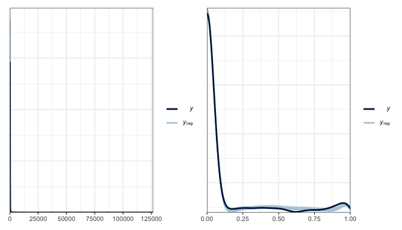
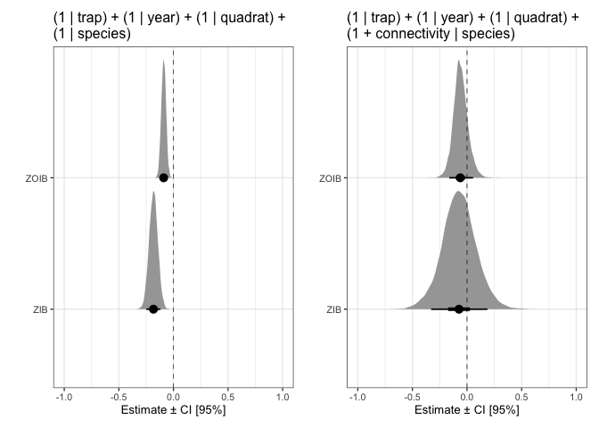
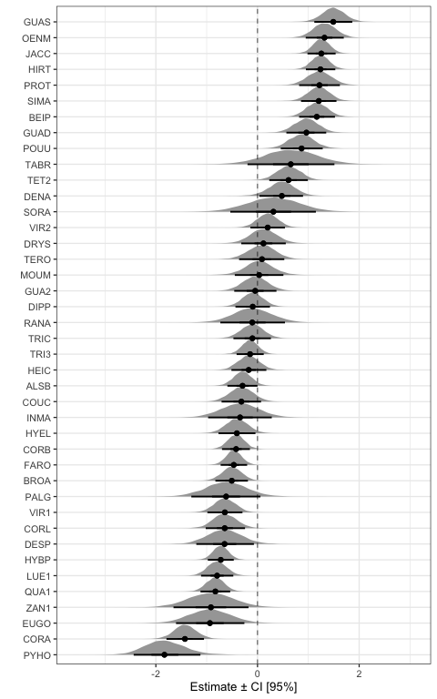

Explore results from models which include a random slope for species
================
Eleanor Jackson
04 June, 2021

In these models (`all_models_quad_rslope`), I have let species have
random slopes as well as random intercepts. A random intercept assumes
that species are allowed to have their own baseline values (and these
are normally distributed around the average intercept). Despite these
different starting points, species may not respond to connectivity in
exactly the same way - which would need to be accounted for by random
slopes… However, this may have made the model too complex, they
certainly took a lot longer to run. Let’s take a look.

``` r
library("tidyverse"); theme_set(theme_bw(base_size = 10))
library("broom.mixed")
library("brms")
library("ggdist")
library("loo")
library("patchwork")
options(mc.cores = 4)

# new models
load(here::here("output", "models", "mods_full_quad_rslope.RData")) 
all_models_quad_rslope
```

    ## # A tibble: 2 x 3
    ##   SP4                 model fit      
    ##   <chr>               <chr> <list>   
    ## 1 full_sp_quad_rslope ZIB   <brmsfit>
    ## 2 full_sp_quad_rslope ZOIB  <brmsfit>

``` r
# old models
load(here::here("output", "models", "part_pool_quad_models.RData")) 
part_pool_quad_models
```

    ## # A tibble: 2 x 2
    ##   model fit      
    ##   <chr> <list>   
    ## 1 ZIB   <brmsfit>
    ## 2 ZOIB  <brmsfit>

## Posterior predictive checks (PPC)

``` r
pp_check(all_models_quad_rslope$fit[[1]], type = "dens_overlay", nsamples = 50) -> p1
pp_check(all_models_quad_rslope$fit[[2]], type = "dens_overlay", nsamples = 50) -> p2

p1 + p2
```

<!-- -->

These look identical to the pp\_check plots from the models without
random slopes.

## Compare the predictive accuracy of the models using LOO-CV

``` r
comp <- loo_compare(part_pool_quad_models$fit[[1]], part_pool_quad_models$fit[[2]],
                    all_models_quad_rslope$fit[[1]], all_models_quad_rslope$fit[[2]])
```

    ## Warning: Not all models have the same y variable. ('yhash' attributes do not
    ## match)

``` r
print(comp, digits = 3)
```

    ##                                 elpd_diff  se_diff   
    ## all_models_quad_rslope$fit[[2]]      0.000      0.000
    ## part_pool_quad_models$fit[[2]]    -110.820     14.913
    ## all_models_quad_rslope$fit[[1]] -16799.505    195.031
    ## part_pool_quad_models$fit[[1]]  -16846.071    194.972

Interesting! loo says from best to worst:

-   random slope ZOIB
-   non-random slope ZOIB
-   random slope ZIB
-   non-random slope ZIB

## Model Results

Compare results from these new models to the non-random slope models.

``` r
part_pool_quad_models %>%
  mutate(posterior = map(fit, ~brms::posterior_samples(.x, pars = c("b_CI_pred.sc")))) %>%
  select(model, posterior) %>%
  unnest(posterior) %>% 
  pivot_longer(b_CI_pred.sc, names_to="mu" ) %>%
  ggplot(aes(x = as.factor(model), y = as.numeric(value))) +
  coord_flip() +
  labs(y = "Estimate ± CI [95%]", x = "") +
  scale_y_continuous(limits = c(-1, 1)) +
  ggdist::stat_halfeye(.width = c(.90, .5), normalize = "xy", limits = c(-3, 3)) +
  geom_hline(yintercept = 0, linetype = 2, size = 0.25) +
  ggtitle("(1 | trap) + (1 | year) + (1 | quadrat) +\n(1 | species) ")-> p3

all_models_quad_rslope %>%
  mutate(posterior = map(fit, ~brms::posterior_samples(.x, pars = c("b_CI_pred.sc")))) %>%
  select(model, posterior) %>%
  unnest(posterior) %>%
  pivot_longer(b_CI_pred.sc, names_to="mu" ) %>% 
  ggplot(aes(x = as.factor(model), y = as.numeric(value))) +
  coord_flip() +
  labs(y = "Estimate ± CI [95%]", x = "") +
  scale_y_continuous(limits = c(-1, 1)) +
  ggdist::stat_halfeye(.width = c(.90, .5), normalize = "xy", limits = c(-3, 3)) +
  geom_hline(yintercept = 0, linetype = 2, size = 0.25)  +
  ggtitle("(1 | trap) + (1 | year) + (1 | quadrat) +\n(1 + connectivity | species)") -> p4

p3 + p4
```

<!-- -->

The posterior distribution is much more spread out now! I think this was
to be expected as we are allowing more variation. I think it’s good that
the estimates look very similar in the different approaches, suggests
that they are quite robust?

Let’s take a quick look at the species random effects from the new ZOIB.

``` r
all_models_quad_rslope %>%
  filter(model == "ZOIB") %>%
  mutate(posterior = map(fit, ~brms::posterior_samples(.x))) %>%
  select(model, posterior) %>%
  unnest(posterior) %>% 
  select(contains("r_SP4[")) %>% 
  select(contains(",Intercept]")) %>% 
  pivot_longer(cols = contains("r_SP4["), names_to = "SP4") %>%
  mutate(SP4 = as.character(SP4)) %>%
  mutate(SP4 = gsub("r_SP4[", "", SP4, fixed = TRUE)) %>%
  mutate(SP4 = gsub(",Intercept]", "", SP4, fixed = TRUE))-> rslope_ZOIB_plot_dat

ggplot(rslope_ZOIB_plot_dat, aes(x = reorder(SP4, value), y = as.numeric(value))) +
  ggdist::stat_halfeye(.width = c(.90, .5), normalize = "xy", limits = c(-3, 3), size = 1.5) +
  coord_flip() +
  labs(y = "Estimate ± CI [95%]", x = "") +
  geom_hline(yintercept = 0, linetype = 2, size = 0.25)
```

<!-- -->

From a quick eyeball they don’t look different from the old models, the
species seem to be in the same order.

## To conclude..

These models look good! I think that the random slope is good in both a
model-fitting sense and an ecological sense.

However, note that I did get some warnings when the ZIB was fit: “1:
Bulk Effective Samples Size (ESS) is too low, indicating posterior means
and medians may be unreliable. Running the chains for more iterations
may help. See <http://mc-stan.org/misc/warnings.html#bulk-ess> 2: Tail
Effective Samples Size (ESS) is too low, indicating posterior variances
and tail quantiles may be unreliable. Running the chains for more
iterations may help. See
<http://mc-stan.org/misc/warnings.html#tail-ess>”

I did not get these warnings with the ZOIB. Stan recommends running for
more iterations - I will try this if I decide to take the ZIB model
further, but perhaps now is the time to drop it. The ZOIB has performed
better in every iteration so far.

Next steps:

-   try nesting trap inside quadrat
