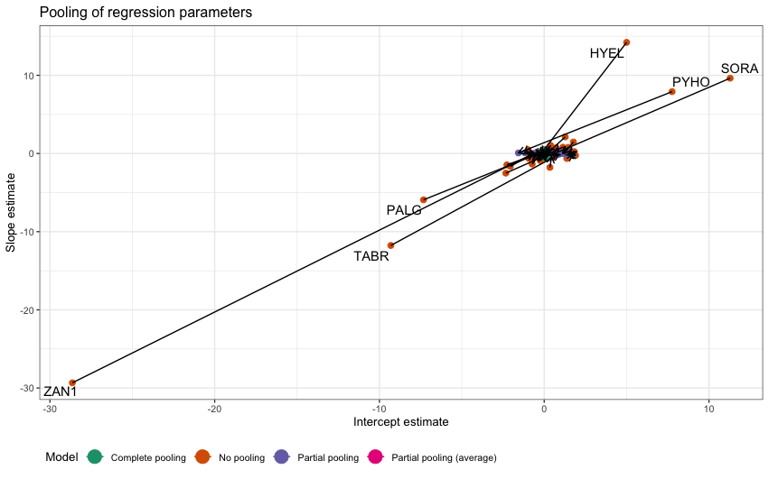

Explore pooling in mixed-effects models
================
Eleanor Jackson
14 June, 2021

You would expect species-level estimates to be pulled towards the mean
when compared to no-pooling estimates. However, when we first looked
into no-pooling vs partial-pooling models we got [counter-intuitive
results](https://github.com/ee-jackson/spatial-premature-fruit-drop/blob/master/code/exploration/05_partial-pooling-model-results.md).

I am going to revisit this by running no-pooling models for all of the
species, rather than just 4, and trying to visualise what’s going on by
following (and copying most of the code from) this very helpful blog
post:
<https://www.tjmahr.com/plotting-partial-pooling-in-mixed-effects-models/>

``` r
library("tidyverse"); theme_set(theme_bw(base_size = 10))
library("brms")
library("ggforce")

# no pooling for 4 species
# proportion_abscised ~ 1 + connectivity | species
load(here::here("output", "models", "no_pooling_4sp.RData")) 
no_pooling_4sp <- complete_pooling_models

# complete-pooling
# proportion_abscised ~ 1 + connectivity 
complete_pooling <- readRDS(here::here("output", "models", "ZOIB_complete_pooling_model_all_sp_ZOIB.rds"))

# partial-pooling
# proportion_abscised ~ 1 + connectivity + (1 + connectivity | species)
part_pooling <- readRDS(here::here("output", "models", "full_sp_quad_rslope_ZOIB.rds"))
```

## Orignial 4 species

First I am going to take another look at the 4 no-pooling models that I
ran initially, which gave us the confusing result.

Here, I am extracting intercept and slope parameters from each model,
creating a scatterplot, and connecting estimates for the same species.

``` r
## No pooling
df_no_pooling <- no_pooling_4sp %>%
  mutate(Intercept = as.numeric(map(fit, ~fixef(.x)[1] ))  ) %>%
  mutate(Slope_Connectivity = as.numeric(map(fit, ~fixef(.x)[5] ) ) ) %>%
  as.data.frame() %>%
  add_column(Model = "No pooling") %>%
  select(-c("model", "fit"))

## Partial pooling
# Make a dataframe with the fitted effects
df_partial_pooling <- coef(part_pooling)[["SP4"]] %>% 
  as.data.frame() %>%
  rownames_to_column("SP4") %>% 
  select(-contains("phi"), -contains("coi"), -contains("zoi"),
         -contains("Est.Error"), -contains("Q2.5"), -contains("Q97.5")) %>%
  rename(Intercept = `Estimate.Intercept`, Slope_Connectivity = Estimate.CI_pred.sc) %>%
  add_column(Model = "Partial pooling")

# Also visualize the point for the fixed effects
df_fixef <- tibble(
  Model = "Partial pooling (average)",
  Intercept = fixef(part_pooling)[1],
  Slope_Connectivity = fixef(part_pooling)[5]
)

# get the complete pooling estimates
df_complete_pooling <- tibble(
  Model = "Complete pooling",
  Intercept = fixef(complete_pooling)[1],
  Slope_Connectivity = fixef(complete_pooling)[5]
)

# Complete pooling / fixed effects are center of gravity in the plot
df_gravity <- bind_rows(df_fixef, df_complete_pooling)

df_pulled <- bind_rows(df_no_pooling, df_partial_pooling)

# make the plot
ggplot(df_pulled) + 
  aes(x = Intercept, y = Slope_Connectivity, color = Model) + 
  geom_point(size = 2) + 
  geom_point(data = df_gravity, size = 5) + 
  # Draw an arrow connecting the observations between models
  geom_path(
    aes(group = SP4, color = NULL), 
    arrow = arrow(length = unit(.02, "npc"))
  ) + 
  # Use ggrepel to jitter the labels away from the points
  ggrepel::geom_text_repel(
   aes(label = SP4, color = NULL),
   data = df_no_pooling
  ) +
  theme(legend.position = "bottom", legend.justification = "left") + 
  ggtitle("Pooling of regression parameters") + 
  xlab("Intercept estimate") + 
  ylab("Slope estimate") + 
  scale_color_brewer(palette = "Dark2")
```

<!-- -->

This doesn’t look so bad now that we are visualising the intercept as
well as the slope. Although HYBP definitely seems like it’s been pulled
in the wrong direction.

## All 41 species

Will now look at all of the no-pooling models together.

``` r
# no pooling for all species
# proportion_abscised ~ 1 + connectivity | species
load(here::here("output", "models", "no_pooling_allsp.RData"))

df_no_pooling41 <- no_pooling_models %>% 
  as_tibble_col(column_name = "fit") %>%
  add_column(SP4 = names(no_pooling_models) ) %>%
  add_column(Model = "No pooling") %>%
  mutate(Intercept = as.numeric(map(fit, ~fixef(.x)[1] ))  ) %>% 
  mutate(Slope_Connectivity = as.numeric(map(fit, ~fixef(.x)[5] ) ) ) 

df_pulled41 <- bind_rows(df_no_pooling41, df_partial_pooling)

# plot
ggplot(df_pulled41) + 
  aes(x = Intercept, y = Slope_Connectivity, color = Model) + 
  geom_point(size = 2) + 
  geom_point(data = df_gravity, size = 5) + 
  # Draw an arrow connecting the observations between models
  geom_path(
    aes(group = SP4, color = NULL), 
    arrow = arrow(length = unit(.02, "npc"))
  ) + 
  # Use ggrepel to jitter the labels away from the points
  ggrepel::geom_text_repel(
    aes(label = SP4, color = NULL), 
    data = df_no_pooling
  ) +
  theme(legend.position = "bottom", legend.justification = "left") + 
  ggtitle("Pooling of regression parameters") + 
  xlab("Intercept estimate") + 
  ylab("Slope estimate") + 
  scale_color_brewer(palette = "Dark2")
```

    ## Warning: ggrepel: 35 unlabeled data points (too many overlaps). Consider
    ## increasing max.overlaps

<!-- -->

Agh! Some of the no-pooling estimates are so far from the mean! It’s
hard to see what’s going on. Try and zoom in:

``` r
ggplot(df_pulled41) + 
  aes(x = Intercept, y = Slope_Connectivity, color = Model) + 
  geom_point(size = 2) + 
  geom_point(data = df_gravity, size = 5) + 
  # Draw an arrow connecting the observations between models
  geom_path(
    aes(group = SP4, color = NULL), 
    arrow = arrow(length = unit(.02, "npc"))
  ) + 
  theme(legend.position = "bottom", legend.justification = "left") + 
  ggtitle("Pooling of regression parameters") + 
  xlab("Intercept estimate") + 
  ylab("Slope estimate") + 
  scale_color_brewer(palette = "Dark2") +
  ggforce::facet_zoom(xlim = c(-2, 2), ylim = c(-0.5, 0.3), horizontal = FALSE)
```


That’s better. I think most of these points look fine. They’re going in
the right direction and the pull is greater for more extreme values.
However, I can see a few that have gone in the wrong direction. Might be
worth investigating these? Perhaps these are species for which we have
little data, or the model didn’t fit very well? I did get some warnings
from brms re the 41 non-pooling models but haven’t looked through them
all. I also haven’t visualised uncertainty/posterior distributions in
these plots, do the more extreme estimates have greater uncertainty?
