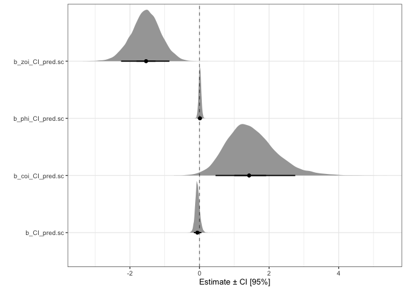
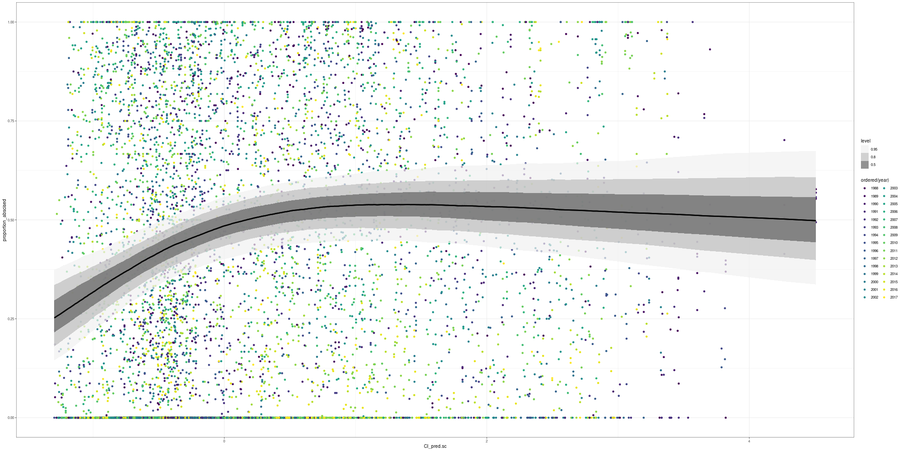
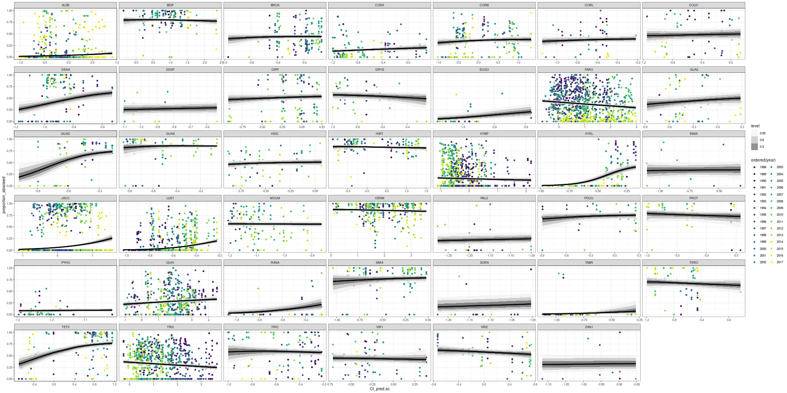
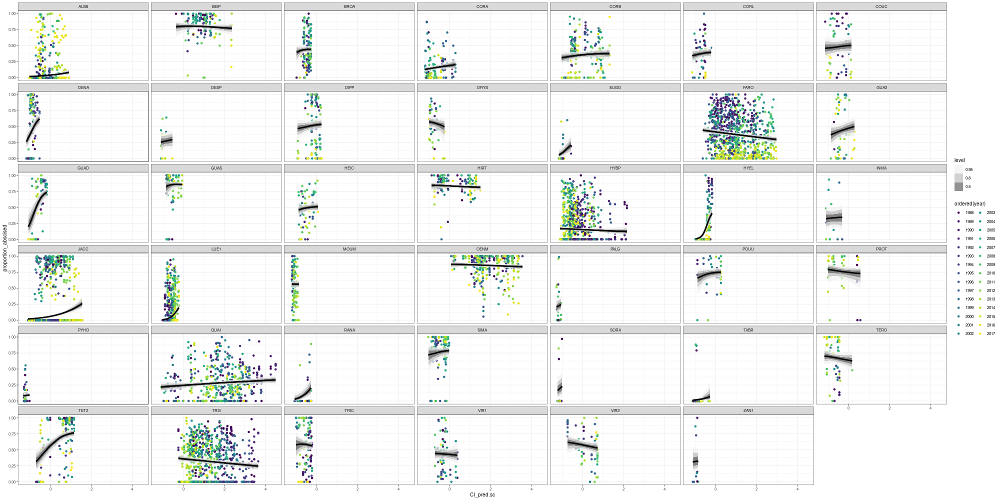
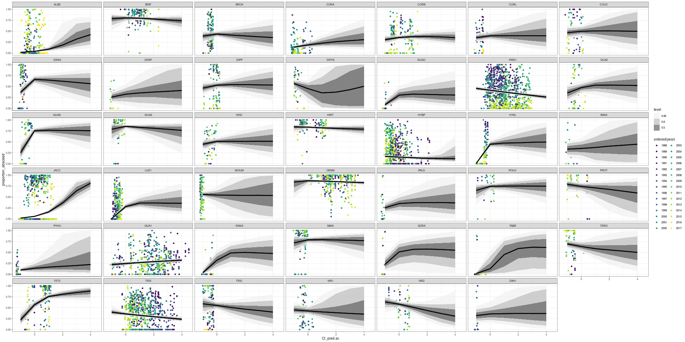

Explore and visualise final model results
================
Eleanor Jackson
26 July, 2021

``` r
library("tidyverse"); theme_set(theme_bw(base_size = 10))
library("brms")
library("tidybayes")

model <- readRDS(here::here("output", "models", "full_sp_quad_rslope_ZOIB.rds"))
```

Lets start by plotting the posteriors for each of the parameters.

``` r
model %>%
  brms::posterior_samples() %>%
  select(b_CI_pred.sc, b_coi_CI_pred.sc, b_zoi_CI_pred.sc, b_phi_CI_pred.sc) %>% 
  pivot_longer(cols = contains("CI_pred.sc"), names_to = "parameters") %>% 
  mutate(parameters = as.character(parameters)) -> posterior_slope_params

ggplot(posterior_slope_params, aes(x = parameters, y = as.numeric(value))) +
  ggdist::stat_halfeye(.width = c(.90, .5), normalize = "xy", limits = c(-3, 3), size = 1.5) +
  coord_flip() +
  labs(y = "Estimate ± CI [95%]", x = "") +
  geom_hline(yintercept = 0, linetype = 2, size = 0.25)
```

<!-- -->

Looking at this, we can say: Connectivity has a negative effect on the
probability that abscission is zero or one (zoi). Given that abscission
is zero or one, connectivity has a positive effect on the probability
that it is one (coi). Connectivity has no effect on the mean amount of
abscission or on the precision of the mean (phi).

We could also report this with hypothesis tests

``` r
# null hypothesis 1 = connectivity has no effect on zoi
h1 <- c("no effect on zoi" = "plogis(zoi_Intercept + zoi_CI_pred.sc) = plogis(zoi_Intercept)")

# null hypothesis 1 = connectivity has no effect on coi
h2 <- c("no effect on coi" = "plogis(coi_Intercept + coi_CI_pred.sc) = plogis(coi_Intercept)")

# null hypothesis 2 = connectivity has no effect on mean
h3 <- c("no effect on mu" = "plogis(Intercept + CI_pred.sc) = plogis(Intercept)")

hypothesis(model, c(h1, h2, h3) ) 
```

    ## Hypothesis Tests for class b:
    ##         Hypothesis Estimate Est.Error CI.Lower CI.Upper Evid.Ratio Post.Prob
    ## 1 no effect on zoi    -0.12      0.03    -0.18    -0.07         NA        NA
    ## 2 no effect on coi     0.21      0.17     0.01     0.61         NA        NA
    ## 3  no effect on mu    -0.01      0.02    -0.05     0.02         NA        NA
    ##   Star
    ## 1    *
    ## 2    *
    ## 3     
    ## ---
    ## 'CI': 90%-CI for one-sided and 95%-CI for two-sided hypotheses.
    ## '*': For one-sided hypotheses, the posterior probability exceeds 95%;
    ## for two-sided hypotheses, the value tested against lies outside the 95%-CI.
    ## Posterior probabilities of point hypotheses assume equal prior probabilities.

We can reject the null hypotheses that connectivity has no effect on zoi
or coi.

Will now switch onto the cluster to look at predictions of connectivity
against proportion abscised.

Read in data and model on the cluster

``` r
library("tidyverse"); theme_set(theme_bw(base_size = 10))
library("brms")
library("tidybayes")

load("data/cleanData.RData")
model <- readRDS("output/models/full_sp_quad_rslope_ZOIB.rds")

trapConnect$abscised_seeds <- as.integer(trapConnect$abscised_seeds)
trapConnect$total_seeds <- as.integer(trapConnect$total_seeds)
trapConnect$year <- as.factor(trapConnect$year)
trapConnect$trap <- as.factor(trapConnect$trap)

trapConnect <- transform(trapConnect, 
    CI_pred.sc = scale(CI_pred)
    )

testdat <- subset(trapConnect, sum_parts > 10)
```

Plot fitted draws from the posterior

``` r
# include all random effects -> re_formula = NULL 
# don't include random effects -> re_formula = NA
testdat %>% 
  add_fitted_draws(model = model, scale = "response", n = 1000, allow_new_levels = TRUE, re_formula = NA) -> test_fit

# plot
test_fit %>%
  ggplot(aes(x = CI_pred.sc, y = proportion_abscised)) +
  geom_point(data = testdat, aes(color = ordered(year))) +
  stat_lineribbon(aes(y = .value), alpha = 0.7) +
  scale_fill_brewer(palette = "Greys") -> fitted

png("fitted.png", width = 2000, height = 1000)
fitted
dev.off()
```



Really interesting how it kind of flattens out. We get the expected
positive relationship at low connectivities, fruit drop reaches a peak
at medium connectivity and then decreases slightly. Why? Predator
satiation at high plant densities? The benefits of increased
reproductive success (more pollination) at v. high connectivity outweigh
the negative effects of predation?

Lets look at species separately

``` r
# add posterior samples only including species-level random effects
testdat %>% 
  group_by(SP4) %>%
  add_fitted_draws(model = model, scale = "response", n = 1000, allow_new_levels = TRUE, re_formula = ~(CI_pred.sc|SP4)) -> test_re_fit

# plot
test_re_fit %>%
  ggplot(aes(x = CI_pred.sc, y = proportion_abscised)) +
  facet_wrap(~SP4, scales = "free_x") +
  geom_point(data = testdat, aes(color = ordered(year))) +
  stat_lineribbon(aes(y = .value), alpha = 0.7) +
  scale_fill_brewer(palette = "Greys") -> sp_fitted

png("fitted_sp_re.png", width = 2000, height = 1000)
sp_fitted
dev.off()
```



Most of them look quite flat. A few species with hardly any data, but
the confidence intervals are relatively narrow - because the model is
borrowing information from better sampled species?

Plot again, this time with a fixed x axis

``` r
test_re_fit %>%
  ggplot(aes(x = CI_pred.sc, y = proportion_abscised)) +
  facet_wrap(~SP4) +
  geom_point(data = testdat, aes(color = ordered(year))) +
  stat_lineribbon(aes(y = .value), alpha = 0.7) +
  scale_fill_brewer(palette = "Greys") -> sp_fitted_fixedx

png("fitted_sp_re_fixedx.png", width = 2000, height = 1000)
sp_fitted_fixedx
dev.off()
```



Here you can see that very few species have data at the highest
connectivity levels. This could explain why when we look at the overall
model results, the confidence intervals become broader as you move along
the x axis.

Here’s what it looks like if we expand out the predictions.

``` r
testdat %>% 
  expand(nesting(year, SP4, trap, quadrat)) %>%
  group_by(SP4) %>%
  mutate(CI_pred.sc = rep_len(-1:4.5, length.out = n())) %>%
  add_fitted_draws(model = model, scale = "response", n = 1000, allow_new_levels = TRUE, re_formula = ~(CI_pred.sc|SP4)) -> sp_fitted_expand

sp_fitted_expand %>%
  ggplot(aes(x = CI_pred.sc, y = proportion_abscised)) +
  facet_wrap(~SP4) +
  geom_point(data = testdat, aes(color = ordered(year))) +
  stat_lineribbon(aes(y = .value), alpha = 0.7) +
  scale_fill_brewer(palette = "Greys") -> sp_fitted_expand_p

png("sp_fitted_expand.png", width = 2000, height = 1000)
sp_fitted_expand_p
dev.off()
```



Big uncertainties when we try and predict where there is no data.

## Figures

``` r
model %>%
  brms::posterior_samples() %>%
  select(contains("r_SP4[")) %>%
  select(contains(",CI_pred.sc]")) %>% 
  pivot_longer(cols = contains("r_SP4["), names_to = "SP4") %>%
  mutate(SP4 = as.character(SP4)) %>%
  mutate(SP4 = gsub("r_SP4[", "", SP4, fixed = TRUE)) %>%
  mutate(SP4 = gsub(",CI_pred.sc]", "", SP4, fixed = TRUE)) -> sp_ests

# add species  names
testdat %>%
  mutate(taxa = paste(GENUS, SPECIES, sep = " ")) -> testdat

testdat %>% 
  select(SP4, taxa) %>%
  unique() %>%
  right_join(sp_ests) -> sp_ests_n
 
pdf("sp_ests.pdf", width = 3.15, height = 3.15)
ggplot(sp_ests_n, aes(y = reorder(taxa, value), x = as.numeric(value))) +
  ggdist::stat_gradientinterval(.width = 0.95, fill = "forestgreen", 
                                interval_size =0.005, stroke = 0.5,
                                shape = 21, 
                                point_fill = "white") +
  labs(x = "Estimate ± CI [95%]", y = "") +
  geom_vline(xintercept = 0, linetype = 1, size = 0.25, colour = "blue") +
  coord_cartesian(xlim = c(-1, 1), expand = FALSE) +
  theme_classic(base_size = 7 ) +
  theme(axis.text.y = element_text(face = "italic", size = 5, colour = "black"),
        plot.margin = margin(2, 3, 2, 2, "mm")) 
dev.off()
```

<figure>
<embed src="figures/08_final-model-results/sp_ests.pdf" height="350" /><figcaption aria-hidden="true">species_slope_estimates</figcaption>
</figure>

``` r
testdat %>% 
  add_fitted_draws(model = model, scale = "response", n = 1000, allow_new_levels = TRUE, re_formula = NA) -> test_fit_na

test_fit_na %>%
  ggplot(aes(x = CI_pred.sc)) +
  geom_point(data = testdat, aes(y = proportion_abscised, size = total_seeds), 
             colour = "black", alpha = 0.4, pch = 16, size = 0.5) +
  stat_lineribbon(aes(y = .value), alpha = 0.7, size = 0.25, colour = "darkgreen", show.legend = FALSE) +
  theme_classic(base_size = 7) +
  xlab("Connectivity") +
  ylab("Rate of premature seed abscission") +
  scale_x_continuous(expand = c(0 , 0)) +
  scale_y_continuous(expand = c(0.001, 0.001)) +
  scale_fill_brewer(palette = "Greens") -> fitted2

pdf("fitted2.pdf", width = 3.15, height = 3.15)
fitted2
dev.off()
```

<figure>
<embed src="figures/08_final-model-results/fitted2.pdf" height="350" /><figcaption aria-hidden="true">fitted_draws</figcaption>
</figure>

``` r
model %>%
  brms::posterior_samples() %>%
  select(b_CI_pred.sc, b_coi_CI_pred.sc, b_zoi_CI_pred.sc, b_phi_CI_pred.sc) %>% 
  pivot_longer(cols = contains("CI_pred.sc"), names_to = "parameters") %>% 
  mutate(parameters = recode(parameters, b_CI_pred.sc = "mu", b_coi_CI_pred.sc = "coi", 
                             b_zoi_CI_pred.sc = "zoi", b_phi_CI_pred.sc = "phi")) %>%
  mutate(parameters = as.character(parameters)) -> posterior_slope_params

pdf("post_params.pdf", width = 3.15, height = 3.15)
ggplot(posterior_slope_params, aes(y = reorder(parameters, abs(value)), x = as.numeric(value))) +
  ggdist::stat_halfeye(normalize = "xy", .width = 0.95, fill = "forestgreen", 
                                interval_size =0.005, stroke = 0.5,
                                shape = 21, slab_alpha = 0.6, point_size = 1,
                                point_fill = "white") + 
  labs(x = "Estimate ± CI [95%]", y = "") +
  geom_vline(xintercept = 0, linetype = 1, size = 0.25, colour = "blue") +
  scale_y_discrete(labels = c("mu" = substitute(Beta),
                              "phi"  = substitute(phi),
                              "coi" = substitute(gamma),
                              "zoi" = substitute(alpha))) +
  theme_classic(base_size = 7 )+ 
  theme(axis.text.y = element_text(face = "italic", size = 12, colour = "black")) 
dev.off()
```

<figure>
<embed src="figures/08_final-model-results/post_params.pdf" height="350" /><figcaption aria-hidden="true">parameter_estimates</figcaption>
</figure>
