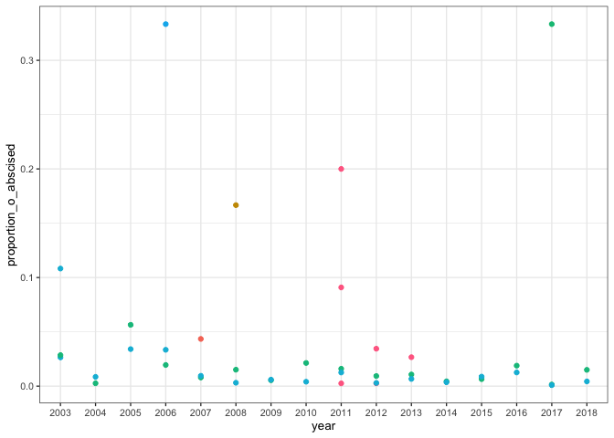

Estimate fruit set using flowers
================
Eleanor Jackson
04 April, 2022

Can/should we include analogous analyses on fruit set (proportion of
flowers turning into fruits) for some of the species?

``` r
library("tidyverse"); theme_set(theme_bw(base_size = 10))
load(here::here("data", "clean", "trapData.RData"))
```

Part 6 is perfect and female flowers, part 9 is male flowers. We are
only interested in female flowers and can use these as an estimate of
abscised flowers, successful female flowers will have turned into
fruits, so we can do:

(abscised flowers \* nseedfull) / total seeds

N.B. The variable ‘quantity’ was recorded as presence only (i.e., all
values equal 1) for flowers (part=6 or part=9) and buds (part=0) until
20020709. Starting on 20020709, the variable quantity was recorded on an
approximate logarithmic scale (i.e., 1, 10, 100 or 1000) for flowers and
buds.

## Calculate the proportion of ovules that were prematurely abscised

``` r
# seed rain data
seedRain <- read.table(here::here("data", "raw",
    "BCI_TRAP200_20190215_spcorrected.txt"),
    header=TRUE, stringsAsFactors = FALSE)

seedTrait <- read.csv(here::here("data", "raw",
    "20120227_seedsMassForTraits.csv"),
    header=TRUE, stringsAsFactors = FALSE)

seedRain <- rename(seedRain, SP4 = sp)

seedTrait <- seedTrait %>%
   select(LIFEFORM, N_SEEDFULL, SP4, GENUS, SPECIES)

seedRain$fecha <- as.character(seedRain$fecha)
seedRain$fecha <- as.Date(seedRain$fecha, "%Y-%m-%d")
seedRain$year <- format(as.Date(seedRain$fecha), "%Y")

seedDat <- left_join(seedRain, seedTrait, by = c("SP4"))

seedDat <- subset(seedDat, LIFEFORM != "EPIPHYTE"|LIFEFORM != "HEMIEPIPHYTE"|LIFEFORM != "HERB"|LIFEFORM != "VINE")

seedDat <- seedDat %>%
    drop_na("N_SEEDFULL")

# don't have the full data for these years
seedDat %>%
  filter(year >= 2003 & year != 2019) -> seedDat

# format trap id
seedDat$trap <- formatC(seedDat$trap, width = 3, format = "d", flag = "0")
seedDat$trap <- paste("trap", seedDat$trap, sep="_")

seedDat %>%
    group_by(part, SP4, year, trap, N_SEEDFULL, GENUS, SPECIES) %>%
    summarise(quantity_sum = sum(quantity, na.rm = TRUE)) %>%
    ungroup() -> absdat
```

    ## `summarise()` has grouped output by 'part', 'SP4', 'year', 'trap',
    ## 'N_SEEDFULL', 'GENUS'. You can override using the `.groups` argument.

``` r
absdat %>% 
  subset(part == 6) %>%
    replace(., is.na(.), 0) %>%
    rowwise() %>%
    mutate(abscised_ovules = quantity_sum*N_SEEDFULL) %>%
    ungroup() %>% 
    group_by(SP4, year, trap, GENUS, SPECIES) %>%
    summarise(abscised_ovules = sum(abscised_ovules, na.rm = TRUE)) %>%
    ungroup() -> flower_dat 
```

    ## `summarise()` has grouped output by 'SP4', 'year', 'trap', 'GENUS'. You can
    ## override using the `.groups` argument.

``` r
glimpse(flower_dat)
```

    ## Rows: 32,152
    ## Columns: 6
    ## $ SP4             <chr> "ABUR", "ABUR", "ABUR", "AECT", "AEGC", "AEGC", "AEGC"…
    ## $ year            <chr> "2006", "2009", "2011", "2006", "2003", "2003", "2003"…
    ## $ trap            <chr> "trap_133", "trap_048", "trap_348", "trap_311", "trap_…
    ## $ GENUS           <chr> "Abuta", "Abuta", "Abuta", "Aechmea", "Aegiphila", "Ae…
    ## $ SPECIES         <chr> "racemosa", "racemosa", "racemosa", "tillandsioid", "c…
    ## $ abscised_ovules <dbl> 1.00, 1.00, 1.00, 22.36, 2.75, 5.50, 60.50, 30.25, 27.…

``` r
# join up with fruit abscission data and calculate the proportion of ovules abscised
left_join(trapDat, flower_dat, by = c("SP4", "year", "trap", "GENUS", "SPECIES")) %>%
  mutate(proportion_o_abscised = abscised_ovules / total_seeds) -> trapDat_fs
```

## can now take a look at it

``` r
trapDat_fs %>%
  filter(SP4 == "HYEL" & year >= 2003) %>%
  ggplot(aes(x = year, y = proportion_o_abscised, colour = trap)) +
  geom_point() +
  theme(legend.position = "none")
```

    ## Warning: Removed 895 rows containing missing values (geom_point).

<!-- -->

Can’t really say much from this brief foray into fruit set, but I think
we aren’t going to go down this route for the current manuscript. We
have run out of time and there are some unknowns about how reliably
flowers will fall into the seed traps.
