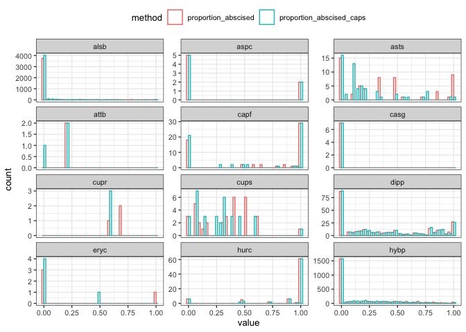
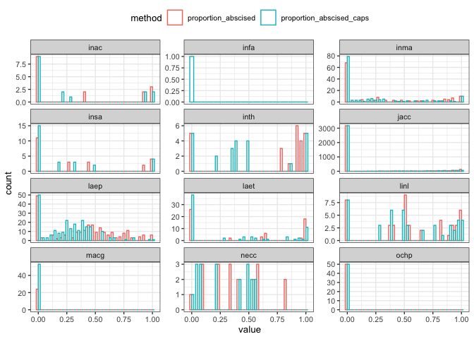
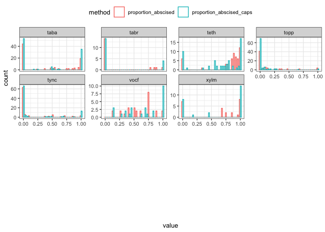
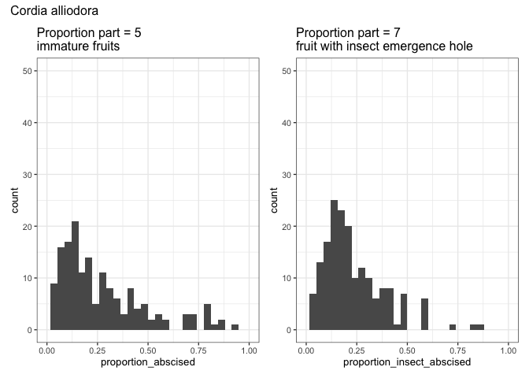

Using capsules to estimate fruit drop for vertebrate dispersed species
================
Eleanor Jackson
28 April, 2022

For the analysis thus far we have assumed that the probability of a
fruit or seed falling into a trap is the same for mature and immature
fruits and seeds. However, we have concerns about including species for
which the ratio of immature to mature fruits could be affected by
removal of mature fruits from the canopy. (If animals forage for fruit
in a density-dependent fashion, this could create patterns in the seed
trap data that are hard to interpret.)

To avoid those complications, we were thinking that it might be worth
focusing on species which are not animal dispersed (and therefore
presumably unlikely to be routinely eaten by animals). SJW suggested
that for some species it is possible to reconstruct the numbers of
mature fruits based on capsules and similar evidence found in the traps.

Capsules are recorded as `part 3` in the seed rain dataset. *"Capsules -
This is a part that vertebrates never eat. Botanically this might be a
capsule, pedicel, bract, etc.* SJW and OC also record *“Fragments of
fruit dropped by vertebrates (we record the number of fruit represented
by counting pedicels or the points of attachment of fruits to the mother
plant).”* these are `part 4` in the dataset.

In [Gripenberg et al. 2019](https://doi.org/10.1111/ele.13359) they use
capsules to estimate seed abundances. In the supplementary material they
write: *“To estimate the total number of seeds produced for each
species, we multiplied the number of fruits collected by the
species-specific average number of seeds per fruit, and then added
either the number of seeds or the number of capsules multiplied by
species-specific average number of fruits per capsule multiplied by
average number of seeds per fruit; whichever number was larger. The
rationale for this approach is that since some of the seeds falling into
the trap might have originated from the capsule, we might overestimate
seed numbers if we were to use (fruits × average seeds/fruit) + seeds +
(capsules × average seeds/fruit). Since many seed predators are likely
to be pre-dispersal seed predators attacking the fruits before they
reach maturity, immature fruits were included in the estimates.”*

Here, I am going to use capsules to estimate fruit drop and compare this
against the values we estimated using `part 1` - mature fruits.

notes:

-   could multiple capsule parts have come off of a single fruit?
-   could capsule parts have come from immature fruits?
-   do we have average number of fruits per capsule? - Yes

SJW: *“If you need a few examples to get started on this, use any or all
species of Trichilia, Virola, Protium, Tetragastris (which is now in
Protium isthmensis \[spelling?\]).”*

``` r
library("tidyverse")
library("patchwork")
library("ggforce")

# seed rain data
read.table(
  here::here("data", "raw", "BCI_TRAP200_20190215_spcorrected.txt"),
  header = TRUE,
  stringsAsFactors = FALSE
) -> seed_rain

# seed traits from joe
read.csv(
  here::here("data", "raw", "20120227_seedsMassForTraits.csv"),
  header = TRUE,
  stringsAsFactors = FALSE
) %>%
  select(LIFEFORM, N_SEEDFULL, SP4) -> seed_trait
```

### Clean up seed rain data

``` r
seed_rain %>%
  mutate(fecha = as.character(fecha)) %>%
  mutate(fecha = as.Date(fecha, "%Y-%m-%d"),
         year = format(as.Date(fecha), "%Y")) %>%
  left_join(seed_trait, by = c("sp" = "SP4")) %>%
  
  # don't have the full data for these years
  filter(year != "1987" & year != "2019") %>%
  
  # keep only woody plants
  filter(
    LIFEFORM != "EPIPHYTE" |
      LIFEFORM != "HEMIEPIPHYTE" |
      LIFEFORM != "HERB" | LIFEFORM != "VINE"
  ) %>%
  drop_na("N_SEEDFULL") %>%
  mutate(sp = tolower(sp),
         trap = formatC(
           trap,
           width = 3,
           format = "d",
           flag = "0"
         )) %>%
  mutate(trap = paste("trap", trap, sep = "_")) %>%
  rename(sp4 = sp, n_seedfull = N_SEEDFULL) -> seed_dat

# sum weekly counts of parts into yearly counts per trap per species
seed_dat %>%
  filter(part == 1 | part == 2 | part == 5 | part == 3 | part == 7) %>%
  group_by(part, sp4, year, trap, n_seedfull) %>%
  summarise(quantity_sum = sum(quantity, na.rm = TRUE),
            .groups = "drop") -> abs_dat

# combine with species data to drop species that we can't use
read.csv(here::here("data", "clean", "species_list.csv")) %>%
  filter(dioecious == FALSE & ((animal_disp == FALSE | is.na(animal_disp)) | capsules == TRUE)) %>%
  select("sp4", "capsules", "capsules_per_fruit") %>%
  inner_join(abs_dat, by = "sp4") -> abs_dat_comb
```

### Calculate viable seeds

if capsule = TRUE, viable seeds = (mature fruits \* avg seeds per fruit)
+ ( (capsules \* avg seeds per fruit) **OR** single diaspores)

`part 1` + `part 2` **OR** `part 1` + `part 3`

if capsule = FALSE, viable seeds = (mature fruits \* avg seeds per
fruit) + single diaspores

`part 1` + `part 2`

``` r
abs_dat_comb %>%
  subset(part == 1 | part == 2 | part == 3) %>%
  
    rowwise() %>%
    mutate(parts_avgseeds = case_when(
      
       # mature fruit
      part == 1 ~ quantity_sum * n_seedfull,
      
      # single diaspores
      part == 2 ~ quantity_sum, 
      
      # capsules
      part == 3 ~ (quantity_sum / capsules_per_fruit) * n_seedfull)) %>%
  
  # estimate number of mature fruits based on fruits + capsules, and based on fruits + seeds
  group_by(sp4, year, trap, capsules) %>%
  summarise(capsules_seeds = ifelse(
      part == 1 | part == 3, sum(parts_avgseeds, na.rm = TRUE), 0), 
      
         fruits_seeds = ifelse(
      part == 1 | part == 2, sum(parts_avgseeds, na.rm = TRUE), 0),
      .groups = "drop") %>%
  
  # if fruits + seeds estimate is larger, use that rather than fruits + capsules
  mutate(fruits_capsules = 
           ifelse(fruits_seeds > capsules_seeds, fruits_seeds, capsules_seeds)) %>%
  
  # if we can't estimate fruits from capsules for a species, use fruits + seeds
  mutate(viable_seeds = case_when(
      capsules == FALSE | is.na(capsules) ~ fruits_seeds,
      capsules == TRUE ~ capsules_seeds)) %>%
  
  select(-capsules_seeds, -fruits_seeds) -> abs_dat_viable
```

### Calculate abscised seeds

``` r
# abscised seeds,  part 5 = immature fruit 
abs_dat_comb %>%  
  subset(part == 5) %>%
    rowwise() %>%
    mutate(abscised_seeds = quantity_sum*n_seedfull) %>%
    group_by(sp4, year, trap) %>%
    summarise(abscised_seeds = sum(abscised_seeds, na.rm = TRUE), 
              .groups = "drop") -> abs_dat_abscised
```

### Calculate proportion abscised

``` r
# join abscised and viable seeds data, where there is no match will = NA, change to zero
full_join(abs_dat_abscised, abs_dat_viable, by= c("sp4", "year", "trap")) %>%
  mutate_at(vars(viable_seeds, abscised_seeds), ~replace(., is.na(.), 0)) -> abs_dat_abscised_viable

# calculate proportion abscised
abs_dat_abscised_viable %>%
    rowwise() %>%
    mutate(total_seeds = sum(abscised_seeds, viable_seeds, na.rm = TRUE), 
           proportion_abscised = abscised_seeds / total_seeds) -> prop_dat

abs_dat %>%
    group_by(sp4, year, trap) %>%
    summarise(sum_parts = sum(quantity_sum, na.rm = TRUE), .groups = "drop") -> sum_dat

prop_dat %>%
    left_join(sum_dat, by = c("sp4", "year", "trap")) -> trap_dat_caps
```

# Compare with old (non-capsule) data

First load in the original `proportion_abscised` values and join with
the new dataset that uses capsules to estimate viable seeds.

``` r
load(here::here("data", "clean", "trapData.RData"))

trapDat %>%
  select(SP4, year, trap, proportion_abscised) %>%
  mutate(SP4 = tolower(SP4)) -> trap_dat_select

trap_dat_caps %>% 
  select(sp4, year, trap, proportion_abscised, capsules, total_seeds) %>%
  rename(proportion_abscised_caps = proportion_abscised) %>%
  full_join(trap_dat_select, by = c("sp4" = "SP4", "year", "trap")) -> comp_dat
```

``` r
comp_dat %>%
  filter(capsules == TRUE) %>%
  distinct(sp4) -> sp4_caps_true
  
comp_dat %>% 
  filter(sp4 %in% sp4_caps_true$sp4 & total_seeds >= 5) %>%
  pivot_longer(cols = c(proportion_abscised_caps, proportion_abscised), names_to = "method") %>%
  ggplot(aes(x = value, colour = method)) +
  geom_histogram(fill = "white", position="dodge") +
  ggforce::facet_wrap_paginate(~sp4, scales = "free_y",  ncol = 4, nrow = 4) +
  theme(legend.position = "top") -> p
    
ggforce::n_pages(p) -> n_pages
```

    ## `stat_bin()` using `bins = 30`. Pick better value with `binwidth`.

``` r
for(i in 1:n_pages){
    print(p + ggforce::facet_wrap_paginate(~sp4, scales = "free_y",  ncol = 4, nrow = 4, page = i))
}
```

    ## `stat_bin()` using `bins = 30`. Pick better value with `binwidth`.

<!-- -->

    ## `stat_bin()` using `bins = 30`. Pick better value with `binwidth`.

<!-- -->

    ## `stat_bin()` using `bins = 30`. Pick better value with `binwidth`.

<!-- -->

    ## `stat_bin()` using `bins = 30`. Pick better value with `binwidth`.

<!-- -->

    ## `stat_bin()` using `bins = 30`. Pick better value with `binwidth`.

<!-- -->

For many species there is little difference between the proportion
abscised calculated using the capsules method and the original method.
If the original estimate of viable seeds was larger than the estimate
calculated using capsules, the original estimate was used. This suggests
that few capsules were collected for most species.

# Fruits with insect emergence holes

SJW: *“I believe I have a Christmas present for you. Check out the
definition of part=7 in the metadata for the 200 trap study. There are a
handful of species whose fruits are abscised with conspicuous
“weirdnesses” when infested by an insect. Faramea occidentalis is an
example that Sofia will know well. For this handful of species, we know
an insect predator is the cause of immature fruit fall. For other
species, you only have the reasonable inference that enemies cause
immature fruit fall. Results for the handful of species with part=7
will, hopefully, substantiate this inference."*

I‘ll have a look at the data for species with `part 7` counts to see how
many fruits were dropped immaturely without insect emergence holes VS.
fruits with insect emergence holes. I think Joe’s idea was that if the
proportion of `part 7` looked similar to the proportion of `part 5`
(immature fruits) then it will back-up our assumption that seed enemies
are causing premature fruit drop.

We aren’t actually going to be using *Faramea occidentalis* in the model
because it’s animal dispersed and it’s seeds cannot be estimated from
capsules.

How many other species have a `part 7`?

``` r
abs_dat_comb %>%
  filter(part == 7) %>%
  group_by(sp4) %>%
  summarise(
    sum_part_7 = sum(quantity_sum)
  ) %>%
  arrange(desc(sum_part_7))
```

    ## # A tibble: 79 × 2
    ##    sp4   sum_part_7
    ##    <chr>      <dbl>
    ##  1 thim       12975
    ##  2 masn       11073
    ##  3 serm        9696
    ##  4 cora        2204
    ##  5 teth         916
    ##  6 tero         486
    ##  7 stil         466
    ##  8 alsb         425
    ##  9 peta         395
    ## 10 oenm         372
    ## # … with 69 more rows

79 is more species than I was expecting. Let’s look at `thim` (*Thinouia
myriantha*) as it has the highest count of `part 7`.

``` r
# calculate proportion part 7
abs_dat_comb %>%
  filter(sp4 == "thim" & (part == 7 | part == 1 | part == 2)) %>%
  rowwise() %>%
  mutate(
    parts_avgseeds = case_when(
      # mature fruit
      part == 1 ~ quantity_sum * n_seedfull,
      
      # single diaspores
      part == 2 ~ quantity_sum,
      
      # fruit with insect emergence holes
      part == 7 ~ quantity_sum * n_seedfull
    )
  ) %>%
  group_by(sp4, year, trap) %>%
  summarise(
    insect_abscised_seeds = sum(parts_avgseeds[part == 7]),
    viable_seeds = sum(parts_avgseeds[part == 1 | part == 2]),
    .groups = "drop"
  ) %>%
  group_by(sp4, year, trap) %>%
  mutate(
    total_seeds = sum(insect_abscised_seeds, viable_seeds, na.rm = TRUE),
    proportion_insect_abscised = insect_abscised_seeds / total_seeds
  )  -> thim_part7


trap_dat_caps %>%
  filter(sp4 == "thim") %>% 
  filter(total_seeds >=5) %>%
  ggplot(aes(x = proportion_abscised)) +
  geom_histogram() +
  xlim(0, 1) +
  ylim(0, 200) +
  ggtitle("Proportion part = 5\nimmature fruits") -> p1

thim_part7 %>% 
  filter(total_seeds >=5) %>%
  ggplot(aes(x = proportion_insect_abscised)) +
  geom_histogram() +
  xlim(0, 1) +
  ylim(0, 200) +
  ggtitle("Proportion part = 7\nfruit with insect emergence hole") -> p2

p1 + p2 + plot_annotation(
  title = "Thinouia myriantha")
```

    ## `stat_bin()` using `bins = 30`. Pick better value with `binwidth`.

    ## Warning: Removed 2 rows containing missing values (geom_bar).

    ## `stat_bin()` using `bins = 30`. Pick better value with `binwidth`.

    ## Warning: Removed 2 rows containing missing values (geom_bar).

<!-- -->

The distributions look kind of similar, can we measure this
quantitatively?

Kolmogorov–Smirnov test: What is the probability that these two sets of
samples were drawn from the same (but unknown) probability distribution?

``` r
trap_dat_caps %>%
  ungroup() %>%
  filter(sp4 == "thim") %>% 
  filter(total_seeds >=5) %>%
  select(proportion_abscised) -> x

thim_part7 %>% 
  ungroup() %>%
  filter(total_seeds >=5) %>%
  select(proportion_insect_abscised) -> y

ks.test(x$proportion_abscised, y$proportion_insect_abscised)
```

    ## Warning in ks.test(x$proportion_abscised, y$proportion_insect_abscised): p-value
    ## will be approximate in the presence of ties

    ## 
    ##  Two-sample Kolmogorov-Smirnov test
    ## 
    ## data:  x$proportion_abscised and y$proportion_insect_abscised
    ## D = 0.34987, p-value < 2.2e-16
    ## alternative hypothesis: two-sided

Null hypothesis: x and y were drawn from the same continuous
distribution. We have p &lt; 0.05 which means we reject the null
hypothesis - the two samples came from different distributions.

We can also use a Mann-Whitney test (equivalent to the Wilcoxon rank sum
test), which is better at handling tied values.

``` r
wilcox.test(x$proportion_abscised, y$proportion_insect_abscised, conf.int = TRUE, paired = FALSE)
```

    ## 
    ##  Wilcoxon rank sum test with continuity correction
    ## 
    ## data:  x$proportion_abscised and y$proportion_insect_abscised
    ## W = 724403, p-value < 2.2e-16
    ## alternative hypothesis: true location shift is not equal to 0
    ## 95 percent confidence interval:
    ##  -0.1999708 -0.1512458
    ## sample estimates:
    ## difference in location 
    ##             -0.1666937

Here, the null hypothesis is that the distributions of x and y differ by
a location shift of mu and the alternative is that they differ by some
other location shift. We have p &lt; 0.05 which means we reject the null
hypothesis - the two samples came from different distributions.

**To do:** Repeat for species with highest counts of `part 7`, top 10?
