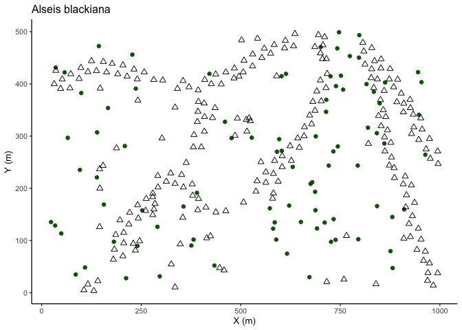

Making maps
================
Eleanor Jackson
31 May, 2022

``` r
library("tidyverse")
```

    ## ── Attaching packages ─────────────────────────────────────── tidyverse 1.3.1 ──

    ## ✓ ggplot2 3.3.5     ✓ purrr   0.3.4
    ## ✓ tibble  3.1.6     ✓ dplyr   1.0.8
    ## ✓ tidyr   1.2.0     ✓ stringr 1.4.0
    ## ✓ readr   2.0.2     ✓ forcats 0.5.1

    ## ── Conflicts ────────────────────────────────────────── tidyverse_conflicts() ──
    ## x dplyr::filter() masks stats::filter()
    ## x dplyr::lag()    masks stats::lag()

``` r
tree_data <- readRDS(here::here("data", "clean", "tree_data.rds"))
trap_data <- readRDS(here::here("data", "clean", "trap_data.rds"))
trap_connect <- readRDS(here::here("data", "clean", "trap_connect.rds"))
```

``` r
tree_data %>%
  filter(sp4 == "alsb", year == "2015") -> alsb_2015_tree

trap_data %>%
  filter(sp4 == "alsb", year == "2015") %>%
  distinct(trap, .keep_all = TRUE)-> alsb_2015_trap

ggplot() +
  geom_point(
    data = alsb_2015_tree,
    aes(x = x, y = y),
    colour = "darkgreen",
    shape = 20,
    size = 2.5
  ) +
  geom_point(data = alsb_2015_trap,
             aes(x = x, y = y),
             shape = 2,
             size = 2) +
  labs(x = "X (m)", y = "Y (m)") +
  ggtitle("Alseis blackiana")
```

<!-- -->

``` r
trap_connect %>%
  group_by(sp4) %>%
  summarise(
    sum_parts = sum(sum_parts)
  ) %>%
  arrange(desc(sum_parts)) %>%
  slice_head(n = 12) %>%
  pull(sp4) -> twelve_sp4

plot_sp_map <- function(species) {
    tree <- subset(tree_data, sp4 == species)
    trap <- subset(trap_data, year == "2015" & sp4 == species & sum_parts >=3)
    ggplot() +
        geom_point(data = trap, aes(x = x, y = y, colour = proportion_abscised), 
            size = 3) +
        geom_point(data = tree, aes(x = x, y = y), 
            size = 2, shape = 2) +
      ggtitle(species)
}

species_plots <- map(twelve_sp4, plot_sp_map)
ggpubr::ggarrange(plotlist = species_plots, common.legend = TRUE)
```
