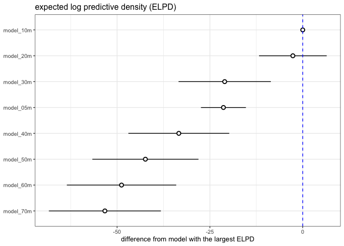
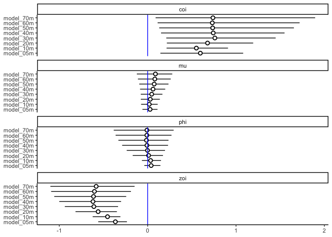

Testing different values of alpha
================
Eleanor Jackson
04 July, 2022

In calculating Hanski’s connectivity index we had to include a measure
of the hypothesised dispersal ability of host-specific enemies
associated with seeds of the focal tree species. alpha = (1/average
dispersal distance in m). Dispersal distances of tropical seed predators
are unknown. We chose **alpha = 0.02**, which corresponds to an average
migration distance of 50 m. This choice was based on empirical data on
the average dispersal distance of a temperate leaf mining moth
associated with oak trees (Gripenberg and Roslin 2005).

T.O.: *If it is not too computationally intensive, I would be tempted to
pick a few values and re-run the models, then pick the one that has the
best fit and use that in main paper. This sensitivity analysis to find
the best alpha value can be described in Supp Info and shouldn’t be too
arduous? Will avoid criticism from reviews that this choice is
arbitrary.*

Lets do 20m, 30m, 40m, 50m, 60m, 70m. So alpha = 0.05, 0.033, 0.025,
0.016, 0.014.

*Edited to add 5m and 10m*

## Compare the predictive accuracy of the models using LOO-CV

``` r
model_05m <- readRDS(here::here("output", "models", "zoib_capsules_05m.rds"))
model_10m <- readRDS(here::here("output", "models", "zoib_capsules_10m.rds"))
model_20m <- readRDS(here::here("output", "models", "zoib_capsules_20m.rds"))
model_30m <- readRDS(here::here("output", "models", "zoib_capsules_30m.rds"))
model_40m <- readRDS(here::here("output", "models", "zoib_capsules_40m.rds"))
model_50m <- readRDS(here::here("output", "models", "zoib_capsules_quad_rslope_nest.rds"))
model_60m <- readRDS(here::here("output", "models", "zoib_capsules_60m.rds"))
model_70m <- readRDS(here::here("output", "models", "zoib_capsules_70m.rds"))

library("tidyverse"); theme_set(theme_bw(base_size = 10))
library("broom.mixed")
library("brms")
library("ggdist")
library("loo") # v 2.4.1
library("patchwork")
options(mc.cores = 3)
```

## Compare the predictive accuracy of the models using Leave-One-Out Cross Validation

Leave-one-out cross-validation (LOO-CV) is a popular method for
comparing Bayesian models based on their estimated predictive
performance on new/unseen data.

Expected log predictive density (ELPD): If new observations are
well-accounted by the posterior predictive distribution, then the
density of the posterior predictive distribution is high and so is its
logarithm. So higher ELPD = better predictive performance.

``` r
comp <- loo_compare(model_05m, model_10m, model_20m, model_30m, 
                    model_40m, model_50m, model_60m, model_70m)

print(comp, digits = 3)
```

    ##           elpd_diff se_diff
    ## model_10m   0.000     0.000
    ## model_20m  -2.658     9.113
    ## model_30m -21.021    12.430
    ## model_05m -21.356     6.054
    ## model_40m -33.372    13.582
    ## model_50m -42.370    14.290
    ## model_60m -48.797    14.725
    ## model_70m -53.279    15.080

``` r
comp %>% 
  data.frame() %>% 
  rownames_to_column(var = "model_name") %>% 
  ggplot(aes(x    = reorder(model_name, elpd_diff), 
             y    = elpd_diff, 
             ymin = elpd_diff - se_diff, 
             ymax = elpd_diff + se_diff)) +
  geom_pointrange(shape = 21, fill = "white") +
  coord_flip() +
  geom_hline(yintercept = 0, colour = "blue", linetype = 2) +
  labs(x = NULL, y = "difference from model with the largest ELPD", 
       title = "expected log predictive density (ELPD)") 
```

<!-- -->

In the [loo package
documentation](https://mc-stan.org/loo/articles/online-only/faq.html#how-to-use-cross-validation-for-model-selection-)
they say:

“If elpd difference (`elpd_diff` in loo package) is less than 4, the
difference is small [(Sivula, Magnusson and Vehtari,
2020)](https://doi.org/10.48550/arXiv.2008.10296)). If elpd difference
(`elpd_diff` in loo package) is larger than 4, then compare that
difference to standard error of `elpd_diff` (provided e.g. by loo
package) [(Sivula, Magnusson and Vehtari,
2020)](https://doi.org/10.48550/arXiv.2008.10296).”

The `elpd_diff` between `model_10m` and `model_20m` is -2.658, this is
less than 4 so we can say that the difference in predictive accuracy
between these two models is negligible. But, the difference between our
original model (`model_50m`) and `model_10m` is -42.370 and the standard
error of `elpd_diff`, (`se_diff`) doesn’t overlap. I think this means
that `model_10m` and `model_20m` have better predictive accuracy than
`model_50m`.

A 10 m dispersal distance is lower than we predicted, but we are
modelling the realised dispersal distance rather than the potential
dispersal distance. In a dense forest, perhaps a mean of 10 m is
typical?

## Compare estimates

Has changing alpha changed the results of our model?

``` r
tibble(model = c("model_05m", "model_10m", "model_20m", "model_30m", 
                 "model_40m", "model_50m", "model_60m", "model_70m")) %>% 
  mutate(fit   = purrr::map(model, get)) %>% 
  mutate(tidy  = purrr::map(fit, tidy)) %>% 
  unnest(tidy) %>% 
  filter(effect == "fixed" & !grepl("(Intercept)", term)) -> my_coef_tab

my_coef_tab
```

    ## # A tibble: 32 × 10
    ##    model     fit       effect component group term   estimate std.error conf.low
    ##    <chr>     <list>    <chr>  <chr>     <chr> <chr>     <dbl>     <dbl>    <dbl>
    ##  1 model_05m <brmsfit> fixed  cond      <NA>  conne…   0.0279    0.0422  -0.0588
    ##  2 model_05m <brmsfit> fixed  cond      <NA>  phi_c…   0.0399    0.0458  -0.0373
    ##  3 model_05m <brmsfit> fixed  cond      <NA>  zoi_c…  -0.365     0.0832  -0.559 
    ##  4 model_05m <brmsfit> fixed  cond      <NA>  coi_c…   0.596     0.234    0.144 
    ##  5 model_10m <brmsfit> fixed  cond      <NA>  conne…   0.0182    0.0471  -0.0743
    ##  6 model_10m <brmsfit> fixed  cond      <NA>  phi_c…   0.0335    0.0544  -0.0646
    ##  7 model_10m <brmsfit> fixed  cond      <NA>  zoi_c…  -0.454     0.0787  -0.622 
    ##  8 model_10m <brmsfit> fixed  cond      <NA>  coi_c…   0.551     0.174    0.214 
    ##  9 model_20m <brmsfit> fixed  cond      <NA>  conne…   0.0297    0.0549  -0.0775
    ## 10 model_20m <brmsfit> fixed  cond      <NA>  phi_c…   0.0108    0.0841  -0.169 
    ## # … with 22 more rows, and 1 more variable: conf.high <dbl>

``` r
my_coef_tab %>% 
  mutate(term = recode(term, connectivity_pred_sc = "mu", 
                       coi_connectivity_pred_sc = "coi",
                       zoi_connectivity_pred_sc = "zoi", 
                       phi_connectivity_pred_sc = "phi")) %>% 
  ggplot(aes(x = model, y = estimate, ymin = conf.low, ymax = conf.high)) +
  geom_pointrange(shape = 21, fill = "white") +
  labs(x = NULL,
       y = NULL) +
  geom_hline(yintercept = 0,  color = "blue") +
  coord_flip() +
  theme_classic() +
  facet_wrap(~term, ncol = 1)
```

<!-- -->

Confidence intervals are all overlapping - no real change in the model’s
parameter estimates.
