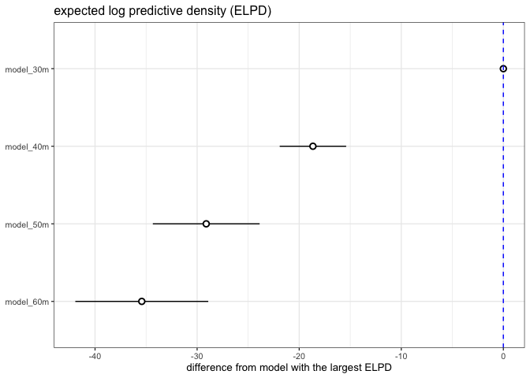
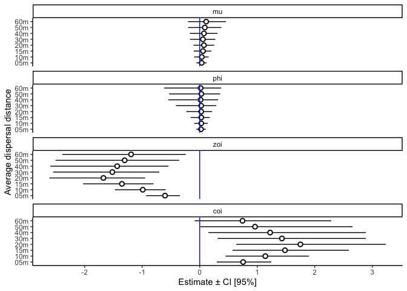

Testing different values of alpha (again)
================
Eleanor Jackson
21 July, 2023

I have re-run the models and done edge effect corrections and will now
compare them. When I compared models previously (in
[12_testing-alpha-values.md](https://github.com/ee-jackson/spatial-premature-fruit-drop/blob/main/code/exploration/12_testing-alpha-values.md))
I hadn’t yet done edge corrections.

Edge effect correction testing (like
[this](https://github.com/ee-jackson/spatial-premature-fruit-drop/blob/main/code/exploration/03_edge-effects.md))
suggested that when:

- alpha = 1/30, edge effect correction radius should be 90m
- alpha = 1/40, edge effect correction radius should be 110m
- alpha = 1/50, edge effect correction radius should be 120m
- alpha = 1/60, edge effect correction radius should be 150m

When alpha was 1/5, 1/10 or 1/20, tests suggested it was best *not* to
correct for edge effects as the smaller radius wasn’t very good for
making predictions. So in these cases I removed traps from the dataset
which were \< the average migration distance away from the edge.

Because these models were fit with subset data I can’t use LOO to
compare them. But lets look at the other models.

## Compare the predictive accuracy of the models using LOO-CV

``` r
model_05m <- readRDS(here::here("output", "models", "202307", "zoib_capsules_05m.rds"))
model_10m <- readRDS(here::here("output", "models", "202307","zoib_capsules_10m.rds"))
model_15m <- readRDS(here::here("output", "models", "202307","zoib_capsules_15m.rds"))
model_20m <- readRDS(here::here("output", "models", "202307","zoib_capsules_20m.rds"))
model_30m <- readRDS(here::here("output", "models", "202307","zoib_capsules_30m.rds"))
model_40m <- readRDS(here::here("output", "models", "202307","zoib_capsules_40m.rds"))
model_50m <- readRDS(here::here("output", "models", "202307","zoib_capsules_50m.rds"))
model_60m <- readRDS(here::here("output", "models", "202307", "zoib_capsules_60m.rds"))

library("tidyverse"); theme_set(theme_bw(base_size = 10))
library("broom.mixed")
library("brms")
library("ggdist")
library("loo") # v 2.4.1
library("patchwork")
options(mc.cores = 3)
```

## Compare the predictive accuracy of the models using Leave-One-Out Cross Validation

Leave-one-out cross-validation (LOO-CV) is a popular method for
comparing Bayesian models based on their estimated predictive
performance on new/unseen data.

Expected log predictive density (ELPD): If new observations are
well-accounted by the posterior predictive distribution, then the
density of the posterior predictive distribution is high and so is its
logarithm. So higher ELPD = better predictive performance.

``` r
comp <- loo_compare(model_30m, model_40m, model_50m, model_60m)

print(comp, digits = 3)
```

    ##           elpd_diff se_diff
    ## model_30m   0.000     0.000
    ## model_40m -18.655     3.255
    ## model_50m -29.108     5.231
    ## model_60m -35.421     6.512

``` r
comp %>% 
  data.frame() %>% 
  rownames_to_column(var = "model_name") %>% 
  ggplot(aes(x    = reorder(model_name, elpd_diff), 
             y    = elpd_diff, 
             ymin = elpd_diff - se_diff, 
             ymax = elpd_diff + se_diff)) +
  geom_pointrange(shape = 21, fill = "white") +
  coord_flip() +
  geom_hline(yintercept = 0, colour = "blue", linetype = 2) +
  labs(x = NULL, y = "difference from model with the largest ELPD", 
       title = "expected log predictive density (ELPD)") 
```

<!-- -->

Of these, the 30m model looks the best.

Quick look at the models with smaller datasets.

``` r
loo(model_05m)
```

    ## 
    ## Computed from 12000 by 8768 log-likelihood matrix
    ## 
    ##          Estimate    SE
    ## elpd_loo  -2201.7  63.9
    ## p_loo       390.0  13.1
    ## looic      4403.4 127.9
    ## ------
    ## Monte Carlo SE of elpd_loo is NA.
    ## 
    ## Pareto k diagnostic values:
    ##                          Count Pct.    Min. n_eff
    ## (-Inf, 0.5]   (good)     8715  99.4%   1592      
    ##  (0.5, 0.7]   (ok)         46   0.5%   716       
    ##    (0.7, 1]   (bad)         7   0.1%   126       
    ##    (1, Inf)   (very bad)    0   0.0%   <NA>      
    ## See help('pareto-k-diagnostic') for details.

``` r
loo(model_10m)
```

    ## 
    ## Computed from 12000 by 8540 log-likelihood matrix
    ## 
    ##          Estimate    SE
    ## elpd_loo  -2125.3  62.5
    ## p_loo       378.6  13.3
    ## looic      4250.6 125.1
    ## ------
    ## Monte Carlo SE of elpd_loo is NA.
    ## 
    ## Pareto k diagnostic values:
    ##                          Count Pct.    Min. n_eff
    ## (-Inf, 0.5]   (good)     8493  99.4%   809       
    ##  (0.5, 0.7]   (ok)         39   0.5%   471       
    ##    (0.7, 1]   (bad)         7   0.1%   33        
    ##    (1, Inf)   (very bad)    1   0.0%   16        
    ## See help('pareto-k-diagnostic') for details.

``` r
loo(model_15m)
```

    ## 
    ## Computed from 12000 by 8436 log-likelihood matrix
    ## 
    ##          Estimate    SE
    ## elpd_loo  -2119.6  62.4
    ## p_loo       381.3  13.5
    ## looic      4239.1 124.7
    ## ------
    ## Monte Carlo SE of elpd_loo is NA.
    ## 
    ## Pareto k diagnostic values:
    ##                          Count Pct.    Min. n_eff
    ## (-Inf, 0.5]   (good)     8380  99.3%   1866      
    ##  (0.5, 0.7]   (ok)         48   0.6%   450       
    ##    (0.7, 1]   (bad)         6   0.1%   214       
    ##    (1, Inf)   (very bad)    2   0.0%   34        
    ## See help('pareto-k-diagnostic') for details.

``` r
loo(model_20m)
```

    ## 
    ## Computed from 12000 by 8288 log-likelihood matrix
    ## 
    ##          Estimate    SE
    ## elpd_loo  -2124.4  62.4
    ## p_loo       385.1  13.6
    ## looic      4248.7 124.8
    ## ------
    ## Monte Carlo SE of elpd_loo is NA.
    ## 
    ## Pareto k diagnostic values:
    ##                          Count Pct.    Min. n_eff
    ## (-Inf, 0.5]   (good)     8240  99.4%   710       
    ##  (0.5, 0.7]   (ok)         42   0.5%   606       
    ##    (0.7, 1]   (bad)         5   0.1%   67        
    ##    (1, Inf)   (very bad)    1   0.0%   15        
    ## See help('pareto-k-diagnostic') for details.

Of these, the 20m model looks the best. These results are similar to
when I did this pre-edge effect corrections.

## Compare estimates

Has changing alpha changed the results of our model?

``` r
tibble(model = c("model_05m","model_15m", "model_10m", "model_20m", "model_30m", 
                 "model_40m", "model_50m", "model_60m")) %>% 
  mutate(fit   = purrr::map(model, get)) %>% 
  mutate(tidy  = purrr::map(fit, tidy)) %>% 
  unnest(tidy) %>% 
  filter(effect == "fixed" & !grepl("(Intercept)", term)) -> my_coef_tab

my_coef_tab
```

    ## # A tibble: 32 × 10
    ##    model     fit       effect component group term   estimate std.error conf.low
    ##    <chr>     <list>    <chr>  <chr>     <chr> <chr>     <dbl>     <dbl>    <dbl>
    ##  1 model_05m <brmsfit> fixed  cond      <NA>  conne…   0.0337    0.0445  -0.0571
    ##  2 model_05m <brmsfit> fixed  cond      <NA>  phi_c…   0.0229    0.0418  -0.0577
    ##  3 model_05m <brmsfit> fixed  cond      <NA>  zoi_c…  -0.602     0.148   -0.933 
    ##  4 model_05m <brmsfit> fixed  cond      <NA>  coi_c…   0.755     0.232    0.297 
    ##  5 model_15m <brmsfit> fixed  cond      <NA>  conne…   0.0576    0.0755  -0.103 
    ##  6 model_15m <brmsfit> fixed  cond      <NA>  phi_c…   0.0266    0.0834  -0.155 
    ##  7 model_15m <brmsfit> fixed  cond      <NA>  zoi_c…  -1.35      0.309   -2.03  
    ##  8 model_15m <brmsfit> fixed  cond      <NA>  coi_c…   1.48      0.506    0.570 
    ##  9 model_10m <brmsfit> fixed  cond      <NA>  conne…   0.0364    0.0634  -0.0952
    ## 10 model_10m <brmsfit> fixed  cond      <NA>  phi_c…   0.0270    0.0597  -0.0940
    ## # ℹ 22 more rows
    ## # ℹ 1 more variable: conf.high <dbl>

``` r
my_coef_tab %>% 
  mutate(term = recode(term, connectivity_sc = "mu", 
                       phi_connectivity_sc = "phi",
                       zoi_connectivity_sc = "zoi", 
                       coi_connectivity_sc = "coi"
                       )) %>% 
  mutate(term = as.factor(term)) %>% 
  mutate(term = fct_relevel(term, c("mu", "phi", "zoi", "coi"))) %>%
  mutate(model = gsub("model_", "", model, fixed = TRUE)) %>% 
  ggplot(aes(x = model, y = estimate, ymin = conf.low, ymax = conf.high)) +
  geom_pointrange(shape = 21, fill = "white") +
  labs(x = "Average dispersal distance",
       y = "Estimate ± CI [95%]") +
  geom_hline(yintercept = 0,  color = "blue") +
  coord_flip() +
  theme_classic() +
  facet_wrap(~term, ncol = 1)
```

<!-- -->

Confidence intervals are all overlapping - no real change in parameter
estimates between models. Think I will probably go with the 30m model as
it allows us to utilise more of the data and the decision doesnt seem to
matter too much for the results.
