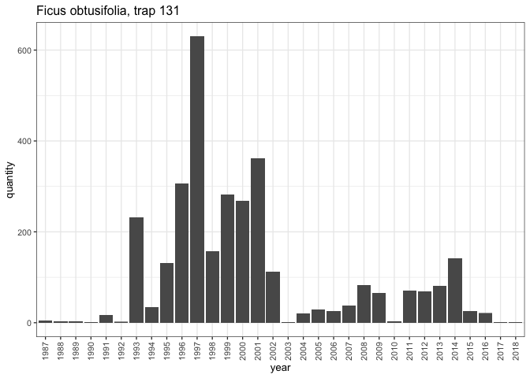
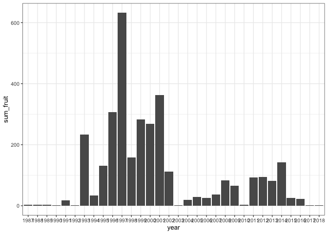
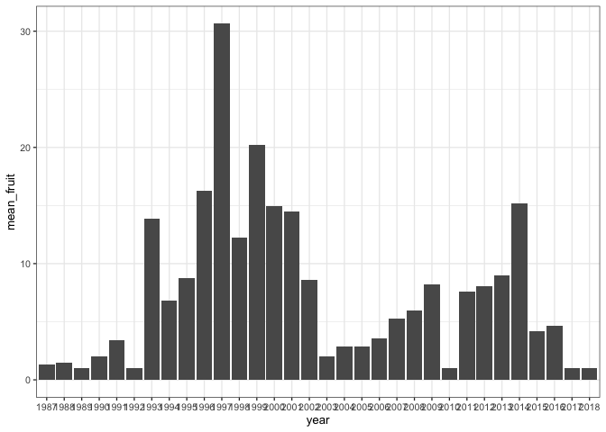
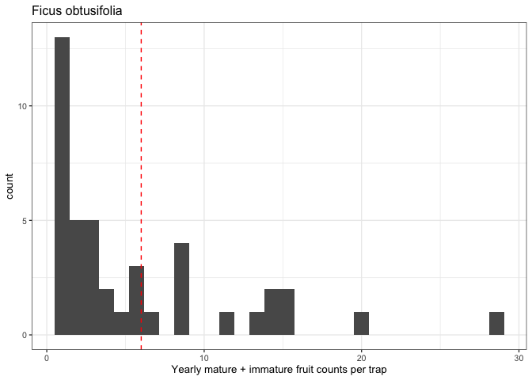

Ficus
================
Eleanor Jackson
25 July, 2024

Sofia:

I wondered whether I could ask you for a favour (sorry!):

Together with Liz Shaw (soil ecologist at the School of Geography) we
are planning to conduct a little lab-based pilot study on the effects of
fruit drop (immature or mature fruits) on soil processes. Strangely
enough, it seems like this is something that hasn’t really been looked
into. Zoe (cc:d) has kindly agreed to help out with this as part of her
current post with us. The idea is to place some soil in pots, add fruits
on top to a subset of the pots (three treatment levels: high fruit
density, low/medium fruit density, and no fruits) and measure what
happens in the soil at different time points (soil respiration, plant
available nutrients). We are planning on using figs as our focal
species.

It occurred to me that it would be nice to use Joe’s trap data to inform
treatment levels. I don’t have access to those, but wondered whether you
might be able to check Ficus species for :

1.  max yearly fruit count observed in any individual trap throughout
    the ~30 year study period (and which fig species that was), and
2.  for that particular fig species, the mean number of yearly fruit
    counts observed in ‘occupied’ traps (i.e. excluding traps with no
    fruits) throughout the 30 year study period. With a little bit of
    luck, some traps will have been located under fruiting figs…

``` r
library("tidyverse"); theme_set(theme_bw(base_size=10))
library("patchwork")
library("here")
```

``` r
read.table(
  here::here("data", "raw", "BCI_TRAP200_20190215_spcorrected.txt"),
  header = TRUE,
  stringsAsFactors = FALSE
) %>%
  mutate(fecha = as.character(fecha)) %>%
  mutate(fecha = as.Date(fecha, "%Y-%m-%d"),
         year = format(as.Date(fecha), "%Y"),
         sp = tolower(sp),
         trap = formatC(
           trap,
           width = 3,
           format = "d",
           flag = "0"
         )) %>%
  mutate(trap = paste("trap", trap, sep = "_")) %>%
  left_join(read_csv(here::here("data", "clean", "sp_data.csv")), by = c("sp" = "sp4")) %>% 
  filter(genus == "Ficus") %>% 
  filter( part == 1 | part == 5)-> figs
```

    ## Rows: 465 Columns: 12
    ## ── Column specification ────────────────────────────────────────────────────────
    ## Delimiter: ","
    ## chr (5): sp4, sp6, family, genus, species
    ## dbl (4): capsules_per_fruit, dmax, r50, max_n_reproductive
    ## lgl (3): capsules, animal_disp, dioecious
    ## 
    ## ℹ Use `spec()` to retrieve the full column specification for this data.
    ## ℹ Specify the column types or set `show_col_types = FALSE` to quiet this message.

``` r
glimpse(figs)
```

    ## Rows: 600
    ## Columns: 19
    ## $ sp                 <chr> "fici", "fici", "fici", "fici", "fiin", "fiin", "fi…
    ## $ fecha              <date> 1994-09-12, 2011-12-28, 2002-06-06, 1998-08-31, 20…
    ## $ census             <int> 401, 1303, 804, 608, 713, 199, 1380, 20, 81, 175, 3…
    ## $ trap               <chr> "trap_090", "trap_339", "trap_172", "trap_182", "tr…
    ## $ part               <int> 1, 1, 5, 1, 1, 1, 5, 1, 1, 1, 5, 1, 5, 1, 1, 1, 1, …
    ## $ quantity           <dbl> 1, 1, 3, 1, 1, 1, 6, 1, 1, 1, 1, 2, 8, 1, 1, 1, 1, …
    ## $ mass               <dbl> -9, -9, -9, -9, -9, -9, -9, -9, -9, -9, -9, -9, -9,…
    ## $ year               <chr> "1994", "2011", "2002", "1998", "2000", "1990", "20…
    ## $ sp6                <chr> "ficuci", "ficuci", "ficuci", "ficuci", "ficuin", "…
    ## $ family             <chr> "Moraceae", "Moraceae", "Moraceae", "Moraceae", "Mo…
    ## $ genus              <chr> "Ficus", "Ficus", "Ficus", "Ficus", "Ficus", "Ficus…
    ## $ species            <chr> "citrifolia", "citrifolia", "citrifolia", "citrifol…
    ## $ capsules           <lgl> NA, NA, NA, NA, NA, NA, NA, NA, NA, NA, NA, NA, NA,…
    ## $ capsules_per_fruit <dbl> NA, NA, NA, NA, NA, NA, NA, NA, NA, NA, NA, NA, NA,…
    ## $ animal_disp        <lgl> TRUE, TRUE, TRUE, TRUE, TRUE, TRUE, TRUE, TRUE, TRU…
    ## $ dioecious          <lgl> FALSE, FALSE, FALSE, FALSE, FALSE, FALSE, FALSE, FA…
    ## $ dmax               <dbl> 24.8000, 24.8000, 24.8000, 24.8000, 394.6667, 394.6…
    ## $ r50                <dbl> 12.4000, 12.4000, 12.4000, 12.4000, 197.3333, 197.3…
    ## $ max_n_reproductive <dbl> 3, 3, 3, 3, 3, 3, 3, 3, 3, 3, 3, 3, 3, 3, 3, 3, 3, …

``` r
figs %>% 
  group_by(sp, trap, year) %>% 
  summarise(sum_fruit = sum(quantity)) %>% 
  group_by(sp) %>% 
  summarise(max_fruit = max(sum_fruit))
```

    ## `summarise()` has grouped output by 'sp', 'trap'. You can override using the
    ## `.groups` argument.

    ## # A tibble: 7 × 2
    ##   sp    max_fruit
    ##   <chr>     <dbl>
    ## 1 fici          3
    ## 2 fiin         25
    ## 3 fiob         26
    ## 4 fipo          8
    ## 5 fito          2
    ## 6 fitr          6
    ## 7 fiyo        630

``` r
read_csv(here::here("data", "clean", "sp_data.csv")) %>% 
           filter(sp4 == "fiyo")
```

    ## Rows: 465 Columns: 12
    ## ── Column specification ────────────────────────────────────────────────────────
    ## Delimiter: ","
    ## chr (5): sp4, sp6, family, genus, species
    ## dbl (4): capsules_per_fruit, dmax, r50, max_n_reproductive
    ## lgl (3): capsules, animal_disp, dioecious
    ## 
    ## ℹ Use `spec()` to retrieve the full column specification for this data.
    ## ℹ Specify the column types or set `show_col_types = FALSE` to quiet this message.

    ## # A tibble: 1 × 12
    ##   sp4   sp6    family   genus species    capsules capsules_per_fruit animal_disp
    ##   <chr> <chr>  <chr>    <chr> <chr>      <lgl>                 <dbl> <lgl>      
    ## 1 fiyo  ficuyo Moraceae Ficus yoponensis NA                       NA TRUE       
    ## # ℹ 4 more variables: dioecious <lgl>, dmax <dbl>, r50 <dbl>,
    ## #   max_n_reproductive <dbl>

``` r
figs %>% 
  filter(sp == "fiyo" & trap == "trap_131") %>% 
  ggplot(aes(x = year, y = quantity)) +
  geom_col() +
  ggtitle("Ficus obtusifolia, trap 131") +
  scale_x_discrete(guide = guide_axis(angle = 90)) 
```

<!-- -->

The max yearly fruit count observed in any individual trap was 630, and
it was for Ficus obtusifolia.

``` r
figs %>% 
  filter(sp == "fiyo") %>% 
  group_by(year) %>% 
  summarise(sum_fruit = sum(quantity)) %>% 
  ggplot(aes(x = year, y = sum_fruit)) +
  geom_col()
```

<!-- -->

``` r
figs %>% 
  filter(sp == "fiyo") %>% 
  group_by(year, trap) %>% 
  summarise(mean_fruit = mean(quantity)) %>% 
  ggplot(aes(x = year, y = mean_fruit)) +
  geom_col()
```

    ## `summarise()` has grouped output by 'year'. You can override using the
    ## `.groups` argument.

<!-- -->

``` r
figs %>% 
  filter(sp == "fiyo") %>% 
  group_by(year, trap) %>% 
  summarise(sum_fruit = mean(quantity)) %>%
  filter(sum_fruit > 0) %>% 
  ggplot(aes(x = sum_fruit)) +
  geom_histogram() +
  ggtitle("Ficus obtusifolia") +
  xlab("Yearly mature + immature fruit counts per trap") +
  geom_vline(xintercept = 6, linetype = 2, colour = "red")
```

    ## `summarise()` has grouped output by 'year'. You can override using the
    ## `.groups` argument.
    ## `stat_bin()` using `bins = 30`. Pick better value with `binwidth`.

<!-- -->

``` r
figs %>% 
  filter(sp == "fiyo") %>% 
  group_by(year, trap) %>% 
  summarise(sum_fruit = mean(quantity)) %>%
  ungroup() %>% 
  filter(sum_fruit > 0) %>% 
  summarise(mean_fruit = mean(sum_fruit))
```

    ## `summarise()` has grouped output by 'year'. You can override using the
    ## `.groups` argument.

    ## # A tibble: 1 × 1
    ##   mean_fruit
    ##        <dbl>
    ## 1       5.70
