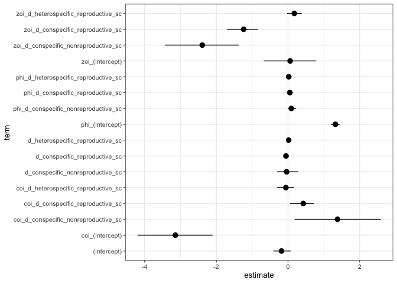
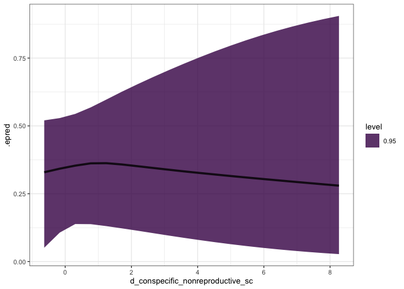
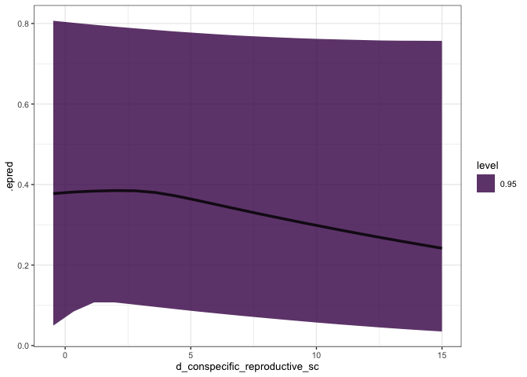
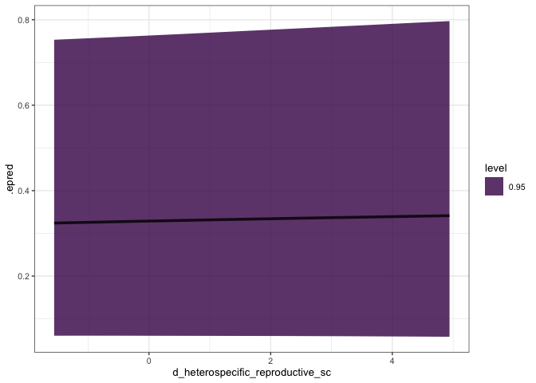
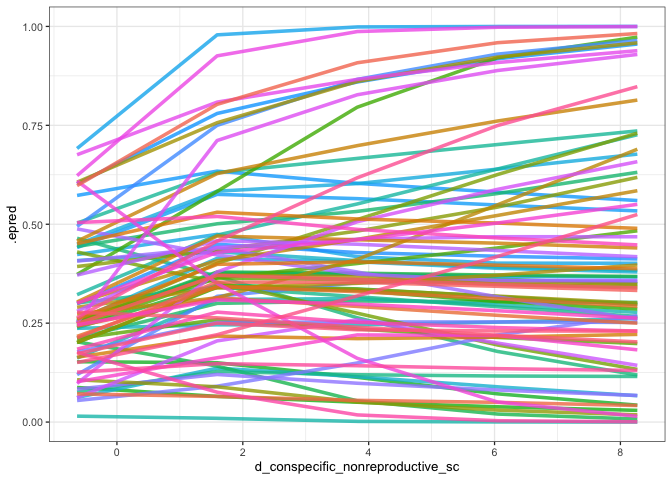
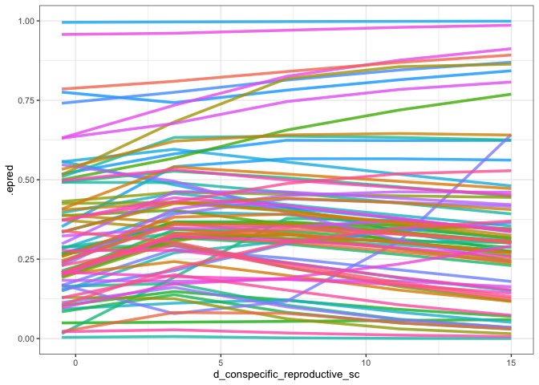
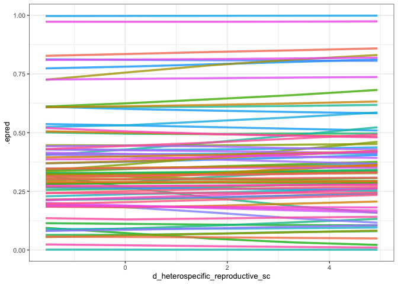

3 density model
================
Eleanor Jackson
06 June, 2025

``` r
library("tidyverse"); theme_set(theme_bw(base_size = 10))
library("patchwork")
library("here")
library("tidybayes")
```

This model has all three density indices as predictors. Dioecious
species were included in the dataset.

``` r
model <-
  readRDS(here::here("output", "models", 
                     "all_dens_20m.rds"))

formula(model)
```

    ## proportion_abscised ~ d_conspecific_nonreproductive_sc + d_conspecific_reproductive_sc + d_heterospecific_reproductive_sc + (1 | quadrat/trap) + (1 | year) + (1 + d_conspecific_nonreproductive_sc + d_conspecific_reproductive_sc + d_heterospecific_reproductive_sc | sp4) 
    ## phi ~ d_conspecific_nonreproductive_sc + d_conspecific_reproductive_sc + d_heterospecific_reproductive_sc + (1 | quadrat/trap) + (1 | year) + (1 + d_conspecific_nonreproductive_sc + d_conspecific_reproductive_sc + d_heterospecific_reproductive_sc | sp4)
    ## zoi ~ d_conspecific_nonreproductive_sc + d_conspecific_reproductive_sc + d_heterospecific_reproductive_sc + (1 | quadrat/trap) + (1 | year) + (1 + d_conspecific_nonreproductive_sc + d_conspecific_reproductive_sc + d_heterospecific_reproductive_sc | sp4)
    ## coi ~ d_conspecific_nonreproductive_sc + d_conspecific_reproductive_sc + d_heterospecific_reproductive_sc + (1 | quadrat/trap) + (1 | year) + (1 + d_conspecific_nonreproductive_sc + d_conspecific_reproductive_sc + d_heterospecific_reproductive_sc | sp4)

## Parameter estimates

``` r
broom.mixed::tidy(model) %>% 
  filter(effect == "fixed") %>% 
  ggplot(aes(y = term, x = estimate,
             xmin = conf.low,
             xmax = conf.high)) +
  geom_pointrange() 
```

    ## Warning in tidy.brmsfit(model): some parameter names contain underscores: term
    ## naming may be unreliable!

<!-- -->

## Posterior predictions

Get the data

``` r
consp_nonrepro <-
  readRDS(here::here("data", "clean", "trap_connect_nonrepro_consp_20m.rds"))

consp_repro <-
  readRDS(here::here("data", "clean", "trap_connect_repro_consp_20m.rds"))

hetero_repro <-
  readRDS(here::here("data", "clean", "trap_connect_repro_hetero_20m.rds"))

# combine
# there are some NAs for connectivity - this is when there are no trees
# of that category in the plot in that year, so replace with zero
# only happens for sp4 attb and tri6
trap_connect <-
  consp_nonrepro %>%
  rename(d_conspecific_nonreproductive = connectivity) %>%
  full_join(consp_repro) %>%
  rename(d_conspecific_reproductive = connectivity) %>%
  full_join(hetero_repro) %>%
  rename(d_heterospecific_reproductive = connectivity) %>%
  mutate(across(contains("d_"), ~ replace_na(., 0)))
```

    ## Joining with `by = join_by(year, sp4, trap, capsules, abscised_seeds,
    ## viable_seeds, total_seeds, proportion_abscised, sum_parts, quadrat, x, y)`
    ## Joining with `by = join_by(year, sp4, trap, capsules, abscised_seeds,
    ## viable_seeds, total_seeds, proportion_abscised, sum_parts, quadrat, x, y)`

``` r
# don't include traps < 20m from the edge of the plot
# centre and scale connectivity
test_data <-
  trap_connect %>%
  filter(x < 980 & x > 20) %>%
  filter(y < 480 & y > 20) %>%
  select(- x, - y, - capsules) %>%
  transform(d_conspecific_nonreproductive_sc =
              scale(d_conspecific_nonreproductive)) %>%
  transform(d_conspecific_reproductive_sc =
              scale(d_conspecific_reproductive)) %>%
  transform(d_heterospecific_reproductive_sc =
              scale(d_heterospecific_reproductive)) %>%
  filter(sum_parts >= 3) %>% # do we need to do this?
  mutate_at(c("sp4", "year", "trap", "quadrat"), ~as.factor(.))
```

Make the predictions

``` r
preds <- 
  test_data %>%
  modelr::data_grid(
    d_conspecific_nonreproductive_sc =
      modelr::seq_range(d_conspecific_nonreproductive_sc, n = 20),
    d_conspecific_reproductive_sc =
      modelr::seq_range(d_conspecific_reproductive_sc, n = 20),
    d_heterospecific_reproductive_sc =
      modelr::seq_range(d_heterospecific_reproductive_sc, n = 20),
                    .model = model
  ) %>%
  tidybayes::add_epred_draws(model, re_formula = NA) 
```

Plot

``` r
preds %>% 
  ggplot(aes(y = .epred, x = d_conspecific_nonreproductive_sc)) +
  stat_lineribbon(.width = 0.95, alpha = 0.8) 
```

<!-- -->

``` r
preds %>% 
  ggplot(aes(y = .epred, x = d_conspecific_reproductive_sc)) +
  stat_lineribbon(.width = 0.95, alpha = 0.8)  
```

<!-- -->

``` r
preds %>% 
  ggplot(aes(y = .epred, x = d_heterospecific_reproductive_sc)) +
  stat_lineribbon(.width = 0.95, alpha = 0.8) 
```

<!-- -->

Species-level predictions

``` r
preds_sp <- 
  test_data %>%
  modelr::data_grid(
    d_conspecific_nonreproductive_sc =
      modelr::seq_range(d_conspecific_nonreproductive_sc, n = 5),
    d_conspecific_reproductive_sc =
      modelr::seq_range(d_conspecific_reproductive_sc, n = 5),
    d_heterospecific_reproductive_sc =
      modelr::seq_range(d_heterospecific_reproductive_sc, n = 5),
    sp4 = unique(test_data$sp4),
                    .model = model
  ) %>%
  tidybayes::add_epred_draws(model, 
                             re_formula = 
                               ~ (1 + 
                                    d_conspecific_nonreproductive_sc +
                                    d_conspecific_reproductive_sc +
                                    d_heterospecific_reproductive_sc | sp4)) 
```

``` r
preds_sp %>% 
  ggplot(aes(y = .epred, x = d_conspecific_nonreproductive_sc,
             colour = sp4)) +
  stat_lineribbon(.width = 0, alpha = 0.8) +
  theme(legend.position = "none")
```

<!-- -->

``` r
preds_sp %>% 
  ggplot(aes(y = .epred, x = d_conspecific_reproductive_sc,
             colour = sp4)) +
  stat_lineribbon(.width = 0, alpha = 0.8) +
  theme(legend.position = "none")
```

<!-- -->

``` r
preds_sp %>% 
  ggplot(aes(y = .epred, x = d_heterospecific_reproductive_sc,
             colour = sp4)) +
  stat_lineribbon(.width = 0, alpha = 0.8) +
  theme(legend.position = "none")
```

<!-- -->
