Species abundance
================
Eleanor Jackson
19 June, 2025

``` r
library("tidyverse"); theme_set(theme_bw(base_size = 10))
library("patchwork")
library("here")
library("marginaleffects")
library("tidybayes")
library("ggfortify")
```

``` r
tree_data <- 
  readRDS(here::here("data", "clean", "tree_data.rds")) %>% 
  filter(year %in% c("1990", "1995", "2000", "2005", "2010",
                     "2010", "2015", "2022"))

trap_data <- readRDS(here::here("data", "clean", "trap_data.rds"))


monoecious_species <-
  read.csv(here::here("data", "clean", "species_list.csv")) %>%
  filter(dioecious != TRUE)

# only keep species which appear in both datasets
shared_sp <-
  trap_data %>%
  select(sp4) %>%
  distinct() %>%
  inner_join(
    y = tree_data %>%
      select(sp4) %>%
      distinct()
  ) %>%
  filter(sp4 %in% monoecious_species$sp4) # drops 21 dioecious species
```

    ## Joining with `by = join_by(sp4)`

``` r
tree_data <-
  tree_data %>%
  filter(sp4 %in% shared_sp$sp4)
```

``` r
tree_data %>% 
  group_by(year, sp4, genus, species) %>% 
  summarise(abundance = sum(basal_area_m2, na.rm = TRUE)) %>% 
  ggplot(aes(x = as.factor(year), y = abundance )) +
  geom_point() +
  facet_wrap(~sp4, scales = "free_y")
```

    ## `summarise()` has grouped output by 'year', 'sp4', 'genus'. You can override
    ## using the `.groups` argument.

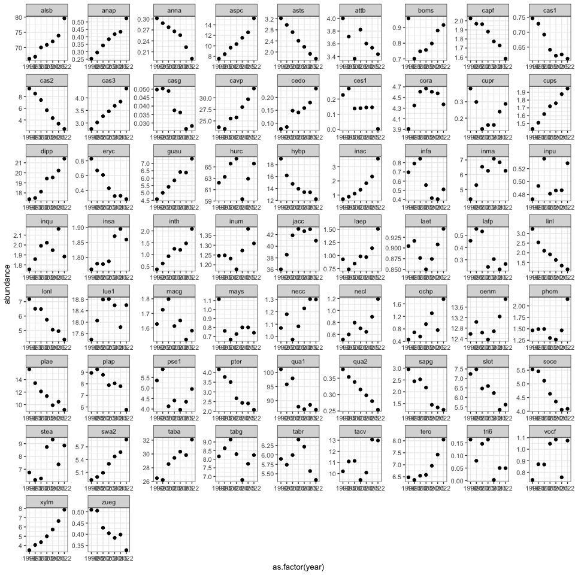<!-- -->

Abundance changes quite a lot..

``` r
tree_data %>% 
  group_by(year, sp4, genus, species) %>% 
  summarise(abundance = sum(basal_area_m2, na.rm = TRUE)) %>% 
  ggplot(aes(y = sp4, x = abundance )) +
  geom_boxplot() 
```

    ## `summarise()` has grouped output by 'year', 'sp4', 'genus'. You can override
    ## using the `.groups` argument.

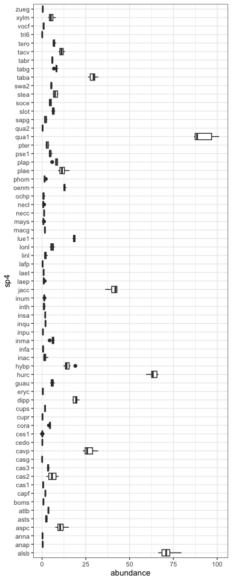<!-- -->

Could either use median across years studied, or get a year x species
prediction of density effect on fruit drop?

``` r
tree_data %>% 
  group_by(year, sp4, genus, species) %>% 
  summarise(abundance = sum(basal_area_m2, na.rm = TRUE)) %>% 
  group_by(sp4, genus, species) %>% 
  summarise(median_abundance = median(abundance, na.rm = TRUE),
            mean_abundance = mean(abundance, na.rm = TRUE)) %>% 
  ggplot(aes(y = sp4)) +
  geom_point(aes( x = median_abundance ), colour = "red") +
  geom_point(aes( x = mean_abundance ))
```

    ## `summarise()` has grouped output by 'year', 'sp4', 'genus'. You can override
    ## using the `.groups` argument.
    ## `summarise()` has grouped output by 'sp4', 'genus'. You can override using the
    ## `.groups` argument.

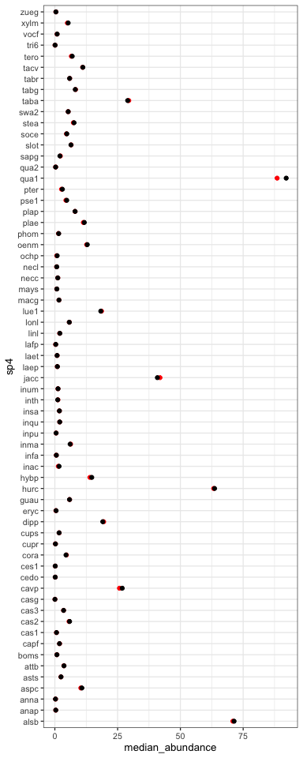<!-- -->

Medians and means are v similar

``` r
model <-
  readRDS(here::here("output", "models", 
                     "repro_consp_20m.rds"))

model_h <-
  readRDS(here::here("output", "models", 
                     "repro_hetero_20m.rds"))
```

``` r
consp_repro <-
  readRDS(here::here("data", "clean", "trap_connect_repro_consp_20m.rds"))

# don't include traps < 20m from the edge of the plot
# centre and scale connectivity
test_data <-
  consp_repro %>%
  filter(x < 980 & x > 20) %>%
  filter(y < 480 & y > 20) %>%
  select(- x, - y, - capsules) %>%
  transform(connectivity_sc =
              scale(connectivity)) %>%
  filter(sum_parts >= 3) %>% # do we need to do this?
  mutate_at(c("sp4", "year", "trap", "quadrat"), ~as.factor(.))
```

``` r
# brms::parnames(model)
abun <- 
  tree_data %>% 
  group_by(year, sp4, genus, species) %>% 
  summarise(abundance = sum(basal_area_m2, na.rm = TRUE)) %>% 
  group_by(sp4, genus, species) %>% 
  summarise(median_abundance = median(abundance, na.rm = TRUE),
            mean_abundance = mean(abundance, na.rm = TRUE),
            max_abundance = max(abundance, na.rm = TRUE))
```

    ## `summarise()` has grouped output by 'year', 'sp4', 'genus'. You can override
    ## using the `.groups` argument.
    ## `summarise()` has grouped output by 'sp4', 'genus'. You can override using the
    ## `.groups` argument.

## Conspecific effect

``` r
sp_ests <- 
  broom.mixed::tidy(model, effects = "ran_vals") %>% 
  rowwise() %>% 
  mutate(rand_group = pluck(strsplit(group,"_"), 1, 1)) %>% 
  filter(rand_group == "sp4")
```

    ## Warning in tidy.brmsfit(model, effects = "ran_vals"): some parameter names
    ## contain underscores: term naming may be unreliable!

``` r
sp_ests %>%
  rowwise() %>% 
  filter(! str_detect("Intercept", term)) %>% 
  left_join(abun, by = c("level" = "sp4")) %>% 
  ggplot(aes(x= log(median_abundance), y = estimate,
             ymin = conf.low , ymax=conf.high)) +
  geom_pointinterval() +
  geom_hline(yintercept = 0, 
             colour = "red", 
             linetype = 2) +
  geom_smooth(method = "lm") +
  facet_wrap(~group, scales = "free") +
  ggtitle("Slopes")
```

    ## `geom_smooth()` using formula = 'y ~ x'

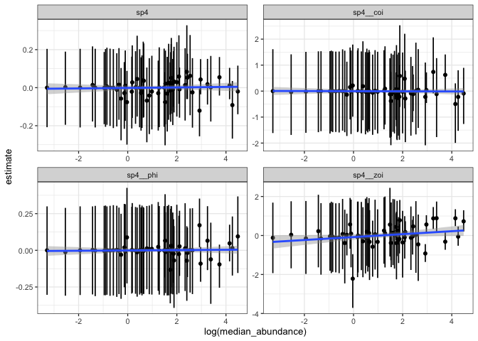<!-- -->

``` r
sp_ests %>%
  rowwise() %>% 
  filter(str_detect("Intercept", term)) %>% 
  left_join(abun, by = c("level" = "sp4")) %>% 
  ggplot(aes(x= log(median_abundance), y = estimate,
             ymin = conf.low , ymax=conf.high)) +
  geom_pointinterval() +
  geom_hline(yintercept = 0, 
             colour = "red", 
             linetype = 2) +
  geom_smooth(method = "lm") +
  facet_wrap(~group, scales = "free") +
  ggtitle("Intercepts")
```

    ## `geom_smooth()` using formula = 'y ~ x'

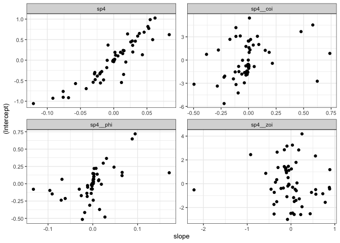<!-- -->

``` r
sp_ests %>%
  rowwise() %>% 
  select(estimate, level, group, term) %>% 
  pivot_wider(names_from = term,
              values_from = estimate) %>% 
  rename("slope" = "connectivity_sc") %>% 
  left_join(abun, by = c("level" = "sp4")) %>% 
  ggplot(aes(x = slope, y = `(Intercept)`, colour = log(median_abundance))) +
  geom_point() +
  facet_wrap(~group, scales = "free") +
  scale_colour_viridis_c() 
```

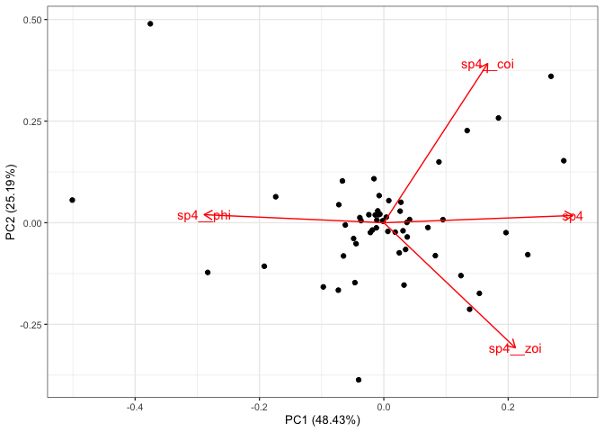<!-- -->

``` r
sp_ests %>% 
  filter(! str_detect("Intercept", term)) %>% 
  select(estimate, group, level) %>% 
  pivot_wider(names_from = group,
              values_from = estimate,
              id_cols = level) %>% 
  column_to_rownames("level") -> cca_dat

pca_p <- 
  prcomp(
  x = cca_dat,
  scale. = TRUE,
  center = TRUE
)

autoplot(pca_p,
         loadings = TRUE, 
         loadings.label = TRUE)
```

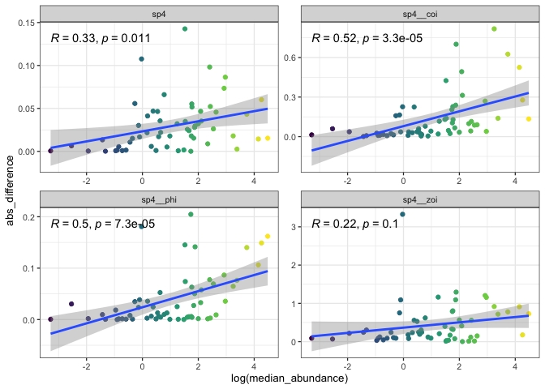<!-- -->

``` r
fortify(pca_p) %>% 
  rownames_to_column(var = "species_id") %>% 
  left_join(abun, by = c("species_id" = "sp4")) %>% 
  ggplot(aes(x = PC1, y = PC2, colour = log(median_abundance)))+
  geom_point()+
  scale_colour_viridis_c() 
```

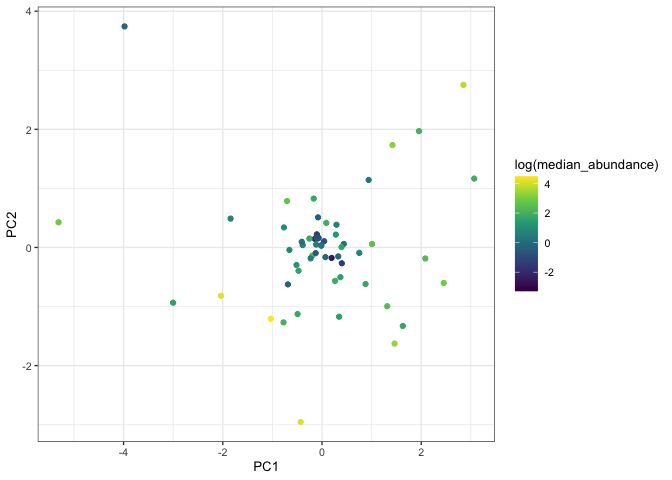<!-- -->

## Difference between conspecific and heterospecific effect

``` r
sp_ests_h <- 
  broom.mixed::tidy(model_h, effects = "ran_vals") %>% 
  rowwise() %>% 
  mutate(rand_group = pluck(strsplit(group,"_"), 1, 1)) %>% 
  filter(rand_group == "sp4")
```

    ## Warning in tidy.brmsfit(model_h, effects = "ran_vals"): some parameter names
    ## contain underscores: term naming may be unreliable!

``` r
est_diff <- 
  bind_rows(list("conspecific" = sp_ests, "heterospecific" = sp_ests_h),
          .id = "density") %>% 
  select(term, level, density, estimate, group) %>% 
  pivot_wider(values_from = estimate, names_from = density) %>% 
  mutate(abs_difference = abs(conspecific - heterospecific),
         difference = conspecific - heterospecific)
```

``` r
est_diff %>%
  rowwise() %>% 
  filter(! str_detect("Intercept", term)) %>% 
  left_join(abun, by = c("level" = "sp4")) %>% 
  ggplot(aes(x= log(median_abundance), y = difference)) +
  geom_point(aes(colour = log(median_abundance))) +
  geom_hline(yintercept = 0, 
             colour = "red", 
             linetype = 2) +
  geom_smooth(method = "lm") +
  facet_wrap(~group, scales = "free") +
  scale_colour_viridis_c() +
  theme(legend.position = "none") + 
  ggpubr::stat_cor(label.x.npc = "left", label.y.npc = "top") 
```

    ## `geom_smooth()` using formula = 'y ~ x'

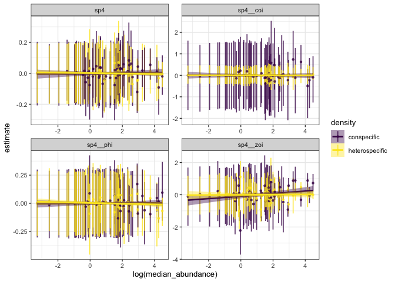<!-- -->

More of a difference between effect of conspecifics & effect of
heterospecifics when abundance is high?

Is this just because we have more data for species which are more
abundant, so species with little data get estimates close to prior for
the effect of conspecifics and heterospecifics = little difference in
effect?

``` r
est_diff %>% 
  filter(! str_detect("Intercept", term)) %>%
  # mutate(group = paste(group, term)) %>% 
  select(difference, group, level) %>% 
  pivot_wider(names_from = group,
              values_from = difference,
              id_cols = level) %>% 
  column_to_rownames("level") -> cca_dat

pca_p <- 
  prcomp(
  x = cca_dat,
  scale. = TRUE,
  center = TRUE
)

autoplot(pca_p,
         loadings = TRUE, 
         loadings.label = TRUE)
```

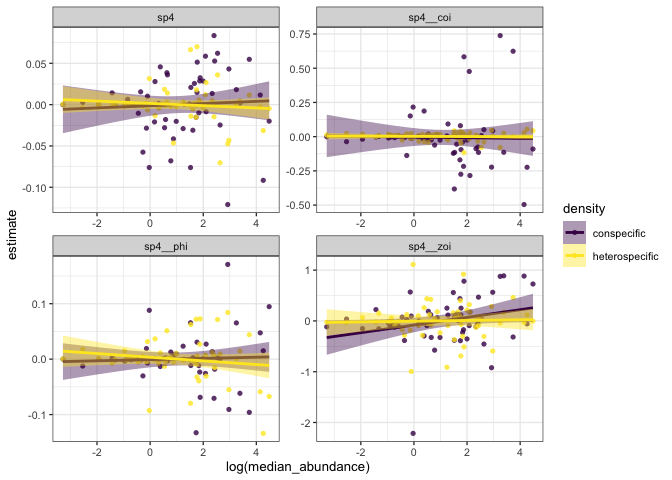<!-- -->

``` r
fortify(pca_p) %>% 
  rownames_to_column(var = "species_id") %>% 
  left_join(abun, by = c("species_id" = "sp4")) %>% 
  ggplot(aes(x = PC1, y = PC2, colour = log(median_abundance)))+
  geom_point()+
  scale_colour_viridis_c() 
```

<!-- -->

``` r
preds_sp <- 
  test_data %>%
  modelr::data_grid(
    connectivity_sc =
      modelr::seq_range(connectivity_sc, n = 5),
    sp4 = unique(test_data$sp4),
                    .model = model
  ) %>%
  tidybayes::add_epred_draws(model, 
                             re_formula = 
                               ~ (1 + 
                                    connectivity_sc | sp4)) 
```

``` r
preds_sp %>% 
  left_join(abun)%>%
  ggplot(aes(y = .epred, x = connectivity_sc,
             colour = log(median_abundance), group = sp4)) +
  stat_lineribbon(.width = 0) +
  scale_colour_viridis_c()
```

    ## Joining with `by = join_by(sp4)`

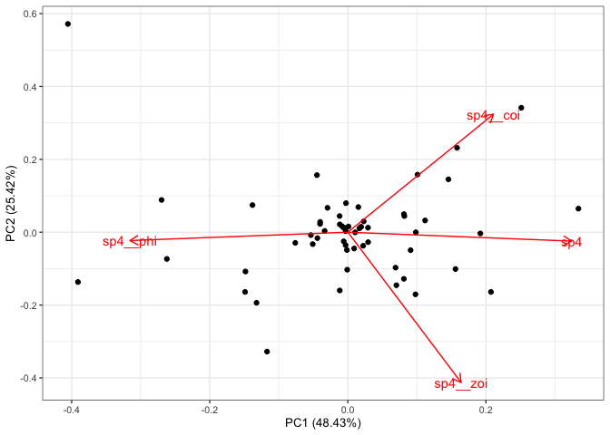<!-- -->
