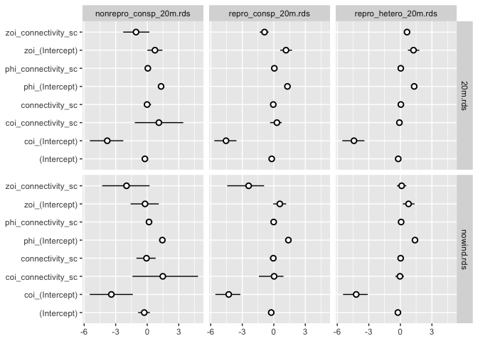
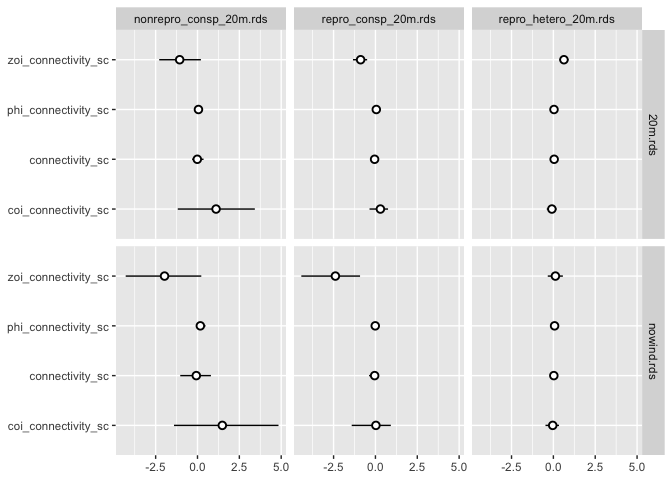
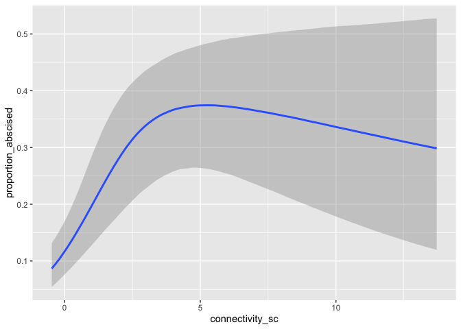
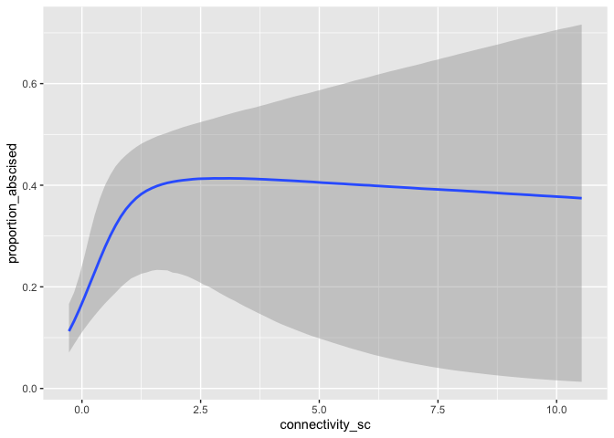
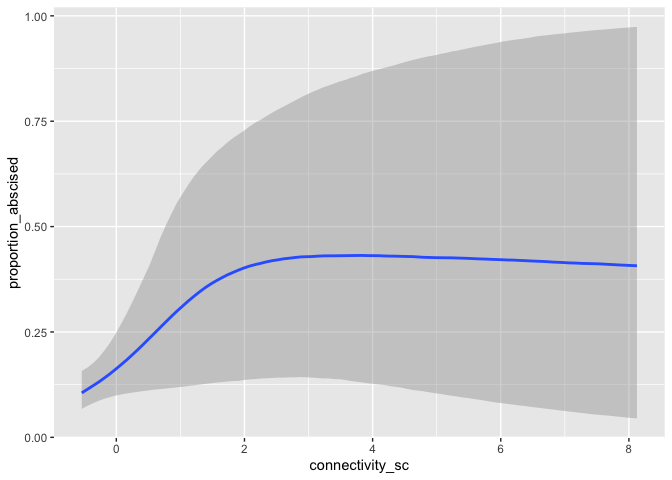
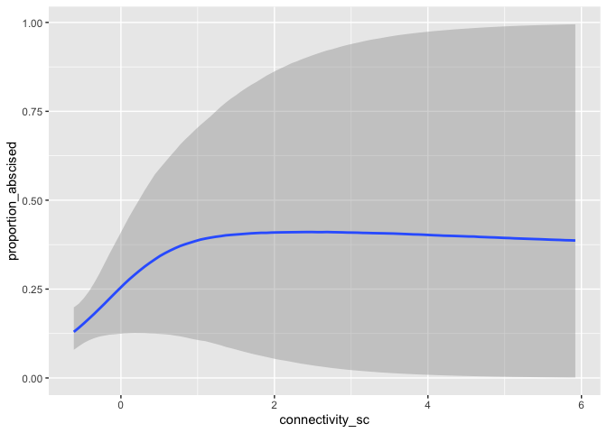
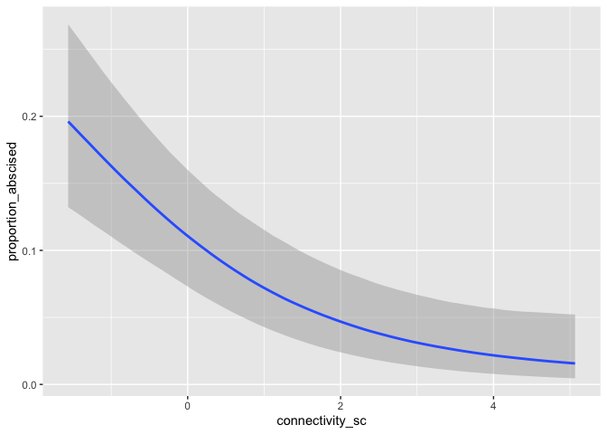
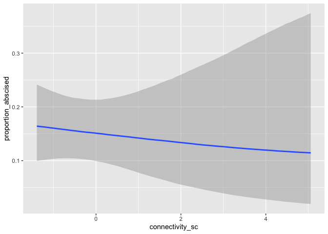

Species abundance
================
Eleanor Jackson
17 June, 2025

``` r
library("tidyverse")
library("here")
library("patchwork")
library("brms")
library("broom.mixed")
```

Looking at models where the data did not include wind dispersed species.

``` r
file_names <- as.list(dir(path = here::here("output", "models"),
                          full.names = TRUE))

model_list <- map(file_names[-1], readRDS, environment())

names(model_list) <- lapply(file_names[-1], basename)
```

``` r
my_coef_tab <-
  tibble(fit = model_list,
         model = names(model_list)) %>%
  mutate(tidy = purrr::map(
    fit,
    tidy,
    effects = "fixed"
  )) %>%
  unnest(tidy)
```

    ## Warning: There were 6 warnings in `mutate()`.
    ## The first warning was:
    ## ℹ In argument: `tidy = purrr::map(fit, tidy, effects = "fixed")`.
    ## Caused by warning in `tidy.brmsfit()`:
    ## ! some parameter names contain underscores: term naming may be unreliable!
    ## ℹ Run `dplyr::last_dplyr_warnings()` to see the 5 remaining warnings.

``` r
my_coef_tab %>% 
  rowwise() %>% 
  mutate(wind = pluck(strsplit(model,"_"), 1, -1)) %>% 
  mutate(model = str_remove(model, "_nowind")) %>% 
  ggplot(aes(x = term, 
             y = estimate, 
             ymin = conf.low, ymax = conf.high)) +
  geom_pointrange(shape = 21, fill = "white") +
  labs(x = NULL,
       y = NULL) +
  coord_flip() +
  facet_grid(wind~model) 
```

<!-- -->

Removing wind dispersed species doesn’t change the parameter estimates
much?

``` r
my_coef_tab %>% 
  filter(! str_detect(term, "Intercept")) %>% 
  rowwise() %>% 
  mutate(wind = pluck(strsplit(model,"_"), 1, -1)) %>% 
  mutate(model = str_remove(model, "_nowind")) %>% 
  ggplot(aes(x = term, 
             y = estimate, 
             ymin = conf.low, ymax = conf.high)) +
  geom_pointrange(shape = 21, fill = "white") +
  labs(x = NULL,
       y = NULL) +
  coord_flip() +
  facet_grid(wind~model) 
```

<!-- -->

Biggest difference seen for zoi - The zero or one inflation

``` r
conditional_effects(model_list$repro_consp_20m.rds) 
```

<!-- -->

``` r
conditional_effects(model_list$repro_consp_20m_nowind.rds)
```

<!-- -->

``` r
conditional_effects(model_list$nonrepro_consp_20m.rds) 
```

<!-- -->

``` r
conditional_effects(model_list$nonrepro_consp_20m_nowind.rds)
```

<!-- -->

``` r
conditional_effects(model_list$repro_hetero_20m.rds)
```

<!-- -->

``` r
conditional_effects(model_list$repro_hetero_20m_nowind.rds)
```

<!-- -->
