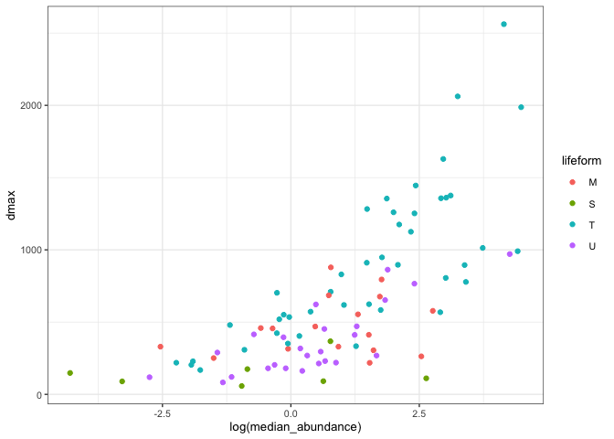
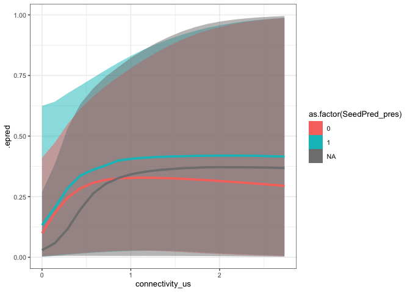

Abundance ~ species size?
================
Eleanor Jackson
18 July, 2025

``` r
library("tidyverse"); theme_set(theme_bw(base_size = 10))
library("patchwork")
library("here")
library("tidybayes")
```

Sofia: \> BTW, do you think abundance will covary with tree size/growth
form? I suspect it will (large canopy trees would have much higher basal
area per individual)? I have been wondering if we might be more likely
to see stronger CNDD in smaller trees (understory trees) than canopy
trees, but if tree growth form and summed basal area covary then the
current results suggest that would not be the case.

``` r
R50 <- read.csv(here::here("data", "clean", "R50.csv"))
```

## Get abundance data

``` r
tree_data <- 
  readRDS(here::here("data", "clean", "tree_data.rds")) %>% 
  filter(year %in% c("1990", "1995", "2000", "2005", "2010",
                     "2010", "2015", "2022"))
```

``` r
# brms::parnames(model)
abun <- 
  tree_data %>% 
  group_by(year, sp4, sp6, genus, species) %>% 
  summarise(abundance_ba = sum(basal_area_m2, na.rm = TRUE),
            abundance_n = n_distinct(tree)) %>% 
  group_by(sp4, sp6, genus, species) %>% 
  summarise(median_abundance_ba = median(abundance_ba, na.rm = TRUE),
            median_abundance_n = median(abundance_n, na.rm = TRUE))
```

    ## `summarise()` has grouped output by 'year', 'sp4', 'sp6', 'genus'. You can
    ## override using the `.groups` argument.
    ## `summarise()` has grouped output by 'sp4', 'sp6', 'genus'. You can override
    ## using the `.groups` argument.

``` r
abun %>% 
  inner_join(R50) %>% 
  left_join(read_csv(here::here("data", "clean", "species_list.csv"))) %>% 
  ggplot(aes(x = log(median_abundance_ba), y = dmax,
             colour = lifeform)) +
  geom_point()  +
  
  abun %>% 
  inner_join(R50) %>% 
  left_join(read_csv(here::here("data", "clean", "species_list.csv"))) %>% 
  ggplot(aes(x = log(median_abundance_n), y = dmax,
             colour = lifeform)) +
  geom_point() +
  
  plot_layout(guides = "collect")
```

    ## Joining with `by = join_by(sp6)`
    ## Rows: 103 Columns: 19
    ## ── Column specification
    ## ──────────────────────────────────────────────────────── Delimiter: "," chr
    ## (6): sp4, sp6, species, lifeform, family, genus dbl (2): seeds_per_fruit,
    ## capsules_per_fruit lgl (11): capsules, dsp_ant, dsp_bat, dsp_bird, dsp_bbird,
    ## dsp_explo, dsp_ma...
    ## ℹ Use `spec()` to retrieve the full column specification for this data. ℹ
    ## Specify the column types or set `show_col_types = FALSE` to quiet this message.
    ## Joining with `by = join_by(sp4, sp6, genus, species)`
    ## Joining with `by = join_by(sp6)`
    ## Rows: 103 Columns: 19
    ## ── Column specification
    ## ──────────────────────────────────────────────────────── Delimiter: "," chr
    ## (6): sp4, sp6, species, lifeform, family, genus dbl (2): seeds_per_fruit,
    ## capsules_per_fruit lgl (11): capsules, dsp_ant, dsp_bat, dsp_bird, dsp_bbird,
    ## dsp_explo, dsp_ma...
    ## ℹ Use `spec()` to retrieve the full column specification for this data. ℹ
    ## Specify the column types or set `show_col_types = FALSE` to quiet this message.
    ## Joining with `by = join_by(sp4, sp6, genus, species)`

<!-- -->

> If we were to do something on growth form (which isn’t necessarily a
> good idea!), my thinking was something similar to what you did for the
> three abundance categories (but instead using the four growth form
> categories (M, S, T and U). The prediction would be to find more of a
> relationship between fruit drop and connectivity in S and U than in M
> and T?

``` r
data <- readRDS(here::here("data", "clean", "trap_connect_repro_consp_20m_dioecious.rds"))

model <- readRDS(here::here("output", "models", "repro_consp_20m_yesdioecious.rds"))

data %>%
  filter(x < 980 & x > 20) %>%
  filter(y < 480 & y > 20) %>%
  select(- x, - y, - capsules) %>%
  filter(sum_parts >= 3) %>%
  mutate(connectivity_sc = scale(connectivity)) %>%
  mutate(
         year = as.factor(year),
         trap = as.factor(trap)) -> testdat
```

``` r
testdat %>%
  modelr::data_grid(
    connectivity_sc = modelr::seq_range(connectivity_sc, n = 20),
    sp4 = unique(testdat$sp4)
  ) %>%
  add_epred_draws(model,
                  re_formula =
                    ~ (1 +
                         connectivity_sc | sp4)) %>%
  mutate(
    connectivity_us = connectivity_sc *
      attr(testdat$connectivity_sc, 'scaled:scale') +
      attr(testdat$connectivity_sc, 'scaled:center')
  ) -> preds
```

``` r
preds %>% 
  left_join(read_csv(here::here("data", "clean", "species_list.csv"))) %>% 
  ggplot(aes(x = connectivity_us, y = .epred, 
             color = lifeform, fill = lifeform)) +
  stat_lineribbon(.width = .95, alpha = 0.5) +
  stat_lineribbon(.width = 0, alpha = 1)
```

    ## Rows: 103 Columns: 19
    ## ── Column specification ────────────────────────────────────────────────────────
    ## Delimiter: ","
    ## chr  (6): sp4, sp6, species, lifeform, family, genus
    ## dbl  (2): seeds_per_fruit, capsules_per_fruit
    ## lgl (11): capsules, dsp_ant, dsp_bat, dsp_bird, dsp_bbird, dsp_explo, dsp_ma...
    ## 
    ## ℹ Use `spec()` to retrieve the full column specification for this data.
    ## ℹ Specify the column types or set `show_col_types = FALSE` to quiet this message.
    ## Joining with `by = join_by(sp4)`

<!-- -->

> One more thing: I think I suggested it could perhaps also be worth
> doing a similar analysis comparing species with/without known seed
> predators?

``` r
read_csv(here("data", "raw", "TidyTrait.csv")) %>% 
  mutate(sp4 = tolower(Codigo)) %>% 
  select(sp4, SeedPred_pres) %>% 
  right_join(preds) %>%
  ggplot(aes(x = connectivity_us, y = .epred, 
             colour = as.factor(SeedPred_pres), 
             fill = as.factor(SeedPred_pres))) +
  stat_lineribbon(.width = .95, alpha = 0.5) +
  stat_lineribbon(.width = 0, alpha = 1)
```

    ## New names:
    ## Rows: 479 Columns: 37
    ## ── Column specification
    ## ──────────────────────────────────────────────────────── Delimiter: "," chr
    ## (13): Codigo, Old_Plant_Species, Lifeform, Freestanding, Woody_or_nonwoo... dbl
    ## (24): ...1, TotUnits_collected, seed_dry, fruitrecord, cvseed, RGR_10, T...
    ## ℹ Use `spec()` to retrieve the full column specification for this data. ℹ
    ## Specify the column types or set `show_col_types = FALSE` to quiet this message.
    ## Joining with `by = join_by(sp4)`
    ## • `` -> `...1`

<!-- -->
