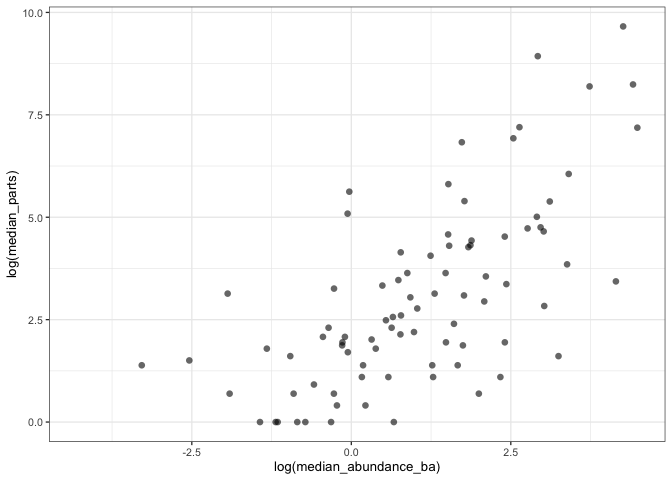
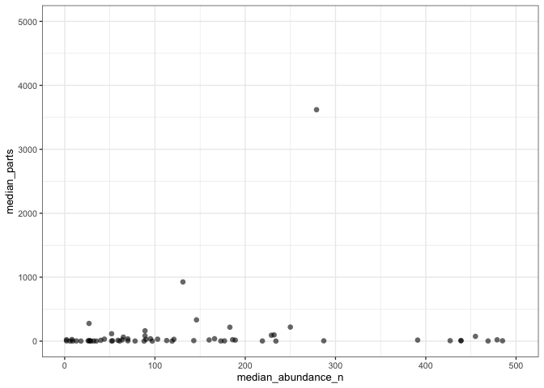
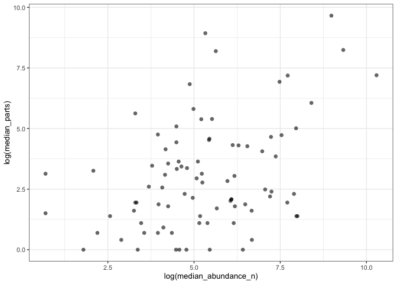
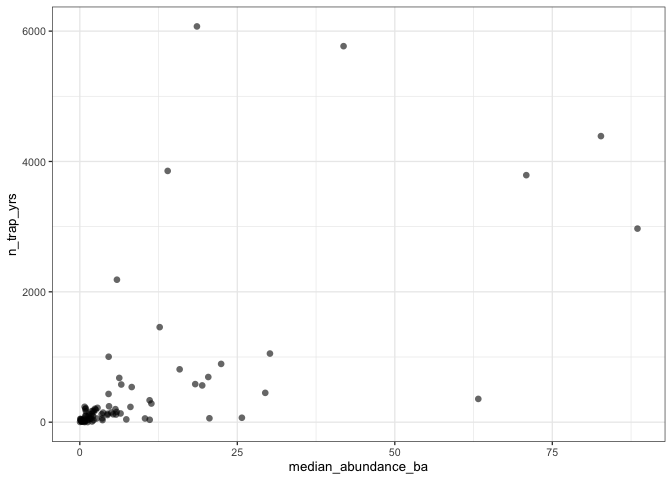
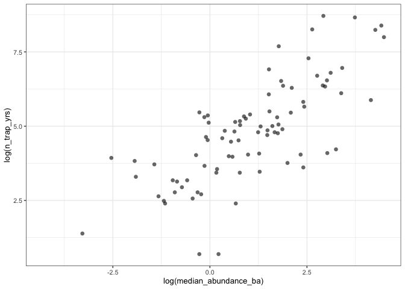

How well are rare species represented in the seed trap data?
================
Eleanor Jackson
26 September, 2025

``` r
library("tidyverse"); theme_set(theme_bw(base_size = 10))
library("patchwork")
library("here")
```

We want to test if the strength of CNDD is stronger in rarer species.
But, species with less data are probably rarer – and hence pulled more
towards the mean in our partial-pooling model.

Here, testing the assumption that we have less data for rare species.

## Get species abundance data

``` r
tree_data <- 
  readRDS(here::here("data", "clean", "tree_data.rds")) %>% 
  filter(year %in% c("1990", "1995", "2000", "2005", "2010",
                     "2010", "2015", "2022"))
```

Calculating abundance as (1) the median summed basal area and (2) count
of individuals across years.

``` r
tree_data <- 
  tree_data %>% 
  group_by(year, sp4, sp6, genus, species) %>% 
  summarise(abundance_ba = sum(basal_area_m2, na.rm = TRUE),
            abundance_n = n_distinct(tree)) %>% 
  group_by(sp4, sp6, genus, species) %>% 
  summarise(median_abundance_ba = median(abundance_ba, na.rm = TRUE),
            median_abundance_n = median(abundance_n, na.rm = TRUE))
```

    ## `summarise()` has grouped output by 'year', 'sp4', 'sp6', 'genus'. You can
    ## override using the `.groups` argument.
    ## `summarise()` has grouped output by 'sp4', 'sp6', 'genus'. You can override
    ## using the `.groups` argument.

## Get seed trap data

``` r
trap_data <- 
  readRDS(here::here("data", "clean", "trap_data.rds"))
```

## Summarise and plot

Summing parts found in traps within a year and taking the median across
years for each species.

A part can be one fruit, one seed or one capsule. I think parts give us
a better idea of sample size than seeds do, as seeds produced can be v.
variable between species? Although, some species just produce lots of
wind dispersed seeds with no “fruit”.

``` r
plotting_data <- 
  trap_data %>%
  group_by(sp4, year) %>% 
  summarise(n_parts_yr = sum(sum_parts)) %>% 
  group_by(sp4) %>% 
  summarise(median_parts = median(n_parts_yr)) %>%
  right_join(tree_data)
```

    ## `summarise()` has grouped output by 'sp4'. You can override using the `.groups`
    ## argument.
    ## Joining with `by = join_by(sp4)`

Basal area

``` r
plotting_data %>% 
  ggplot(aes(x = median_abundance_ba, y = median_parts)) +
  geom_point(size = 2, alpha = 0.6, shape = 16) 
```

    ## Warning: Removed 6 rows containing missing values or values outside the scale range
    ## (`geom_point()`).

<!-- -->

Basal area log-log

``` r
plotting_data %>% 
  ggplot(aes(x = log(median_abundance_ba), y = log(median_parts))) +
  geom_point(size = 2, alpha = 0.6, shape = 16)
```

    ## Warning: Removed 6 rows containing missing values or values outside the scale range
    ## (`geom_point()`).

<!-- -->

n individuals

``` r
plotting_data %>% 
  ggplot(aes(x = median_abundance_n, y = median_parts)) +
  geom_point(size = 2, alpha = 0.6, shape = 16) +
  coord_cartesian(xlim = c(0, 500), ylim = c(0, 5000))
```

    ## Warning: Removed 6 rows containing missing values or values outside the scale range
    ## (`geom_point()`).

<!-- -->

n individuals log-log

``` r
plotting_data %>% 
  ggplot(aes(x = log(median_abundance_n), y = log(median_parts))) +
  geom_point(size = 2, alpha = 0.6, shape = 16) 
```

    ## Warning: Removed 6 rows containing missing values or values outside the scale range
    ## (`geom_point()`).

<!-- -->

Realising now the smallest unit in our models is actually year-traps,
not seeds - because we are using the *proportion* of immature seeds.

``` r
plotting_data2 <- 
  trap_data %>%
  distinct(sp4, year, trap) %>% 
  group_by(sp4) %>% 
  summarise(n_trap_yrs = n()) %>% 
  right_join(tree_data)
```

    ## Joining with `by = join_by(sp4)`

``` r
plotting_data2 %>% 
  ggplot(aes(x = median_abundance_ba, y = n_trap_yrs)) +
  geom_point(size = 2, alpha = 0.6, shape = 16) 
```

    ## Warning: Removed 6 rows containing missing values or values outside the scale range
    ## (`geom_point()`).

<!-- -->

``` r
plotting_data2 %>% 
  ggplot(aes(x = log(median_abundance_ba), y = log(n_trap_yrs))) +
  geom_point(size = 2, alpha = 0.6, shape = 16) 
```

    ## Warning: Removed 6 rows containing missing values or values outside the scale range
    ## (`geom_point()`).

<!-- -->

Well, there is certainly a positive relationship.

If rare species are pulled more towards the mean/ average relationship
between immature seed drop and density, this would make the prediction
for those species more conservative? i.e.  they are still showing a
stronger relationship despite being pulled down to the mean?
