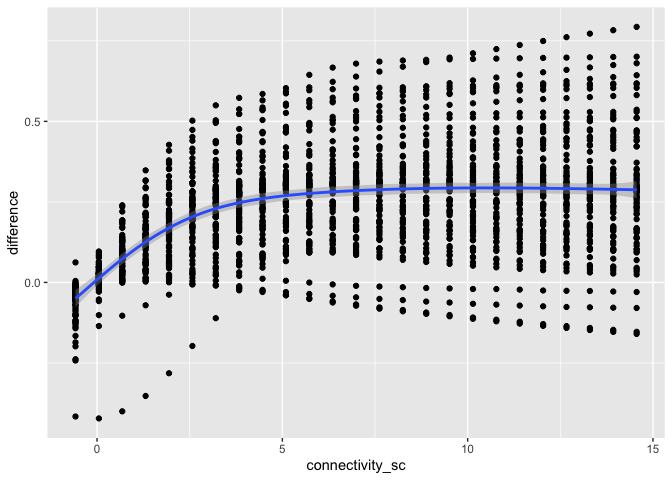
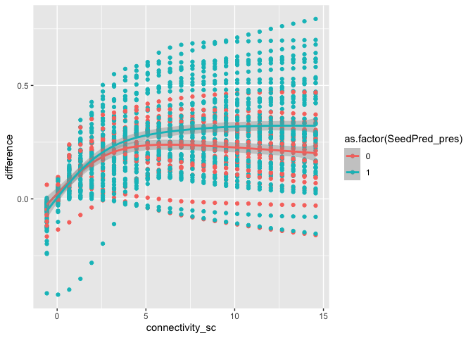
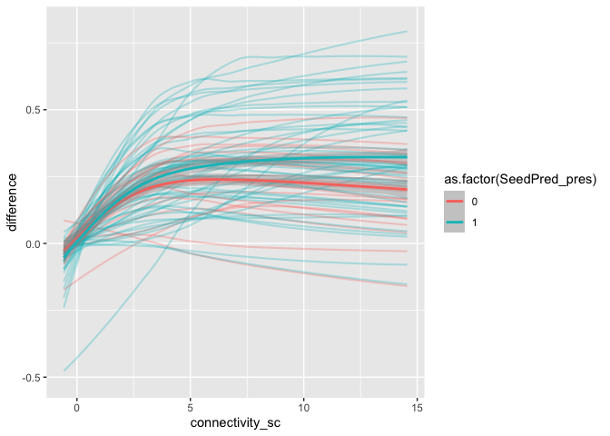
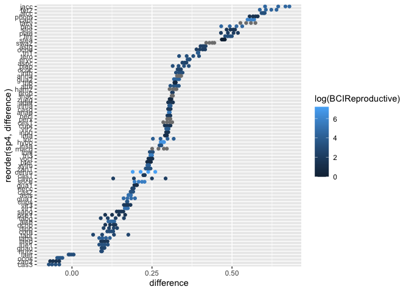
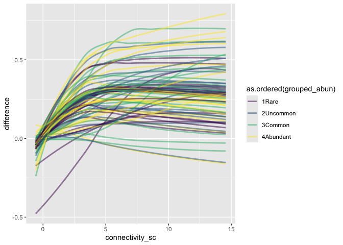
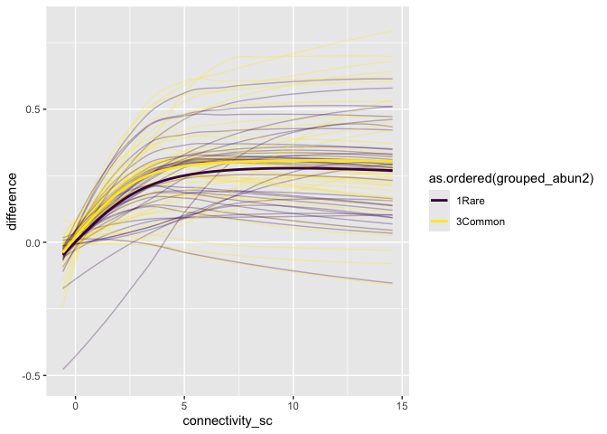
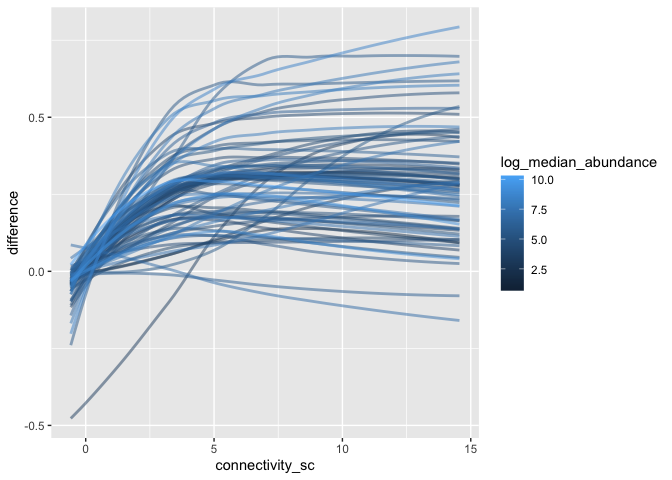
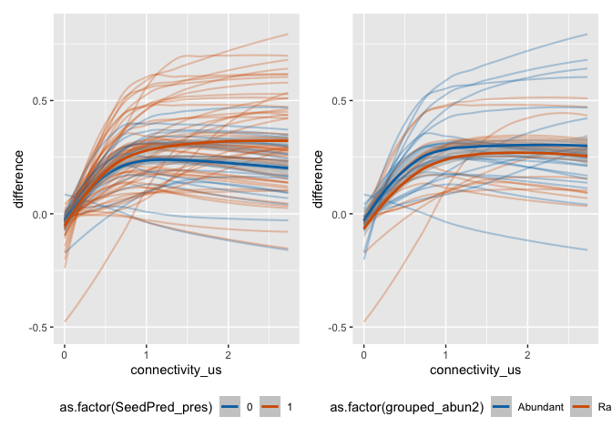
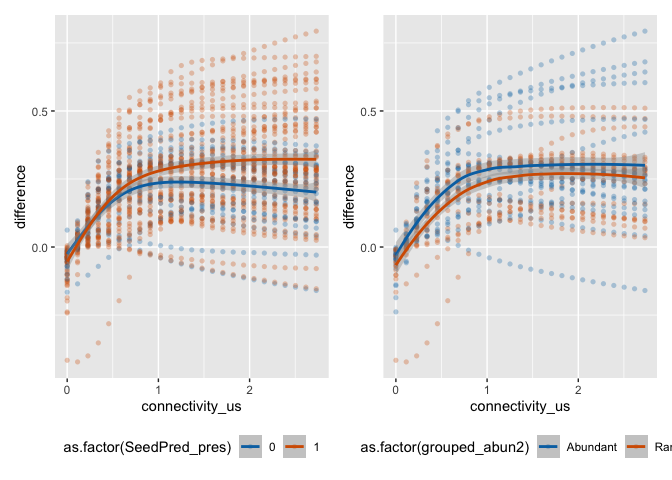

Species level predictions
================
Eleanor Jackson
02 December, 2025

We already know that species which have a host-specific seed predator
drop more fruits prematurely. And species which are more abundant in the
forest drop more fruits prematurely.

But, *within* a species, do individuals drop more fruits when
conspecific density is high? -\> yes

Is this effect greater for species with seed predators and species at
high abundance?

``` r
library("tidyverse")
library("brms")
library("ggdist")
library("tidybayes")
library("patchwork")
```

``` r
data <- readRDS(here::here("data", "clean", "trap_connect_repro_consp_20m_dioecious.rds"))
model <- readRDS(here::here("output", "models", "repro_consp_20m_yesdioecious.rds"))

data_h <- readRDS(here::here("data", "clean", "trap_connect_repro_hetero_20m_dioecious.rds"))
model_h <- readRDS(here::here("output", "models", "repro_hetero_20m_yesdioecious.rds"))

sp_data <- read.csv(here::here("data", "clean", "species_list.csv"))
```

``` r
data %>%
  filter(x < 980 & x > 20) %>%
  filter(y < 480 & y > 20) %>%
  select(- x, - y, - capsules) %>%
  filter(sum_parts >= 3) %>%
  mutate(connectivity_sc = scale(connectivity)) %>%
  mutate(
         year = as.factor(year),
         trap = as.factor(trap)) -> testdat

##

data_h %>%
  filter(x < 980 & x > 20) %>%
  filter(y < 480 & y > 20) %>%
  select(- x, - y, - capsules) %>%
  filter(sum_parts >= 3) %>%
  mutate(connectivity_sc = scale(connectivity)) %>%
  mutate(
    year = as.factor(year),
    trap = as.factor(trap)) -> testdat_h
```

``` r
pred_range <- 
  testdat %>%
  modelr::data_grid(
    connectivity_sc = modelr::seq_range(connectivity_sc, n = 25),
    sp4 = unique(testdat$sp4)
  ) 

pred_range %>%
  add_epred_draws(model, re_formula =
                               ~ (1 +
                                    connectivity_sc | sp4)) %>%
  mutate(
    connectivity_us = connectivity_sc *
      attr(testdat$connectivity_sc, 'scaled:scale') +
      attr(testdat$connectivity_sc, 'scaled:center')
  ) -> repro_mod

pred_range %>%
  add_epred_draws(model_h, re_formula =
                               ~ (1 +
                                    connectivity_sc | sp4)) %>%
  mutate(
    connectivity_us = connectivity_sc *
      attr(testdat_h$connectivity_sc, 'scaled:scale') +
      attr(testdat_h$connectivity_sc, 'scaled:center')
  ) -> hetro_mod
```

``` r
point_preds <-
    repro_mod %>%
    left_join(hetro_mod,
              by = c("connectivity_sc", "sp4",
                     ".row", ".chain",
                     ".iteration", ".draw"),
              suffix = c("_conspecific", "_heterospecific")) %>%
    mutate(difference =  .epred_conspecific - .epred_heterospecific) %>%
    point_interval()
```

``` r
point_preds %>%
  ggplot(aes(x = connectivity_sc, y = difference)) +
  geom_point() +
  geom_smooth()
```

    ## `geom_smooth()` using method = 'gam' and formula = 'y ~ s(x, bs = "cs")'

<!-- -->

``` r
point_preds <- 
  read_csv(here::here("data", "raw", "TidyTrait.csv")) %>% 
  mutate(sp4 = str_to_lower(Codigo)) %>% 
  select(-Codigo) %>% 
  right_join(point_preds)
```

    ## New names:
    ## Rows: 479 Columns: 37
    ## ── Column specification
    ## ──────────────────────────────────────────────────────── Delimiter: "," chr
    ## (13): Codigo, Old_Plant_Species, Lifeform, Freestanding, Woody_or_nonwoo... dbl
    ## (24): ...1, TotUnits_collected, seed_dry, fruitrecord, cvseed, RGR_10, T...
    ## ℹ Use `spec()` to retrieve the full column specification for this data. ℹ
    ## Specify the column types or set `show_col_types = FALSE` to quiet this message.
    ## Joining with `by = join_by(sp4)`
    ## • `` -> `...1`

``` r
point_preds %>%
  drop_na(SeedPred_pres) %>% 
  ggplot(aes(x = connectivity_sc, y = difference, 
             colour = as.factor(SeedPred_pres),
             group = as.factor(SeedPred_pres))) +
  geom_point() +
  geom_smooth()
```

    ## `geom_smooth()` using method = 'gam' and formula = 'y ~ s(x, bs = "cs")'

<!-- -->

``` r
point_preds %>%
  drop_na(SeedPred_pres) %>% 
  ggplot(aes(x = connectivity_sc, y = difference, 
             colour = as.factor(SeedPred_pres),
             group = as.factor(SeedPred_pres))) +
  geom_line(aes(group = sp4),
            stat = "smooth", alpha = 0.3, linewidth = 0.75) +
  geom_smooth()
```

    ## `geom_smooth()` using method = 'loess' and formula = 'y ~ x'
    ## `geom_smooth()` using method = 'gam' and formula = 'y ~ s(x, bs = "cs")'

<!-- -->

``` r
point_preds %>%
  filter(connectivity_sc > 5 & connectivity_sc < 7) %>% 
  ggplot(aes(y = reorder(sp4, difference), x = difference, colour = log(BCIReproductive) )) +
  geom_point() 
```

<!-- -->

``` r
tree_data <-
  readRDS(here::here("data", "clean", "tree_data.rds")) %>%
  filter(year %in% c("1990", "1995", "2000", "2005", "2010",
                     "2010", "2015", "2022"))

trap_data <- readRDS(here::here("data", "clean", "trap_data.rds"))

# only keep species which appear in both datasets
shared_sp <-
  trap_data %>%
  select(sp4) %>%
  distinct() %>%
  inner_join(
    y = tree_data %>%
      select(sp4) %>%
      distinct()
  )
```

    ## Joining with `by = join_by(sp4)`

``` r
tree_data <-
  tree_data %>%
  filter(sp4 %in% shared_sp$sp4)

abun <-
  tree_data %>%
  group_by(year, sp4, genus, species) %>%
  summarise(abundance = n_distinct(tree, na.rm = TRUE)) %>%
  group_by(sp4, genus, species) %>%
  summarise(median_abundance = median(abundance, na.rm = TRUE),
            mean_abundance = mean(abundance, na.rm = TRUE),
            max_abundance = max(abundance, na.rm = TRUE)) %>%
  mutate(log_median_abundance = log(median_abundance))
```

    ## `summarise()` has grouped output by 'year', 'sp4', 'genus'. You can override
    ## using the `.groups` argument.
    ## `summarise()` has grouped output by 'sp4', 'genus'. You can override using the
    ## `.groups` argument.

``` r
q25 <-
  quantile(abun$log_median_abundance) %>%
  pluck(2)

q50 <-
  quantile(abun$log_median_abundance) %>%
  pluck(3)

q75 <-
  quantile(abun$log_median_abundance) %>%
  pluck(4)

point_preds <- 
  point_preds %>% 
  left_join(abun) %>% 
  mutate(grouped_abun = case_when(
    log_median_abundance < q25 ~ "1Rare",
    log_median_abundance > q25  & log_median_abundance < q50 ~ "2Uncommon",
    log_median_abundance > q50  & log_median_abundance < q75 ~ "3Common",
    log_median_abundance > q75 ~ "4Abundant"
  )) %>% 
  mutate(
    connectivity_us = connectivity_sc *
      attr(testdat$connectivity_sc, 'scaled:scale') +
      attr(testdat$connectivity_sc, 'scaled:center')
  )
```

    ## Joining with `by = join_by(sp4)`

``` r
point_preds %>% 
  ggplot(aes(x = connectivity_sc, y = difference, 
             colour = as.ordered(grouped_abun),
             ))  +
  geom_line(aes(group = sp4),
            stat = "smooth",
            se = FALSE, alpha = 0.5,
            linewidth = 1)
```

    ## `geom_smooth()` using method = 'loess' and formula = 'y ~ x'

<!-- -->

``` r
point_preds %>% 
  mutate(grouped_abun2 = case_when(
    log_median_abundance < q50 ~ "1Rare",
    log_median_abundance > q50 ~ "3Common",
  )) %>% 
  ggplot(aes(x = connectivity_sc, y = difference, 
             colour = as.ordered(grouped_abun2),
             ))  +
  geom_line(aes(group = sp4),
            stat = "smooth", alpha = 0.3) +
  geom_smooth(aes(group = grouped_abun2),
              se = FALSE,
              linewidth = 1)
```

    ## `geom_smooth()` using method = 'loess' and formula = 'y ~ x'
    ## `geom_smooth()` using method = 'gam' and formula = 'y ~ s(x, bs = "cs")'

<!-- -->

``` r
point_preds %>% 
  ggplot(aes(x = connectivity_sc, y = difference, 
             colour = log_median_abundance,
             ))  +
  geom_line(aes(group = log_median_abundance),
            stat = "smooth",
            se = FALSE, alpha = 0.5,
            linewidth = 1)
```

    ## `geom_smooth()` using method = 'loess' and formula = 'y ~ x'

<!-- -->

``` r
point_preds %>%
  drop_na(SeedPred_pres) %>% 
  ggplot(aes(x = connectivity_us, y = difference, 
             colour = as.factor(SeedPred_pres),
             group = as.factor(SeedPred_pres))) +
  geom_line(aes(group = sp4),
            stat = "smooth", alpha = 0.3, linewidth = 0.75) +
  geom_smooth() +
  scale_colour_manual(values = c("#0072B2", "#D55E00")) +
  
  point_preds %>% 
  mutate(grouped_abun2 = case_when(
    log_median_abundance < q25 ~ "Rare",
    log_median_abundance > q75 ~ "Abundant",
    .default = NA
  )) %>% 
  drop_na(grouped_abun2) %>% 
  ggplot(aes(x = connectivity_us, y = difference, 
             colour = as.factor(grouped_abun2),
             ))  +
  geom_line(aes(group = sp4),
            stat = "smooth", alpha = 0.3, linewidth = 0.75) +
  geom_smooth(aes(group = grouped_abun2),
              linewidth = 1) +
  scale_colour_manual(values = c("#0072B2", "#D55E00")) &
  theme(legend.position = "bottom") 
```

    ## `geom_smooth()` using method = 'loess' and formula = 'y ~ x'
    ## `geom_smooth()` using method = 'gam' and formula = 'y ~ s(x, bs = "cs")'
    ## `geom_smooth()` using method = 'loess' and formula = 'y ~ x'
    ## `geom_smooth()` using method = 'loess' and formula = 'y ~ x'

<!-- -->

``` r
point_preds %>%
  drop_na(SeedPred_pres) %>% 
  ggplot(aes(x = connectivity_us, y = difference, 
             colour = as.factor(SeedPred_pres),
             group = as.factor(SeedPred_pres))) +
  geom_point(shape = 16, alpha = 0.3) +
  geom_smooth() +
  scale_colour_manual(values = c("#0072B2", "#D55E00")) +
  
  point_preds %>% 
  mutate(grouped_abun2 = case_when(
    log_median_abundance < q25 ~ "Rare",
    log_median_abundance > q75 ~ "Abundant",
    .default = NA
  )) %>% 
  drop_na(grouped_abun2) %>% 
  ggplot(aes(x = connectivity_us, y = difference, 
             colour = as.factor(grouped_abun2),
             ))  +
  geom_point(shape = 16, alpha = 0.3) +
  geom_smooth(aes(group = grouped_abun2),
              linewidth = 1) +
  scale_colour_manual(values = c("#0072B2", "#D55E00")) &
  theme(legend.position = "bottom") 
```

    ## `geom_smooth()` using method = 'gam' and formula = 'y ~ s(x, bs = "cs")'
    ## `geom_smooth()` using method = 'loess' and formula = 'y ~ x'

<!-- -->

``` r
point_preds %>%
  drop_na(SeedPred_pres) %>% 
  ggplot(aes(x = connectivity_us, y = difference, 
             colour = as.factor(SeedPred_pres),
             group = as.factor(SeedPred_pres))) +
  geom_line(aes(group = sp4),
            stat = "smooth", alpha = 0.3, linewidth = 0.75) +
  geom_smooth() +
  scale_colour_manual(values = c("#0072B2", "#D55E00")) +
  facet_wrap(~Lifeform)
```

    ## `geom_smooth()` using method = 'loess' and formula = 'y ~ x'
    ## `geom_smooth()` using method = 'loess' and formula = 'y ~ x'

<!-- -->

``` r
point_preds %>% 
  mutate(grouped_abun2 = case_when(
    log_median_abundance < q25 ~ "Rare",
    log_median_abundance > q75 ~ "Abundant",
    .default = NA
  )) %>% 
  drop_na(grouped_abun2, Lifeform) %>% 
  ggplot(aes(x = connectivity_us, y = difference, 
             colour = as.factor(grouped_abun2),
             ))  +
  geom_line(aes(group = sp4),
            stat = "smooth", alpha = 0.3, linewidth = 0.75) +
  geom_smooth(aes(group = grouped_abun2),
              linewidth = 1) +
  scale_colour_manual(values = c("#0072B2", "#D55E00")) +
  facet_wrap(~Lifeform)
```

    ## `geom_smooth()` using method = 'loess' and formula = 'y ~ x'
    ## `geom_smooth()` using method = 'loess' and formula = 'y ~ x'

<!-- -->

Add random effects to GAM

``` r
predictdf.gam <- function(model, xseq, se, level) {
  olddata <- model.frame(model)
  if (is.null(olddata$randomid)) {
    newdata= tibble(x=xseq)
  } else {
    newdata = tibble(x=xseq, randomid=olddata$randomid[1])
  }
  pred <- predict(model, exclude="s(randomid)", newdata = newdata,
                  se.fit = se, level = level, interval = if (se)
                    "confidence"
                  else "none")
  if (se) {
    y = pred$fit
    ci <- pred$se.fit * 1.96
    ymin = y - ci
    ymax = y + ci
    tibble(x = xseq, y, ymin, ymax, se = pred$se.fit)
  }
  else {
    tibble(x = xseq, y = as.vector(pred))
  }

}
environment(predictdf.gam) <- environment(ggplot2:::predictdf.glm)
```

``` r
point_preds %>%
  drop_na(SeedPred_pres) %>% 
  ggplot(aes(x = connectivity_us, y = difference, 
             colour = as.factor(SeedPred_pres),
             group = as.factor(SeedPred_pres))) +
  geom_point(shape = 16, alpha = 0.3) +
  geom_smooth(aes(randomid = factor(sp4)), 
              method = "gam",
              formula = y ~ s(x, bs = "cs") + s(randomid, bs = "re")) +
  scale_colour_manual(values = c("#0072B2", "#D55E00")) +
  
  point_preds %>% 
  mutate(grouped_abun2 = case_when(
    log_median_abundance < q25 ~ "Rare",
    log_median_abundance > q75 ~ "Abundant",
    .default = NA
  )) %>% 
  drop_na(grouped_abun2) %>% 
  ggplot(aes(x = connectivity_us, y = difference, 
             colour = as.factor(grouped_abun2),
             group = as.factor(grouped_abun2)
             ))  +
  geom_point(shape = 16, alpha = 0.3) +
  geom_smooth(aes(randomid = factor(sp4)), 
              method = "gam",
              formula = y ~ s(x, bs = "cs") + s(randomid, bs = "re")) +
  scale_colour_manual(values = c("#0072B2", "#D55E00")) &
  theme(legend.position = "bottom") 
```

    ## Warning in geom_smooth(aes(randomid = factor(sp4)), method = "gam", formula = y ~ : Ignoring unknown aesthetics: randomid
    ## Ignoring unknown aesthetics: randomid

    ## Warning: The following aesthetics were dropped during statistical transformation:
    ## randomid.
    ## ℹ This can happen when ggplot fails to infer the correct grouping structure in
    ##   the data.
    ## ℹ Did you forget to specify a `group` aesthetic or to convert a numerical
    ##   variable into a factor?
    ## The following aesthetics were dropped during statistical transformation:
    ## randomid.
    ## ℹ This can happen when ggplot fails to infer the correct grouping structure in
    ##   the data.
    ## ℹ Did you forget to specify a `group` aesthetic or to convert a numerical
    ##   variable into a factor?

<!-- -->
