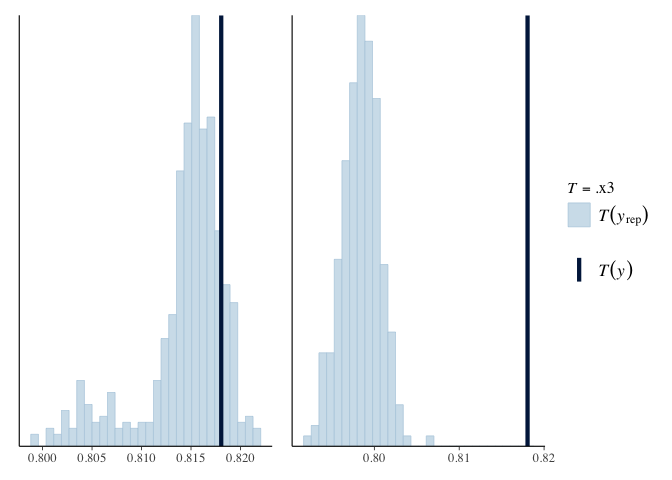
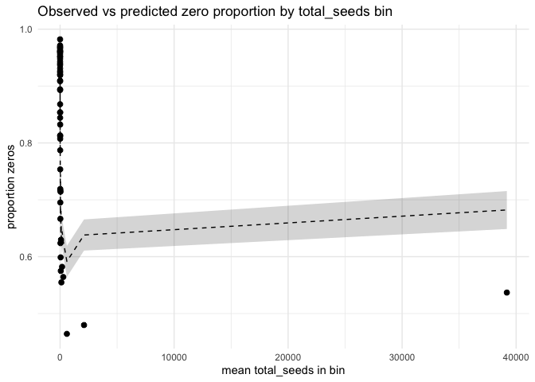

Compare models
================
Eleanor Jackson
02 March, 2026

Compare models with all 3 connectivity/density measures. Do we actually
need zero inflation?

``` r
library("tidyverse")
library("brms")
library("patchwork")
```

``` r
zibb <-
  readRDS(here::here("output", "models", "pheno-repro-adjust",
                     "full_conn_zib.rds"))

bbinom <-
  readRDS(here::here("output", "models", "pheno-repro-adjust",
                     "full_conn_binom.rds"))

zoib <-
  readRDS(here::here("output", "models", "pheno-repro-adjust",
                     "full_conn_simple.rds"))
```

## `summary()`

``` r
summary(zibb)
```

    ## Warning: Parts of the model have not converged (some Rhats are > 1.05). Be
    ## careful when analysing the results! We recommend running more iterations and/or
    ## setting stronger priors.

    ##  Family: zero_inflated_beta_binomial 
    ##   Links: mu = logit; phi = identity; zi = logit 
    ## Formula: abscised_seeds | trials(total_seeds) ~ conn_RC_sc + conn_RH_sc + conn_NRC_sc + (1 | quadrat/trap) + (1 | year) + (1 + conn_RC_sc + conn_RH_sc + conn_NRC_sc | sp4) 
    ##          zi ~ total_seeds
    ##    Data: test_data (Number of observations: 42034) 
    ##   Draws: 4 chains, each with iter = 5000; warmup = 2500; thin = 1;
    ##          total post-warmup draws = 10000
    ## 
    ## Multilevel Hyperparameters:
    ## ~quadrat (Number of levels: 97) 
    ##               Estimate Est.Error l-95% CI u-95% CI Rhat Bulk_ESS Tail_ESS
    ## sd(Intercept)     0.23      0.13     0.00     0.41 1.66        6       19
    ## 
    ## ~quadrat:trap (Number of levels: 421) 
    ##               Estimate Est.Error l-95% CI u-95% CI Rhat Bulk_ESS Tail_ESS
    ## sd(Intercept)     0.42      0.25     0.00     0.64 1.67        6       27
    ## 
    ## ~sp4 (Number of levels: 86) 
    ##                             Estimate Est.Error l-95% CI u-95% CI Rhat Bulk_ESS
    ## sd(Intercept)                   1.58      0.72     0.25     2.40 1.66        6
    ## sd(conn_RC_sc)                  0.94      0.56     0.01     1.83 1.72        6
    ## sd(conn_RH_sc)                  0.28      0.21     0.01     0.64 1.93        6
    ## sd(conn_NRC_sc)                 0.17      0.13     0.02     0.51 1.14       21
    ## cor(Intercept,conn_RC_sc)      -0.15      0.29    -0.56     0.69 1.50        8
    ## cor(Intercept,conn_RH_sc)       0.24      0.41    -0.41     0.83 1.55        7
    ## cor(conn_RC_sc,conn_RH_sc)     -0.05      0.25    -0.57     0.36 1.14       26
    ## cor(Intercept,conn_NRC_sc)      0.61      0.39    -0.33     1.00 1.62        7
    ## cor(conn_RC_sc,conn_NRC_sc)    -0.06      0.37    -0.66     0.70 1.17       17
    ## cor(conn_RH_sc,conn_NRC_sc)     0.25      0.48    -0.60     0.88 1.57        7
    ##                             Tail_ESS
    ## sd(Intercept)                     13
    ## sd(conn_RC_sc)                    20
    ## sd(conn_RH_sc)                    20
    ## sd(conn_NRC_sc)                   82
    ## cor(Intercept,conn_RC_sc)         15
    ## cor(Intercept,conn_RH_sc)         27
    ## cor(conn_RC_sc,conn_RH_sc)        96
    ## cor(Intercept,conn_NRC_sc)        21
    ## cor(conn_RC_sc,conn_NRC_sc)      236
    ## cor(conn_RH_sc,conn_NRC_sc)       13
    ## 
    ## ~year (Number of levels: 35) 
    ##               Estimate Est.Error l-95% CI u-95% CI Rhat Bulk_ESS Tail_ESS
    ## sd(Intercept)     0.16      0.10     0.00     0.28 1.55        7       38
    ## 
    ## Regression Coefficients:
    ##                Estimate Est.Error l-95% CI u-95% CI Rhat Bulk_ESS Tail_ESS
    ## Intercept         -1.32      0.35    -1.99    -0.74 1.58        7       12
    ## zi_Intercept       0.74      0.90    -1.80     1.24 1.69        6       11
    ## conn_RC_sc         0.73      0.30     0.40     1.42 1.54        7       38
    ## conn_RH_sc        -0.08      0.11    -0.29     0.10 1.58        7       13
    ## conn_NRC_sc        0.08      0.25    -0.23     0.77 1.62        7       11
    ## zi_total_seeds    -0.13      0.06    -0.18     0.00 1.60        7       11
    ## 
    ## Further Distributional Parameters:
    ##     Estimate Est.Error l-95% CI u-95% CI Rhat Bulk_ESS Tail_ESS
    ## phi     1.18      0.18     0.80     1.33 1.73        6       11
    ## 
    ## Draws were sampled using sampling(NUTS). For each parameter, Bulk_ESS
    ## and Tail_ESS are effective sample size measures, and Rhat is the potential
    ## scale reduction factor on split chains (at convergence, Rhat = 1).

``` r
summary(bbinom)
```

    ##  Family: beta_binomial 
    ##   Links: mu = logit; phi = identity 
    ## Formula: abscised_seeds | trials(total_seeds) ~ conn_RC_sc + conn_RH_sc + conn_NRC_sc + (1 | quadrat/trap) + (1 | year) + (1 + conn_RC_sc + conn_RH_sc + conn_NRC_sc | sp4) 
    ##    Data: test_data (Number of observations: 42034) 
    ##   Draws: 4 chains, each with iter = 5000; warmup = 2500; thin = 1;
    ##          total post-warmup draws = 10000
    ## 
    ## Multilevel Hyperparameters:
    ## ~quadrat (Number of levels: 97) 
    ##               Estimate Est.Error l-95% CI u-95% CI Rhat Bulk_ESS Tail_ESS
    ## sd(Intercept)     0.27      0.06     0.15     0.38 1.00      912     1279
    ## 
    ## ~quadrat:trap (Number of levels: 421) 
    ##               Estimate Est.Error l-95% CI u-95% CI Rhat Bulk_ESS Tail_ESS
    ## sd(Intercept)     0.49      0.03     0.43     0.56 1.00     2031     3335
    ## 
    ## ~sp4 (Number of levels: 86) 
    ##                             Estimate Est.Error l-95% CI u-95% CI Rhat Bulk_ESS
    ## sd(Intercept)                   2.07      0.24     1.66     2.59 1.00     1456
    ## sd(conn_RC_sc)                  1.67      0.35     1.10     2.43 1.00      895
    ## sd(conn_RH_sc)                  0.39      0.07     0.26     0.55 1.00     2679
    ## sd(conn_NRC_sc)                 0.24      0.08     0.12     0.43 1.00     4096
    ## cor(Intercept,conn_RC_sc)       0.46      0.14     0.15     0.71 1.00     1270
    ## cor(Intercept,conn_RH_sc)       0.09      0.18    -0.27     0.44 1.00     2730
    ## cor(conn_RC_sc,conn_RH_sc)     -0.01      0.20    -0.40     0.39 1.00     2135
    ## cor(Intercept,conn_NRC_sc)      0.37      0.31    -0.27     0.87 1.00     6493
    ## cor(conn_RC_sc,conn_NRC_sc)     0.69      0.20     0.19     0.96 1.00     5314
    ## cor(conn_RH_sc,conn_NRC_sc)     0.04      0.34    -0.64     0.63 1.00     4879
    ##                             Tail_ESS
    ## sd(Intercept)                   3314
    ## sd(conn_RC_sc)                  1833
    ## sd(conn_RH_sc)                  5134
    ## sd(conn_NRC_sc)                 6447
    ## cor(Intercept,conn_RC_sc)       2860
    ## cor(Intercept,conn_RH_sc)       4581
    ## cor(conn_RC_sc,conn_RH_sc)      3841
    ## cor(Intercept,conn_NRC_sc)      6599
    ## cor(conn_RC_sc,conn_NRC_sc)     7582
    ## cor(conn_RH_sc,conn_NRC_sc)     7466
    ## 
    ## ~year (Number of levels: 35) 
    ##               Estimate Est.Error l-95% CI u-95% CI Rhat Bulk_ESS Tail_ESS
    ## sd(Intercept)     0.19      0.03     0.14     0.25 1.00     2925     4557
    ## 
    ## Regression Coefficients:
    ##             Estimate Est.Error l-95% CI u-95% CI Rhat Bulk_ESS Tail_ESS
    ## Intercept      -1.68      0.28    -2.23    -1.13 1.00      659     1247
    ## conn_RC_sc      1.82      0.27     1.31     2.39 1.00      978     1979
    ## conn_RH_sc     -0.18      0.08    -0.34    -0.03 1.00     3165     4911
    ## conn_NRC_sc     0.14      0.09    -0.05     0.31 1.00     4626     6813
    ## 
    ## Further Distributional Parameters:
    ##     Estimate Est.Error l-95% CI u-95% CI Rhat Bulk_ESS Tail_ESS
    ## phi     1.06      0.02     1.02     1.09 1.00    17918     6812
    ## 
    ## Draws were sampled using sampling(NUTS). For each parameter, Bulk_ESS
    ## and Tail_ESS are effective sample size measures, and Rhat is the potential
    ## scale reduction factor on split chains (at convergence, Rhat = 1).

``` r
summary(zoib)
```

    ## Warning: There were 1 divergent transitions after warmup. Increasing
    ## adapt_delta above 0.95 may help. See
    ## http://mc-stan.org/misc/warnings.html#divergent-transitions-after-warmup

    ##  Family: zero_one_inflated_beta 
    ##   Links: mu = logit; phi = log; zoi = logit; coi = logit 
    ## Formula: proportion_abscised ~ conn_RC_sc + conn_RH_sc + conn_NRC_sc + (1 | quadrat/trap) + (1 | year) + (1 + conn_RC_sc + conn_RH_sc + conn_NRC_sc | sp4) 
    ##          phi ~ 1 + (1 | quadrat/trap) + (1 | year) + (1 | sp4)
    ##          zoi ~ conn_RC_sc + conn_RH_sc + conn_NRC_sc + (1 | quadrat/trap) + (1 | year) + (1 + conn_RC_sc + conn_RH_sc + conn_NRC_sc | sp4)
    ##          coi ~ 1
    ##    Data: test_data (Number of observations: 23811) 
    ##   Draws: 4 chains, each with iter = 1000; warmup = 500; thin = 1;
    ##          total post-warmup draws = 2000
    ## 
    ## Multilevel Hyperparameters:
    ## ~quadrat (Number of levels: 97) 
    ##                   Estimate Est.Error l-95% CI u-95% CI Rhat Bulk_ESS Tail_ESS
    ## sd(Intercept)         0.10      0.04     0.01     0.18 1.03      164      145
    ## sd(phi_Intercept)     0.03      0.03     0.00     0.10 1.00      648      851
    ## sd(zoi_Intercept)     0.29      0.10     0.06     0.47 1.02      166      181
    ## 
    ## ~quadrat:trap (Number of levels: 421) 
    ##                   Estimate Est.Error l-95% CI u-95% CI Rhat Bulk_ESS Tail_ESS
    ## sd(Intercept)         0.25      0.02     0.20     0.30 1.01      508     1041
    ## sd(phi_Intercept)     0.15      0.03     0.08     0.22 1.00      426      549
    ## sd(zoi_Intercept)     0.77      0.05     0.67     0.87 1.00      523     1138
    ## 
    ## ~sp4 (Number of levels: 79) 
    ##                                     Estimate Est.Error l-95% CI u-95% CI Rhat
    ## sd(Intercept)                           0.58      0.07     0.46     0.72 1.00
    ## sd(conn_RC_sc)                          0.25      0.07     0.14     0.41 1.00
    ## sd(conn_RH_sc)                          0.16      0.06     0.06     0.28 1.00
    ## sd(conn_NRC_sc)                         0.14      0.08     0.03     0.35 1.00
    ## sd(phi_Intercept)                       0.37      0.06     0.27     0.49 1.01
    ## sd(zoi_Intercept)                       1.98      0.25     1.54     2.53 1.00
    ## sd(zoi_conn_RC_sc)                      1.71      0.28     1.21     2.34 1.00
    ## sd(zoi_conn_RH_sc)                      0.63      0.13     0.40     0.91 1.00
    ## sd(zoi_conn_NRC_sc)                     0.30      0.16     0.04     0.66 1.00
    ## cor(Intercept,conn_RC_sc)               0.22      0.23    -0.26     0.64 1.00
    ## cor(Intercept,conn_RH_sc)              -0.31      0.21    -0.69     0.11 1.00
    ## cor(conn_RC_sc,conn_RH_sc)              0.39      0.31    -0.33     0.86 1.00
    ## cor(Intercept,conn_NRC_sc)              0.24      0.37    -0.52     0.85 1.00
    ## cor(conn_RC_sc,conn_NRC_sc)             0.14      0.43    -0.71     0.86 1.00
    ## cor(conn_RH_sc,conn_NRC_sc)             0.23      0.36    -0.55     0.84 1.00
    ## cor(zoi_Intercept,zoi_conn_RC_sc)       0.34      0.17    -0.02     0.64 1.00
    ## cor(zoi_Intercept,zoi_conn_RH_sc)      -0.14      0.19    -0.48     0.23 1.00
    ## cor(zoi_conn_RC_sc,zoi_conn_RH_sc)     -0.07      0.23    -0.50     0.36 1.01
    ## cor(zoi_Intercept,zoi_conn_NRC_sc)      0.29      0.34    -0.48     0.82 1.00
    ## cor(zoi_conn_RC_sc,zoi_conn_NRC_sc)     0.49      0.34    -0.33     0.94 1.00
    ## cor(zoi_conn_RH_sc,zoi_conn_NRC_sc)     0.00      0.38    -0.72     0.73 1.00
    ##                                     Bulk_ESS Tail_ESS
    ## sd(Intercept)                            711     1015
    ## sd(conn_RC_sc)                           626      904
    ## sd(conn_RH_sc)                           519      558
    ## sd(conn_NRC_sc)                          544      910
    ## sd(phi_Intercept)                        544      932
    ## sd(zoi_Intercept)                        441      663
    ## sd(zoi_conn_RC_sc)                       565      955
    ## sd(zoi_conn_RH_sc)                       656      881
    ## sd(zoi_conn_NRC_sc)                      681      621
    ## cor(Intercept,conn_RC_sc)                913     1217
    ## cor(Intercept,conn_RH_sc)               1737     1343
    ## cor(conn_RC_sc,conn_RH_sc)               627      939
    ## cor(Intercept,conn_NRC_sc)              1836     1594
    ## cor(conn_RC_sc,conn_NRC_sc)              812     1470
    ## cor(conn_RH_sc,conn_NRC_sc)             1745     1757
    ## cor(zoi_Intercept,zoi_conn_RC_sc)        486      808
    ## cor(zoi_Intercept,zoi_conn_RH_sc)        621     1054
    ## cor(zoi_conn_RC_sc,zoi_conn_RH_sc)       437      790
    ## cor(zoi_Intercept,zoi_conn_NRC_sc)      2026     1754
    ## cor(zoi_conn_RC_sc,zoi_conn_NRC_sc)      999     1333
    ## cor(zoi_conn_RH_sc,zoi_conn_NRC_sc)     1412     1384
    ## 
    ## ~year (Number of levels: 35) 
    ##                   Estimate Est.Error l-95% CI u-95% CI Rhat Bulk_ESS Tail_ESS
    ## sd(Intercept)         0.15      0.02     0.10     0.20 1.00      728     1285
    ## sd(phi_Intercept)     0.07      0.03     0.01     0.13 1.00      382      400
    ## sd(zoi_Intercept)     0.18      0.03     0.13     0.25 1.01      779     1428
    ## 
    ## Regression Coefficients:
    ##                 Estimate Est.Error l-95% CI u-95% CI Rhat Bulk_ESS Tail_ESS
    ## Intercept          -0.25      0.09    -0.43    -0.08 1.01      499      765
    ## phi_Intercept       1.38      0.06     1.26     1.51 1.01      538      960
    ## zoi_Intercept       0.39      0.26    -0.11     0.91 1.01      209      489
    ## coi_Intercept      -3.73      0.05    -3.82    -3.63 1.00     4499     1463
    ## conn_RC_sc         -0.06      0.06    -0.18     0.06 1.01      854     1076
    ## conn_RH_sc          0.02      0.04    -0.06     0.11 1.00     1204     1559
    ## conn_NRC_sc        -0.01      0.07    -0.17     0.10 1.00      875     1418
    ## zoi_conn_RC_sc     -1.87      0.28    -2.41    -1.33 1.01      517      970
    ## zoi_conn_RH_sc      0.28      0.12     0.05     0.53 1.00      886      977
    ## zoi_conn_NRC_sc    -0.05      0.12    -0.26     0.22 1.00     1515     1458
    ## 
    ## Draws were sampled using sampling(NUTS). For each parameter, Bulk_ESS
    ## and Tail_ESS are effective sample size measures, and Rhat is the potential
    ## scale reduction factor on split chains (at convergence, Rhat = 1).

## Do we need zero inflation?

``` r
pp_check(zibb, type = "stat", stat = function(y) mean(y == 0), ndraws = 500) +
  pp_check(bbinom, type = "stat", stat = function(y) mean(y == 0), ndraws = 500) +
  patchwork::plot_layout(guides = "collect")
```

    ## `stat_bin()` using `bins = 30`. Pick better value with `binwidth`.
    ## `stat_bin()` using `bins = 30`. Pick better value with `binwidth`.

<!-- -->

Looks like the ZIBB didn’t fit very well, but the BBinom is slightly
under predicting zeros.

``` r
# draw posterior predictive samples (matrix draws x observations)
pp_bbinom <- posterior_predict(bbinom, ndraws = 2000)  

# observed zeros
obs_zero <- as.integer(bbinom$data$abscised_seeds == 0)

# compute predicted overall zero proportion per draw
pred_zero_rate <- apply(pp_bbinom, 1, function(draw) mean(draw == 0))

# summary
obs_zero_rate <- mean(obs_zero)
median_pred <- median(pred_zero_rate)
ci_pred <- quantile(pred_zero_rate, c(0.025, 0.975))

tibble(
  observed = obs_zero_rate,
  pred_median = median_pred,
  pred_lo = ci_pred[1],
  pred_hi = ci_pred[2]
)
```

    ## # A tibble: 1 × 4
    ##   observed pred_median pred_lo pred_hi
    ##      <dbl>       <dbl>   <dbl>   <dbl>
    ## 1    0.818       0.798   0.794   0.803

If observed value is within 95% CI, the model can predict the observed
zero rate.

Check zeros by `total_seeds`:

``` r
# choose bins (quantile binning)
df2 <- bbinom$data %>%
  mutate(n_bin = ntile(total_seeds, 50)) %>%   # 5 bins; change as needed
  group_by(n_bin) %>%
  mutate(mean_n = mean(total_seeds)) %>%
  ungroup()

# map original indices to bins
bins <- df2$n_bin

# compute predicted zero rate per bin for each draw
pred_zero_by_bin <- apply(pp_bbinom, 1, function(draw) {
  tapply(draw == 0, bins, mean)
}) # result: draws x bins (list->matrix)

# summarize per bin
bin_summary <- as_tibble(t(pred_zero_by_bin)) %>%
  mutate(draw = row_number()) %>%
  pivot_longer(-draw, names_to = "n_bin", values_to = "pred_zero") %>%
  group_by(n_bin) %>%
  summarise(
    pred_median = median(pred_zero),
    pred_lo = quantile(pred_zero, 0.025),
    pred_hi = quantile(pred_zero, 0.975)
  ) %>%
  mutate(n_bin = as.integer(n_bin)) %>% 
  arrange(n_bin) 

# observed by bin
obs_by_bin <- df2 %>%
  group_by(n_bin, mean_n) %>%
  summarise(obs_zero = mean(abscised_seeds == 0), .groups = "drop") %>%
  arrange(as.integer(n_bin))

# join and plot
check_bin <- left_join(obs_by_bin, bin_summary, by = "n_bin")

ggplot(check_bin, aes(x = mean_n)) +
  geom_ribbon(aes(ymin = pred_lo, ymax = pred_hi), alpha = 0.2) +
  geom_line(aes(y = pred_median), linetype = "dashed") +
  geom_point(aes(y = obs_zero), size = 2) +
  labs(x = "mean total_seeds in bin", y = "proportion zeros",
       title = "Observed vs predicted zero proportion by total_seeds bin") +
  theme_minimal()
```

<!-- -->

For very large `total_seeds` the beta-binomial predicts more zeros than
actually observed. This suggests the zeros are not structural. If they
were, we’d see too many zeros overall and *underprediction* of zeros at
large n.

This pattern suggests for large `total_seeds` observing zero abscised
seeds is very unlikely.

-\> trees which are very productive likely have a larger proportion of
abscised seeds
