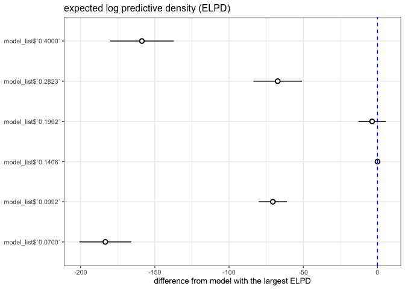
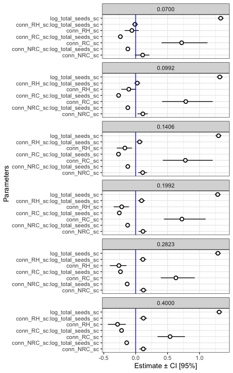

Testing different values of alpha for beta-binomial models
================
Eleanor Jackson
21 March, 2026

``` r
library("tidyverse"); theme_set(theme_bw(base_size = 10))
library("broom.mixed")
library("brms")
library("ggdist")
library("loo") 
library("patchwork")
```

``` r
file_names <- as.list(dir(path = here::here("output", "models", "alpha-tests-subset"),
                          full.names = TRUE))

model_list <- map(file_names, readRDS, environment())

alphas <- 
  round(exp(seq(log(0.07), log(0.40), length.out = 6)),
                digits = 4) %>% 
  formatC(format = "f", drop0trailing = FALSE,
           width = 3)

names(model_list) <- alphas
```

## Compare the predictive accuracy of the models using Leave-One-Out Cross Validation

Leave-one-out cross-validation (LOO-CV) is a popular method for
comparing Bayesian models based on their estimated predictive
performance on new/unseen data.

Expected log predictive density (ELPD): If new observations are
well-accounted by the posterior predictive distribution, then the
density of the posterior predictive distribution is high and so is its
logarithm. So higher ELPD = better predictive performance.

``` r
comp <- 
  loo_compare(model_list$`0.0700`,
              model_list$`0.0992`,
              model_list$`0.1406`,
              model_list$`0.1992`,
              model_list$`0.2823`,
              model_list$`0.4000`)

print(comp, digits = 3)
```

    ##                     elpd_diff se_diff 
    ## model_list$`0.1406`    0.000     0.000
    ## model_list$`0.1992`   -3.661     9.166
    ## model_list$`0.2823`  -67.237    16.367
    ## model_list$`0.0992`  -70.499     9.461
    ## model_list$`0.4000` -158.704    21.418
    ## model_list$`0.0700` -183.369    17.467

``` r
comp %>% 
  data.frame() %>% 
  rownames_to_column(var = "model_name") %>% 
  ggplot(aes(x    = model_name, elpd_diff, 
             y    = elpd_diff, 
             ymin = elpd_diff - se_diff, 
             ymax = elpd_diff + se_diff)) +
  geom_pointrange(shape = 21, fill = "white") +
  coord_flip() +
  geom_hline(yintercept = 0, colour = "blue", linetype = 2) +
  labs(x = NULL, y = "difference from model with the largest ELPD", 
       title = "expected log predictive density (ELPD)") 
```

<!-- -->

## Compare estimates

Has changing alpha changed the results of our model?

``` r
my_coef_tab <-
  tibble(fit = model_list[c(1,2,3,4,5,6)],
         model = names(model_list[c(1,2,3,4,5,6)])) %>%
  mutate(tidy = purrr::map(
    fit,
    tidy,
    effects = "fixed",
    robust = TRUE
  )) %>%
  unnest(tidy)
```

    ## Warning: There were 6 warnings in `mutate()`.
    ## The first warning was:
    ## ℹ In argument: `tidy = purrr::map(fit, tidy, effects = "fixed", robust =
    ##   TRUE)`.
    ## Caused by warning in `tidy.brmsfit()`:
    ## ! some parameter names contain underscores: term naming may be unreliable!
    ## ℹ Run `dplyr::last_dplyr_warnings()` to see the 5 remaining warnings.

``` r
my_coef_tab %>% 
  filter(term !="(Intercept)") %>% 
  mutate(term = as.factor(term)) %>% 
  ggplot(aes(x = term, y = estimate, ymin = conf.low, ymax = conf.high)) +
  geom_pointrange(shape = 21, fill = "white") +
  labs(x = "Parameters",
       y = "Estimate ± CI [95%]") +
  geom_hline(yintercept = 0,  color = "blue") +
  coord_flip() +
  theme_bw() +
  facet_wrap(~model, ncol = 1)
```

<!-- -->
