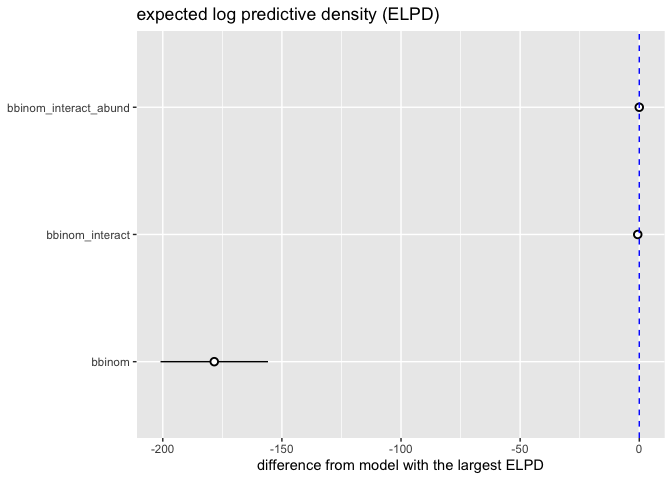
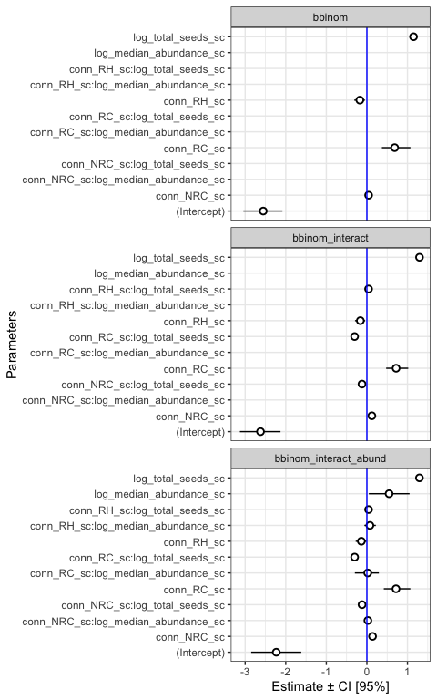
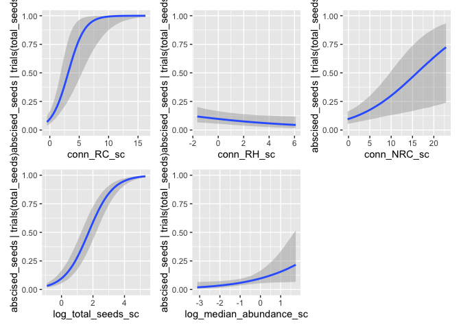
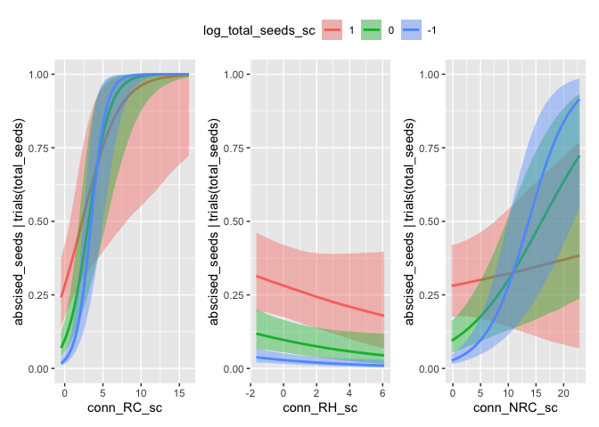
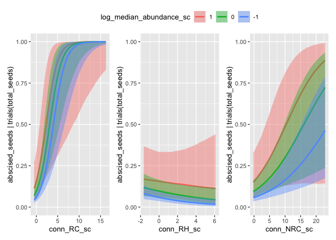
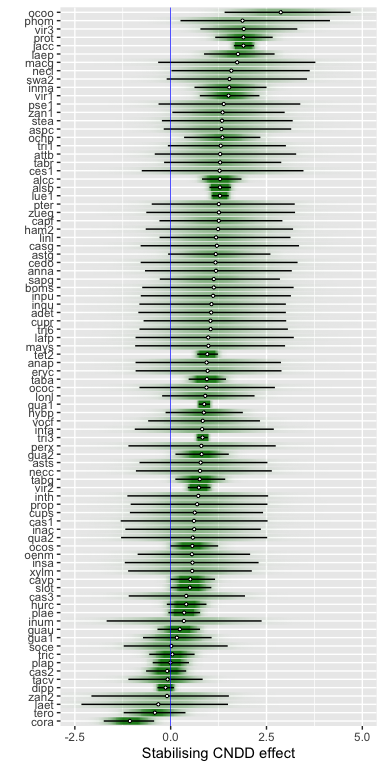
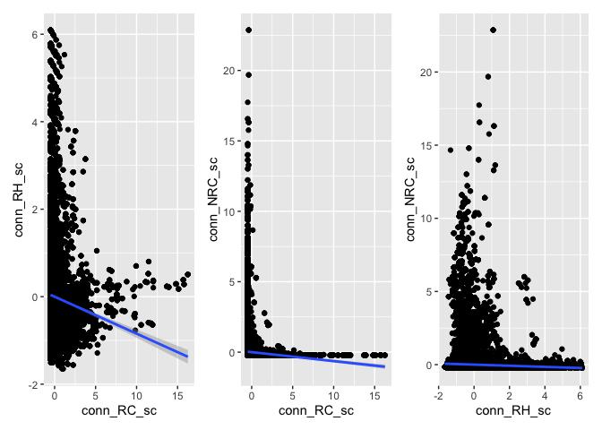

Compare binomial models
================
Eleanor Jackson
23 March, 2026

``` r
library("tidyverse")
library("brms")
library("patchwork")
library("broom.mixed")
library("modelr")
```

``` r
bbinom <-
  readRDS(here::here("output", "models", "pheno-repro-adjust",
                     "full_conn_binom_nseeds.rds"))

bbinom_interact <-
  readRDS(here::here("output", "models", "pheno-repro-adjust",
                     "full_conn_binom_nseeds_interact.rds"))

bbinom_interact_abund <-
  readRDS(here::here("output", "models", "pheno-repro-adjust",
                     "full_conn_binom_nseeds_abund.rds"))
```

``` r
comp <- 
  loo_compare(bbinom,
              bbinom_interact,
              bbinom_interact_abund)

print(comp, digits = 3)
```

    ##                       elpd_diff se_diff 
    ## bbinom_interact_abund    0.000     0.000
    ## bbinom_interact         -0.638     1.238
    ## bbinom                -178.394    22.553

``` r
comp %>% 
  data.frame() %>% 
  rownames_to_column(var = "model_name") %>% 
  ggplot(aes(x    = model_name, elpd_diff, 
             y    = elpd_diff, 
             ymin = elpd_diff - se_diff, 
             ymax = elpd_diff + se_diff)) +
  geom_pointrange(shape = 21, fill = "white") +
  coord_flip() +
  geom_hline(yintercept = 0, colour = "blue", linetype = 2) +
  labs(x = NULL, y = "difference from model with the largest ELPD", 
       title = "expected log predictive density (ELPD)") 
```

<!-- -->

``` r
my_coef_tab <-
  tibble(fit = list(bbinom,
                 bbinom_interact,
                 bbinom_interact_abund),
         model = c("bbinom",
                 "bbinom_interact",
                 "bbinom_interact_abund")) %>%
  mutate(tidy = purrr::map(
    fit,
    tidy,
    effects = "fixed",
    robust = TRUE
  )) %>%
  unnest(tidy)
```

    ## Warning: There were 3 warnings in `mutate()`.
    ## The first warning was:
    ## ℹ In argument: `tidy = purrr::map(fit, tidy, effects = "fixed", robust =
    ##   TRUE)`.
    ## Caused by warning in `tidy.brmsfit()`:
    ## ! some parameter names contain underscores: term naming may be unreliable!
    ## ℹ Run `dplyr::last_dplyr_warnings()` to see the 2 remaining warnings.

``` r
my_coef_tab %>% 
  mutate(term = as.factor(term)) %>% 
  ggplot(aes(x = term, y = estimate, ymin = conf.low, ymax = conf.high)) +
  geom_pointrange(shape = 21, fill = "white") +
  labs(x = "Parameters",
       y = "Estimate ± CI [95%]") +
  geom_hline(yintercept = 0,  color = "blue") +
  coord_flip() +
  theme_bw() +
  facet_wrap(~model, ncol = 1)
```

<!-- -->

No major differences in parameter estimates between models

``` r
all_plots <- conditional_effects(bbinom_interact_abund,
                    plot = TRUE)
```

    ## Setting all 'trials' variables to 1 by default if not specified otherwise.

``` r
wrap_plots(
  plot(all_plots, plot = FALSE)[[1]],
  plot(all_plots, plot = FALSE)[[2]],
  plot(all_plots, plot = FALSE)[[3]],
  plot(all_plots, plot = FALSE)[[4]],
  plot(all_plots, plot = FALSE)[[5]]
) &
  coord_cartesian(ylim = c(0,1))
```

<!-- -->

``` r
wrap_plots(
  plot(all_plots, plot = FALSE)[[6]],
  plot(all_plots, plot = FALSE)[[7]],
  plot(all_plots, plot = FALSE)[[8]] 
) +
  plot_layout(guides = "collect") &
  coord_cartesian(ylim = c(0,1)) &
  theme(legend.position = "top")
```

<!-- -->

``` r
wrap_plots(
  plot(all_plots, plot = FALSE)[[9]],
  plot(all_plots, plot = FALSE)[[10]],
  plot(all_plots, plot = FALSE)[[11]] 
)+
  plot_layout(guides = "collect") &
  coord_cartesian(ylim = c(0,1)) &
  theme(legend.position = "top")
```

<!-- -->

Rare species drop less fruit prematurely, but no evidence that species
abundance explains effect of neighbourhood density on seed abscission.

``` r
draws <- as_draws_df(bbinom_interact_abund)

draws %>%
  transmute(
    abund_effect_on_RC_vs_RH =
      `b_conn_RC_sc:log_median_abundance_sc` -
      `b_conn_RH_sc:log_median_abundance_sc`
  ) %>%
  summarise(
    mean = mean(abund_effect_on_RC_vs_RH),
    sd = sd(abund_effect_on_RC_vs_RH),
    q025 = quantile(abund_effect_on_RC_vs_RH, 0.025),
    q50  = quantile(abund_effect_on_RC_vs_RH, 0.5),
    q975 = quantile(abund_effect_on_RC_vs_RH, 0.975),
    p_gt_0 = mean(abund_effect_on_RC_vs_RH > 0),
    p_lt_0 = mean(abund_effect_on_RC_vs_RH < 0)
  )
```

    ## Warning: Dropping 'draws_df' class as required metadata was removed.

    ## # A tibble: 1 × 7
    ##      mean    sd   q025     q50  q975 p_gt_0 p_lt_0
    ##     <dbl> <dbl>  <dbl>   <dbl> <dbl>  <dbl>  <dbl>
    ## 1 -0.0598 0.177 -0.425 -0.0546 0.270  0.373  0.627

``` r
# there is one abundance value per species
species_abund <- bbinom_interact_abund$data %>%
  distinct(sp4, log_median_abundance_sc)

# extract species random slopes for RC and RH
sp_re <- draws %>%
  select(.draw, matches("^r_sp4\\[")) %>%
  pivot_longer(
    cols = -.draw,
    names_to = "param",
    values_to = "value"
  ) %>%
  filter(str_detect(param, ",conn_RC_sc\\]$|,conn_RH_sc\\]$")) %>%
  mutate(
    sp4 = str_match(param, "^r_sp4\\[(.*?),")[, 2],
    term = str_match(param, ",(conn_RC_sc|conn_RH_sc)\\]$")[, 2]
  ) %>%
  select(.draw, sp4, term, value) %>%
  pivot_wider(names_from = term, values_from = value)
```

    ## Warning: Dropping 'draws_df' class as required metadata was removed.

``` r
# extract the fixed effects for RC and RH
fixef_rc_rh <- draws %>%
  mutate(
    .draw,
    b_RC = .data[["b_conn_RC_sc"]],
    b_RH = .data[["b_conn_RH_sc"]],
    b_RC_seed = .data[["b_conn_RC_sc:log_total_seeds_sc"]],
    b_RH_seed = .data[["b_conn_RH_sc:log_total_seeds_sc"]],
    b_RC_abund = .data[["b_conn_RC_sc:log_median_abundance_sc"]],
    b_RH_abund = .data[["b_conn_RH_sc:log_median_abundance_sc"]],
    .keep = "none"
  )
```

    ## Warning: Dropping 'draws_df' class as required metadata was removed.

``` r
# fix log total seeds at zero (the mean)
L0 <- 0

# compute the RC-RH contrast per draw
species_rc_rh_draws <- fixef_rc_rh %>%
  left_join(sp_re, by = ".draw") %>%
  left_join(species_abund, by = "sp4") %>%
  mutate(
    rc_rh_contrast =
      (b_RC - b_RH) +
      (b_RC_seed - b_RH_seed) * L0 +
      (b_RC_abund - b_RH_abund) * log_median_abundance_sc +
      (conn_RC_sc - conn_RH_sc)
  ) %>%
  select(.draw, sp4, log_median_abundance_sc, rc_rh_contrast)

# summarise draws
species_rc_rh_summary <- species_rc_rh_draws %>%
  group_by(sp4) %>%
  summarise(
    mean = mean(rc_rh_contrast),
    sd = sd(rc_rh_contrast),
    q025 = quantile(rc_rh_contrast, 0.025),
    q50  = quantile(rc_rh_contrast, 0.50),
    q975 = quantile(rc_rh_contrast, 0.975),
    p_gt_0 = mean(rc_rh_contrast > 0),
    p_lt_0 = mean(rc_rh_contrast < 0),
    .groups = "drop"
  )

species_rc_rh_summary
```

    ## # A tibble: 86 × 8
    ##    sp4    mean    sd    q025   q50  q975 p_gt_0 p_lt_0
    ##    <chr> <dbl> <dbl>   <dbl> <dbl> <dbl>  <dbl>  <dbl>
    ##  1 adet  1.07  0.966 -0.843  1.06   3.00  0.876 0.124 
    ##  2 alcc  1.30  0.266  0.818  1.29   1.85  1     0     
    ##  3 alsb  1.29  0.143  1.01   1.29   1.57  1     0     
    ##  4 anap  0.955 0.963 -0.916  0.939  2.88  0.850 0.150 
    ##  5 anna  1.19  0.958 -0.670  1.18   3.16  0.900 0.0998
    ##  6 aspc  1.37  0.853 -0.181  1.33   3.15  0.956 0.0441
    ##  7 astg  1.20  0.675 -0.0665 1.18   2.60  0.967 0.0328
    ##  8 asts  0.801 0.841 -0.812  0.783  2.52  0.841 0.159 
    ##  9 attb  1.32  0.936 -0.415  1.29   3.27  0.929 0.0712
    ## 10 boms  1.16  0.997 -0.742  1.13   3.21  0.886 0.114 
    ## # ℹ 76 more rows

``` r
species_rc_rh_draws %>%
  ggplot(aes(y = reorder(sp4, rc_rh_contrast), x = rc_rh_contrast)) +
  ggdist::stat_gradientinterval(.width = 0.95, fill = "forestgreen",
                                stroke = 0.5, linewidth = 0.5,
                                shape = 21, fatten_point = 0.7,
                                point_fill = "white") +
  labs(x = "Stabilising CNDD effect", y = "") +
  coord_cartesian(xlim = c(-2.5, 5)) +
  geom_vline(xintercept = 0, linetype = 1, colour = "blue",linewidth = 0.25) 
```

<!-- -->

Stabilizing CNDD = CNDD - HNDD

On the logit scale

# Check correlations between density estimates

``` r
bbinom_interact_abund$data %>%
  ggplot(aes(x = conn_RC_sc, conn_RH_sc)) +
  geom_point() +
  geom_smooth(method = "lm") +
  
  bbinom_interact_abund$data %>%
  ggplot(aes(x = conn_RC_sc, conn_NRC_sc)) +
  geom_point() +
  geom_smooth(method = "lm") +
  
  bbinom_interact_abund$data %>%
  ggplot(aes(x = conn_RH_sc, conn_NRC_sc)) +
  geom_point() +
  geom_smooth(method = "lm") 
```

    ## `geom_smooth()` using formula = 'y ~ x'
    ## `geom_smooth()` using formula = 'y ~ x'
    ## `geom_smooth()` using formula = 'y ~ x'

<!-- -->

``` r
cor.test(bbinom_interact_abund$data$conn_RC_sc,
         bbinom_interact_abund$data$conn_RH_sc)
```

    ## 
    ##  Pearson's product-moment correlation
    ## 
    ## data:  bbinom_interact_abund$data$conn_RC_sc and bbinom_interact_abund$data$conn_RH_sc
    ## t = -17.316, df = 41686, p-value < 2.2e-16
    ## alternative hypothesis: true correlation is not equal to 0
    ## 95 percent confidence interval:
    ##  -0.09402897 -0.07496723
    ## sample estimates:
    ##         cor 
    ## -0.08450583

``` r
cor.test(bbinom_interact_abund$data$conn_RC_sc,
         bbinom_interact_abund$data$conn_NRC_sc)
```

    ## 
    ##  Pearson's product-moment correlation
    ## 
    ## data:  bbinom_interact_abund$data$conn_RC_sc and bbinom_interact_abund$data$conn_NRC_sc
    ## t = -13.005, df = 41686, p-value < 2.2e-16
    ## alternative hypothesis: true correlation is not equal to 0
    ## 95 percent confidence interval:
    ##  -0.07312000 -0.05399873
    ## sample estimates:
    ##        cor 
    ## -0.0635652

``` r
cor.test(bbinom_interact_abund$data$conn_RH_sc,
         bbinom_interact_abund$data$conn_NRC_sc)
```

    ## 
    ##  Pearson's product-moment correlation
    ## 
    ## data:  bbinom_interact_abund$data$conn_RH_sc and bbinom_interact_abund$data$conn_NRC_sc
    ## t = -7.7982, df = 41686, p-value = 6.427e-15
    ## alternative hypothesis: true correlation is not equal to 0
    ## 95 percent confidence interval:
    ##  -0.04774828 -0.02857741
    ## sample estimates:
    ##         cor 
    ## -0.03816636
