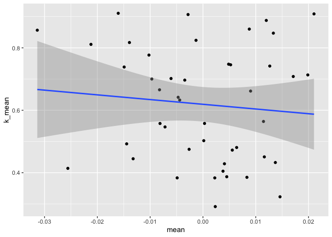
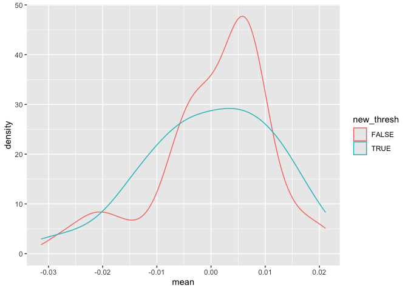

vir2_NRC_effect
================
Eleanor Jackson
02 April, 2026

If the NRC effect is due to species reproductive thresholds not being
great, we might expect a correlation between *k* and NCR effect.

``` r
library("tidyverse")
library("brms")
library("patchwork")
library("tidybayes")
library("modelr")
library("emmeans")
```

``` r
bbinom_interact_abund <-
  readRDS(here::here("output", "models", "pheno-repro-adjust",
                     "full_conn_binom_nseeds_abund.rds"))
```

``` r
size_thresh <-
  read.csv(here::here("data", "clean","size_thresholds_45spp.csv")) %>%
  rename(sp6 = species)
```

``` r
species_list <-
  read.csv(here::here("data", "clean", "species_list.csv"))
```

``` r
draws <- as_draws_df(bbinom_interact_abund)

# extract species random slopes for NRC
sp_re <- 
  draws %>%
  select(.draw, matches("^r_sp4\\[")) %>%
  pivot_longer(
    cols = -.draw,
    names_to = "param",
    values_to = "value"
  ) %>%
  filter(str_detect(param, ",conn_NRC_sc\\]$")) %>%
  mutate(
    sp4 = str_match(param, "^r_sp4\\[(.*?),")[, 2],
    term = str_match(param, ",(conn_NRC_sc)\\]$")[, 2]
  ) %>%
  select(.draw, sp4, term, value) %>%
  pivot_wider(names_from = term, values_from = value)
```

    ## Warning: Dropping 'draws_df' class as required metadata was removed.

``` r
sp_re %>% 
  group_by(sp4) %>%
  summarise(
    mean = mean(conn_NRC_sc),
    sd = sd(conn_NRC_sc),
    q025 = quantile(conn_NRC_sc, 0.025),
    q50  = quantile(conn_NRC_sc, 0.50),
    q975 = quantile(conn_NRC_sc, 0.975),
    p_gt_0 = mean(conn_NRC_sc > 0),
    p_lt_0 = mean(conn_NRC_sc < 0),
    .groups = "drop"
  ) %>% 
  left_join(species_list) %>% 
  left_join(size_thresh) %>% 
  ggplot(aes(x = mean, y = k_mean)) +
  geom_point() +
  geom_smooth(method = "lm")
```

    ## Joining with `by = join_by(sp4)`
    ## Joining with `by = join_by(sp6)`
    ## `geom_smooth()` using formula = 'y ~ x'

    ## Warning: Removed 41 rows containing non-finite outside the scale range
    ## (`stat_smooth()`).

    ## Warning: Removed 41 rows containing missing values or values outside the scale range
    ## (`geom_point()`).

<!-- -->

``` r
sp_re %>% 
  group_by(sp4) %>%
  summarise(
    mean = mean(conn_NRC_sc),
    sd = sd(conn_NRC_sc),
    q025 = quantile(conn_NRC_sc, 0.025),
    q50  = quantile(conn_NRC_sc, 0.50),
    q975 = quantile(conn_NRC_sc, 0.975),
    p_gt_0 = mean(conn_NRC_sc > 0),
    p_lt_0 = mean(conn_NRC_sc < 0),
    .groups = "drop"
  ) %>% 
  left_join(species_list) %>% 
  left_join(size_thresh) %>% 
  mutate(new_thresh = ifelse(is.na(k_mean), FALSE, TRUE)) %>% 
  ggplot(aes(x = mean, colour = new_thresh)) +
  geom_density()
```

    ## Joining with `by = join_by(sp4)`
    ## Joining with `by = join_by(sp6)`

<!-- -->
