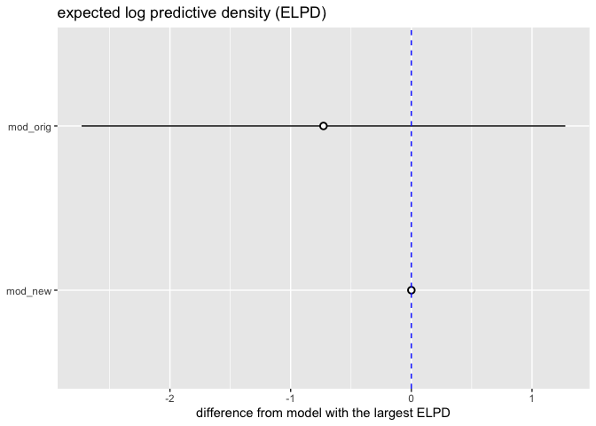
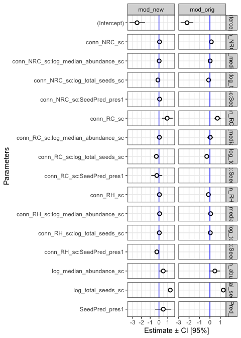
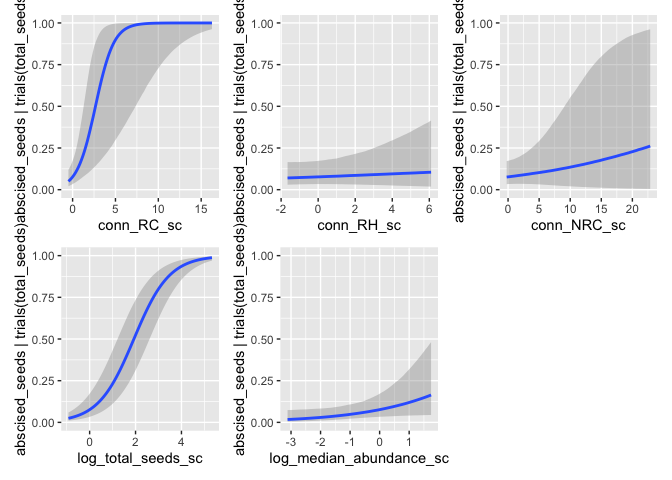
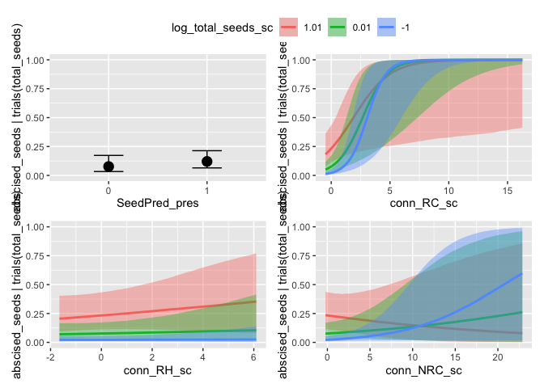
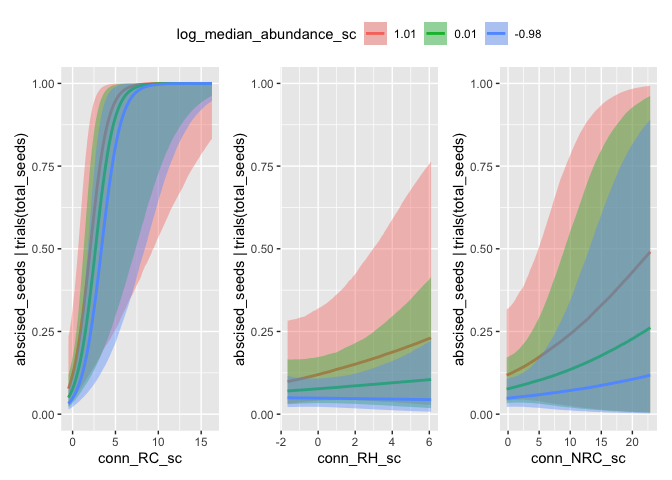
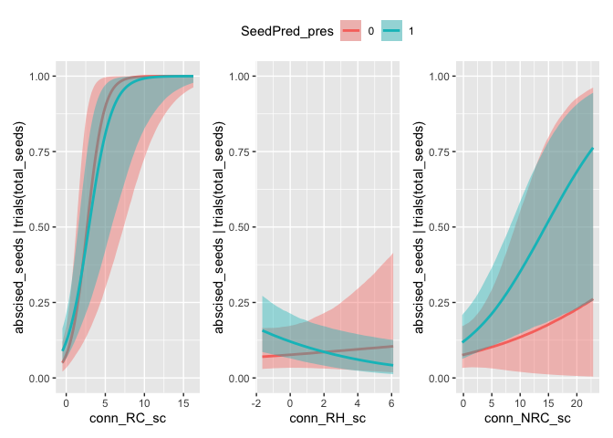
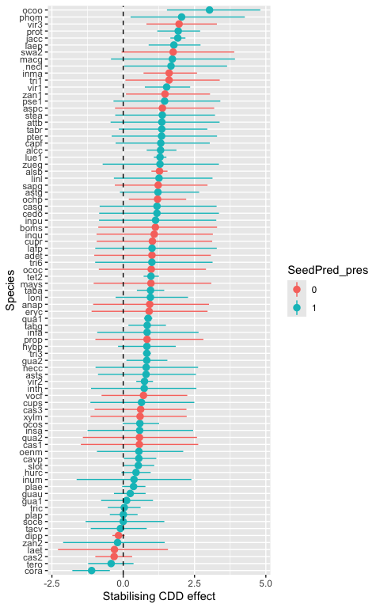

Seed predators model
================
Eleanor Jackson
24 April, 2026

``` r
library("tidyverse")
library("brms")
library("patchwork")
library("broom.mixed")
library("modelr")
```

``` r
mod_orig <-
  readRDS(here::here("output", "models", "pheno-repro-adjust",
                     "full_conn_binom_nseeds_abund_predscomp.rds"))

mod_new <-
  readRDS(here::here("output", "models", "pheno-repro-adjust",
                     "full_conn_binom_nseeds_abund_preds.rds"))
```

## Compare predictive accuracy

``` r
loo(mod_orig)
```

    ## 
    ## Computed from 10000 by 41324 log-likelihood matrix.
    ## 
    ##          Estimate    SE
    ## elpd_loo -37549.2 399.3
    ## p_loo       396.0   8.4
    ## looic     75098.3 798.5
    ## ------
    ## MCSE of elpd_loo is NA.
    ## 
    ## Pareto k diagnostic values:
    ##                          Count Pct.    Min. ESS
    ## (-Inf, 0.7]   (good)     41319 100.0%  627     
    ##    (0.7, 1]   (bad)          5   0.0%  <NA>    
    ##    (1, Inf)   (very bad)     0   0.0%  <NA>    
    ## See help('pareto-k-diagnostic') for details.

``` r
loo(mod_new)
```

    ## 
    ## Computed from 10000 by 41324 log-likelihood matrix.
    ## 
    ##          Estimate    SE
    ## elpd_loo -37548.4 399.3
    ## p_loo       397.6   8.4
    ## looic     75096.8 798.5
    ## ------
    ## MCSE of elpd_loo is NA.
    ## 
    ## Pareto k diagnostic values:
    ##                          Count Pct.    Min. ESS
    ## (-Inf, 0.7]   (good)     41321 100.0%  510     
    ##    (0.7, 1]   (bad)          3   0.0%  <NA>    
    ##    (1, Inf)   (very bad)     0   0.0%  <NA>    
    ## See help('pareto-k-diagnostic') for details.

``` r
comp <- 
  loo_compare(mod_orig,
              mod_new)

print(comp, digits = 3)
```

    ##          elpd_diff se_diff
    ## mod_new   0.000     0.000 
    ## mod_orig -0.728     2.004

``` r
comp %>% 
  data.frame() %>% 
  rownames_to_column(var = "model_name") %>% 
  ggplot(aes(x    = model_name, elpd_diff, 
             y    = elpd_diff, 
             ymin = elpd_diff - se_diff, 
             ymax = elpd_diff + se_diff)) +
  geom_pointrange(shape = 21, fill = "white") +
  coord_flip() +
  geom_hline(yintercept = 0, colour = "blue", linetype = 2) +
  labs(x = NULL, y = "difference from model with the largest ELPD", 
       title = "expected log predictive density (ELPD)") 
```

<!-- -->

``` r
my_coef_tab <-
  tibble(fit = list(mod_orig,
                    mod_new),
         model = c("mod_orig",
                   "mod_new")) %>%
  mutate(tidy = purrr::map(
    fit,
    tidy,
    effects = "fixed",
    robust = TRUE
  )) %>%
  unnest(tidy)
```

    ## Warning: There were 2 warnings in `mutate()`.
    ## The first warning was:
    ## ℹ In argument: `tidy = purrr::map(fit, tidy, effects = "fixed", robust =
    ##   TRUE)`.
    ## Caused by warning in `tidy.brmsfit()`:
    ## ! some parameter names contain underscores: term naming may be unreliable!
    ## ℹ Run `dplyr::last_dplyr_warnings()` to see the 1 remaining warning.

## Compare parameter estimates

``` r
my_coef_tab %>% 
  mutate(term = as.factor(term)) %>% 
  ggplot(aes(x = term, y = estimate, ymin = conf.low, ymax = conf.high)) +
  geom_pointrange(shape = 21, fill = "white") +
  labs(x = "Parameters",
       y = "Estimate ± CI [95%]") +
  geom_hline(yintercept = 0,  color = "blue") +
  coord_flip() +
  theme_bw() +
  facet_grid(term~model, drop=TRUE, scales = "free")
```

<!-- -->

## Conditional effects plots for `mod_new`

``` r
all_plots <- conditional_effects(mod_new,
                    plot = TRUE)
```

    ## Setting all 'trials' variables to 1 by default if not specified otherwise.

``` r
wrap_plots(
  plot(all_plots, plot = FALSE)[[1]],
  plot(all_plots, plot = FALSE)[[2]],
  plot(all_plots, plot = FALSE)[[3]],
  plot(all_plots, plot = FALSE)[[4]],
  plot(all_plots, plot = FALSE)[[5]]
) &
  coord_cartesian(ylim = c(0,1))
```

<!-- -->

``` r
wrap_plots(
  plot(all_plots, plot = FALSE)[[6]],
  plot(all_plots, plot = FALSE)[[7]],
  plot(all_plots, plot = FALSE)[[8]],
  plot(all_plots, plot = FALSE)[[9]]
) +
  plot_layout(guides = "collect") &
  coord_cartesian(ylim = c(0,1)) &
  theme(legend.position = "top")
```

<!-- -->

``` r
wrap_plots(
  plot(all_plots, plot = FALSE)[[10]],
  plot(all_plots, plot = FALSE)[[11]],
  plot(all_plots, plot = FALSE)[[12]]
) +
  plot_layout(guides = "collect") &
  coord_cartesian(ylim = c(0,1)) &
  theme(legend.position = "top")
```

<!-- -->

``` r
wrap_plots(
  plot(all_plots, plot = FALSE)[[13]],
  plot(all_plots, plot = FALSE)[[14]],
  plot(all_plots, plot = FALSE)[[15]]
) +
  plot_layout(guides = "collect") &
  coord_cartesian(ylim = c(0,1)) &
  theme(legend.position = "top")
```

<!-- -->

## Look at stabilising CDD

``` r
# there is one abundance value per species
species_covars <- mod_new$data %>%
  distinct(sp4, log_median_abundance_sc, SeedPred_pres)

draws <- as_draws_df(mod_new)

# extract species random slopes for RC and RH
sp_re <- draws %>%
  select(.draw, matches("^r_sp4\\[")) %>%
  pivot_longer(
    cols = -.draw,
    names_to = "param",
    values_to = "value"
  ) %>%
  filter(str_detect(param, ",conn_RC_sc\\]$|,conn_RH_sc\\]$")) %>%
  mutate(
    sp4  = str_match(param, "^r_sp4\\[(.*?),")[, 2],
    term = str_match(param, ",(conn_RC_sc|conn_RH_sc)\\]$")[, 2]
  ) %>%
  select(.draw, sp4, term, value) %>%
  pivot_wider(names_from = term, values_from = value)
```

    ## Warning: Dropping 'draws_df' class as required metadata was removed.

``` r
# extract the fixed effects for RC and RH
fixef_rc_rh <- draws %>%
  mutate(
    .draw,
    b_RC = .data[["b_conn_RC_sc"]],
    b_RH = .data[["b_conn_RH_sc"]],
    b_RC_seed = .data[["b_conn_RC_sc:log_total_seeds_sc"]],
    b_RH_seed = .data[["b_conn_RH_sc:log_total_seeds_sc"]],
    b_RC_abund = .data[["b_conn_RC_sc:log_median_abundance_sc"]],
    b_RH_abund = .data[["b_conn_RH_sc:log_median_abundance_sc"]],
    b_RC_pred  = .data[["b_conn_RC_sc:SeedPred_pres1"]],
    b_RH_pred  = .data[["b_conn_RH_sc:SeedPred_pres1"]],
    .keep = "none"
  )
```

    ## Warning: Dropping 'draws_df' class as required metadata was removed.

``` r
# fix log total seeds at zero (the mean)
L0 <- 0

species_covars <- species_covars %>%
  mutate(
    SeedPred_num = as.numeric(SeedPred_pres == "1")
  )

# compute the RC-RH contrast per draw
species_rc_rh_draws <- fixef_rc_rh %>%
  left_join(sp_re, by = ".draw") %>%
  left_join(species_covars, by = "sp4") %>%
  mutate(
    rc_rh_contrast =
      (b_RC - b_RH) +
      (b_RC_seed - b_RH_seed) * L0 +
      (b_RC_abund - b_RH_abund) * log_median_abundance_sc +
      (b_RC_pred - b_RH_pred) * SeedPred_num +
      (conn_RC_sc - conn_RH_sc)
  ) %>%
  select(.draw, sp4, log_median_abundance_sc, SeedPred_pres, rc_rh_contrast)

# summarise draws
species_rc_rh_summary <- species_rc_rh_draws %>%
  group_by(sp4, log_median_abundance_sc, SeedPred_pres) %>%
  summarise(
    mean = mean(rc_rh_contrast),
    sd   = sd(rc_rh_contrast),
    q025 = quantile(rc_rh_contrast, 0.025),
    q50  = quantile(rc_rh_contrast, 0.50),
    q975 = quantile(rc_rh_contrast, 0.975),
    p_gt_0 = mean(rc_rh_contrast > 0),
    .groups = "drop"
  )
```

``` r
species_rc_rh_summary %>%
  ggplot(aes(x = reorder(sp4, mean), y = mean, colour = factor(SeedPred_pres))) +
  geom_pointrange(aes(ymin = q025, ymax = q975)) +
  geom_hline(yintercept = 0, linetype = 2) +
  coord_flip() +
  labs(
    x = "Species",
    y = "Stabilising CDD effect",
    colour = "SeedPred_pres"
  )
```

<!-- -->

``` r
seedpred_effect_on_rc_rh <- draws %>%
  transmute(
    .draw,
    seedpred_effect =
      .data[["b_conn_RC_sc:SeedPred_pres1"]] -
      .data[["b_conn_RH_sc:SeedPred_pres1"]]
  )
```

    ## Warning: Dropping 'draws_df' class as required metadata was removed.

``` r
seedpred_effect_on_rc_rh %>%
  summarise(
    mean = mean(seedpred_effect),
    sd   = sd(seedpred_effect),
    q025 = quantile(seedpred_effect, 0.025),
    q50  = quantile(seedpred_effect, 0.50),
    q975 = quantile(seedpred_effect, 0.975),
    p_gt_0 = mean(seedpred_effect > 0),
    p_lt_0 = mean(seedpred_effect < 0)
  )
```

    ## # A tibble: 1 × 7
    ##       mean    sd   q025      q50  q975 p_gt_0 p_lt_0
    ##      <dbl> <dbl>  <dbl>    <dbl> <dbl>  <dbl>  <dbl>
    ## 1 -0.00253 0.365 -0.722 0.000758 0.718  0.501  0.499

No evidence that seed-predator presence systematically modified the
difference between reproductive conspecific and reproductive
heterospecific neighbourhood density effects on seed abscission.
