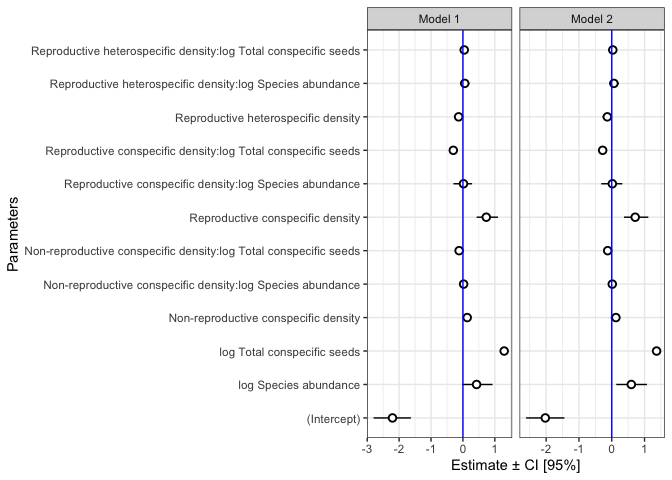

Testing sensitivity to inclusion of ALSB
================
Eleanor Jackson
17 June, 2026

``` r
library("tidyverse")
library("brms")
library("patchwork")
library("broom.mixed")
library("modelr")
```

``` r
mod_orig <-
  readRDS(here::here("output", "models", "pheno-repro-adjust",
                     "full_conn_binom_nseeds_abund.rds"))

mod_new <-
  readRDS(here::here("output", "models", "pheno-repro-adjust",
                     "full_conn_binom_nseeds_abund_no_alsb.rds"))
```

## Compare parameter estimates

``` r
my_coef_tab <-
  tibble(fit = list(mod_orig,
                    mod_new),
         model = c("Model 1",
                   "Model 2")) %>%
  mutate(tidy = purrr::map(
    fit,
    tidy,
    effects = "fixed",
    robust = TRUE
  )) %>%
  unnest(tidy)
```

    ## Warning: There were 2 warnings in `mutate()`.
    ## The first warning was:
    ## ℹ In argument: `tidy = purrr::map(fit, tidy, effects = "fixed", robust =
    ##   TRUE)`.
    ## Caused by warning in `tidy.brmsfit()`:
    ## ! some parameter names contain underscores: term naming may be unreliable!
    ## ℹ Run `dplyr::last_dplyr_warnings()` to see the 1 remaining warning.

``` r
names <-
  c("Intercept",
    "Reproductive conspecific density",
    "Reproductive heterospecific density",
    "Non-reproductive conspecific density",
    "log Total conspecific seeds",
    "log Species abundance")

values <-
  c("(Intercept)",
    "conn_RC_sc",
    "conn_RH_sc",
    "conn_NRC_sc",
    "log_total_seeds_sc",
    "log_median_abundance_sc")

lookup <- setNames(names, values)
```

``` r
my_coef_tab %>% 
  mutate(term = str_replace_all(term, lookup)) %>% 
  mutate(term = as.factor(term)) %>% 
  ggplot(aes(x = term, y = estimate, ymin = conf.low, ymax = conf.high)) +
  geom_pointrange(shape = 21, fill = "white", size = 0.5) +
  labs(x = "Parameters",
       y = "Estimate ± CI [95%]") +
  geom_hline(yintercept = 0,  color = "blue") +
  coord_flip() +
  theme_bw() +
  facet_grid(~model, drop=TRUE, scales = "free") +
  theme(strip.text.y = element_blank())
```

<!-- -->
