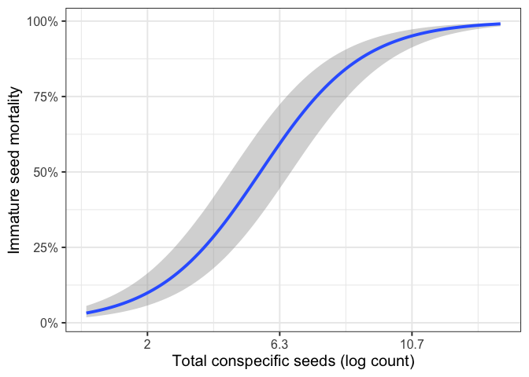

Additional figure
================
Eleanor Jackson
22 June, 2026

``` r
library("tidyverse")
library("brms")
library("bayesplot")
```

``` r
theme_set(
  theme_bw(base_size = 15)
)

mod <-
  readRDS(here::here("output", "models", "pheno-repro-adjust",
                     "full_conn_binom_nseeds_abund.rds"))
```

``` r
# function to return variables to measurement scale
mod_data <-
  readRDS(here::here("data", "clean", "trap_connect_buffer.rds"))

unscale <- function(x, var_name) {
  x * attr(mod_data[[var_name]], "scaled:scale") +
    attr(mod_data[[var_name]], "scaled:center")
}
```

``` r
all_plots <- conditional_effects(mod,
                                 plot = TRUE)
```

    ## Setting all 'trials' variables to 1 by default if not specified otherwise.

``` r
p <- plot(all_plots, plot = FALSE)[[4]]
```

    ## Ignoring unknown labels:
    ## • fill : "NA"
    ## • colour : "NA"
    ## Ignoring unknown labels:
    ## • fill : "NA"
    ## • colour : "NA"
    ## Ignoring unknown labels:
    ## • fill : "NA"
    ## • colour : "NA"
    ## Ignoring unknown labels:
    ## • fill : "NA"
    ## • colour : "NA"
    ## Ignoring unknown labels:
    ## • fill : "NA"
    ## • colour : "NA"

``` r
plot(all_plots, plot = FALSE)[[4]] + 
  ylab("Immature seed mortality") + 
  xlab("Total conspecific seeds (log count)") + 
  scale_y_continuous(labels = scales::label_percent()) +
  scale_x_continuous(
    breaks = c(0, 2, 4), # Scaled points
    labels = round(c(0, 2, 4) * 
                     attr(mod_data$log_total_seeds_sc_mat, "scaled:scale") + 
                     attr(mod_data$log_total_seeds_sc_mat, "scaled:center"), 1) # Unscaled labels
  )
```

    ## Ignoring unknown labels:
    ## • fill : "NA"
    ## • colour : "NA"
    ## Ignoring unknown labels:
    ## • fill : "NA"
    ## • colour : "NA"
    ## Ignoring unknown labels:
    ## • fill : "NA"
    ## • colour : "NA"
    ## Ignoring unknown labels:
    ## • fill : "NA"
    ## • colour : "NA"
    ## Ignoring unknown labels:
    ## • fill : "NA"
    ## • colour : "NA"
    ## Ignoring unknown labels:
    ## • fill : "NA"
    ## • colour : "NA"

<!-- -->
