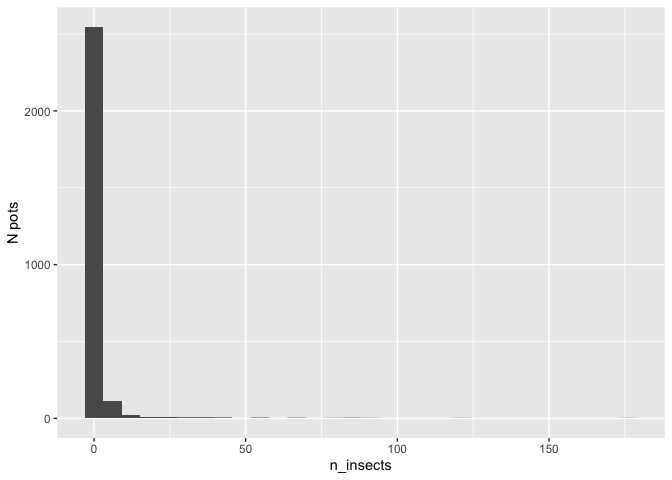

Insect rearing data
================
Eleanor Jackson
22 September, 2026

``` r
library("tidyverse")
library("patchwork")
library("glmmTMB")
```

Reviewers are concerned that the causality between immature seed
mortality and natural enemies is not established.

Sofia: We could perhaps tap into the data collected in the context of
[our food web
study](https://onlinelibrary.wiley.com/doi/abs/10.1111/ele.13359). We
have insect rearing data and fruit/seed dissection data which is
assembled separately for mature and immature fruits. The data sets are
not perfect, but should still allow us to demonstrate that for most
species, immature fruits are *way* more likely to yield insects (or show
signs of insect attack) than mature fruits, which could perhaps help us
in building the case.

1.  Seeds_saved_for_rearing(…).xlsx: Contains a column called
    Nr_units_predated which shows data from dissections (rather
    conservative – sometimes the material was in quite a bad state after
    3 months of rearing, so hard to see evidence of predation). Metadata
    worksheet provides column descriptions.

2.  Insects_final_cleaned(…).xlsx: Each row shows the number of insects
    of a given morphospecies collected from a given pot on a given day
    (and therefore placed in the same vial for storage) – if lots of
    insects there might be multiple vials (and rows in the file) for a
    morphospecies x rearing pot x day combination. The column Quantity
    gives the number of individuals. SeedPot column is the same as
    Pot_ID in the previous file. (You will need to link the two to get
    information on whether seeds/fruits were mature or immature on
    collection.

3.  Seed predator summary(…).xlsx: I can’t remember why I did this
    summary and hope that it does not contain any errors, but it looks
    like some info here might be potentially useful. Worksheet
    IndsPerMorphospPerMaturityStage seems potentially useful, and
    IndsPerMorphosp_seedpreds only has filtered out morphospecies that
    we believe are feeding on seeds (not the fleshy parts of the fruit
    like e.g. most flies and some moth families do). Could possibly
    remove morphospecies that don’t appear in this worksheet from data
    summaries?

With this data, we can ask if more insects are reared from immature than
from mature fruits/seeds. Can also restrict insects to seed predators
and exclude fruit-feeding insects. Our response is: insect emergence
rate from pots containing immature versus mature fruits/seeds
i.e. number of emerged insects divided by number of seeds.

Read in the data:

``` r
data_seed <- readxl::read_xlsx(
  here::here("data", "raw", "insect-data", 
             "Seeds_saved_for_rearing_Cleaned_June2014.xlsx"),
  na = c("", "NA")) |> 
  janitor::clean_names()
```

    ## New names:
    ## • `Month` -> `Month...16`
    ## • `Month` -> `Month...20`

``` r
data_insect <- readxl::read_xlsx(
  here::here("data", "raw", "insect-data", 
             "Insects_final_cleaned_September2015.xlsx"),
  na = c("", "NA")) |> 
  janitor::clean_names()

seed_pred_morphos <- readxl::read_xlsx(
  sheet = 4,
  here::here("data", "raw", "insect-data", 
             "Seed_predator_summary_16July2014.xlsx")) |> 
  janitor::clean_names() |> 
  filter(seed_predator == "Yes")
```

It would be good to estimate the number of seeds within collected
fruits.

``` r
# Joe's fruit dissection data
seed_trait <-
  read_tsv(
    here::here(
      "data",
      "raw",
      "seed-masses",
      "Fruit_Seed_masses_20210111_BanisteriopsisCorrectedToBactrismajor.txt"
    )
  ) %>%
  rename_with(tolower) %>%
  mutate(id = paste(sp4, ind.unique, fruit.unique, sep = "_")) %>%
  select(sp4, id, n_seedfull, n_capsules) %>%
  distinct() %>%
  group_by(sp4) %>%
  summarise(seeds_per_fruit = mean(n_seedfull, na.rm = TRUE)) |> 
  select(sp4, seeds_per_fruit)
```

    ## Rows: 19087 Columns: 26
    ## ── Column specification ────────────────────────────────────────────────────────
    ## Delimiter: "\t"
    ## chr  (7): sp4, lugar, sp6, family, genus, species, lifeform
    ## dbl (19): ind.unique, fruit.unique, date, IND, fruit_frsh, fruit_dry, N_seed...
    ## 
    ## ℹ Use `spec()` to retrieve the full column specification for this data.
    ## ℹ Specify the column types or set `show_col_types = FALSE` to quiet this message.

``` r
glimpse(seed_trait)
```

    ## Rows: 498
    ## Columns: 2
    ## $ sp4             <chr> "ABUD", "ABUR", "ACAG", "ACAH", "ACAT", "ADEP", "ADET"…
    ## $ seeds_per_fruit <dbl> 1.000000, 1.000000, 5.200000, 6.880000, 3.400000, 11.3…

Calculate seeds per pot as `nr_seeds` + (`nr_fruits` \* seeds per
fruit):

``` r
data_seed <- 
  data_seed |> 
  left_join(seed_trait, by = c("codigo" = "sp4")) |> 
  rowwise() |> 
  mutate(equ_seeds = nr_fruits * seeds_per_fruit) |> 
  mutate(n_seeds = sum(equ_seeds, nr_seeds, na.rm = TRUE)) 

data_seed |> 
  filter(is.na(seeds_per_fruit)) |> distinct(codigo) |> glimpse()
```

    ## Rows: 124
    ## Columns: 1
    ## Rowwise: 
    ## $ codigo <chr> "CLUP", "FITO", "HETL", "MAC2", "COMF", "SMIL", "HIRG", "FICI",…

There 124 species out of 483 for which we do not have data on “seeds per
fruit”.

Let’s try just looking at pots with seeds and ignore fruits:

``` r
# join pot data with insect data
insects_by_pot <- 
  data_insect %>%
  filter(!is.na(seed_pot)) %>%
  group_by(seed_pot) %>%
  summarise(
    n_insects = sum(quantity, na.rm = TRUE),
    .groups = "drop"
  )

data_join <-
  data_seed |> 
  left_join(insects_by_pot, by = join_by("pot_id" == "seed_pot")) |> 
  mutate(n_insects = replace_na(n_insects, 0)) |> 
  filter(nr_seeds > 0) # only pots containing seeds

data_join |> 
  ggplot(aes(x = n_insects)) +
  geom_histogram() +
  ylab("N pots")
```

    ## `stat_bin()` using `bins = 30`. Pick better value `binwidth`.

<!-- -->

Most pots had zero insects.

``` r
data_join |> 
  group_by(maturity_type) |> 
  summarise(sum_seeds = sum(nr_seeds, na.rm = TRUE),
            n_insects = sum(n_insects, na.rm = TRUE)) |> 
  mutate(insect_emergence_rate = n_insects/sum_seeds)
```

    ## # A tibble: 2 × 4
    ##   maturity_type sum_seeds n_insects insect_emergence_rate
    ##   <chr>             <dbl>     <dbl>                 <dbl>
    ## 1 inmaduro           3477       136                0.0391
    ## 2 maduro            49940      3185                0.0638

Emergence rate is much higher for immature seeds, this would mean 3
insects emerged per immature seed on average.

Try restricting to only seed predators:

``` r
insects_by_pot_seedpreds <- 
  data_insect %>%
  filter(morphospecies %in% seed_pred_morphos$morphospecies) |> 
  filter(!is.na(seed_pot)) %>%
  group_by(seed_pot) %>%
  summarise(
    n_insects = sum(quantity, na.rm = TRUE),
    .groups = "drop"
  ) 

data_join_seedpreds <-
  data_seed |> 
  left_join(insects_by_pot_seedpreds, by = join_by("pot_id" == "seed_pot")) |> 
  mutate(n_insects = replace_na(n_insects, 0))|> 
  filter(nr_seeds > 0) # only pots containing seeds

data_join_seedpreds |> 
  group_by(maturity_type) |> 
  summarise(sum_seeds = sum(nr_seeds, na.rm = TRUE),
            n_insects = sum(n_insects, na.rm = TRUE)) |> 
  mutate(insect_emergence_rate = n_insects/sum_seeds)
```

    ## # A tibble: 2 × 4
    ##   maturity_type sum_seeds n_insects insect_emergence_rate
    ##   <chr>             <dbl>     <dbl>                 <dbl>
    ## 1 inmaduro           3477        76                0.0219
    ## 2 maduro            49940      1643                0.0329

Emergence rate drops to 1.5 when restricting to likely seed predators.
Emergence rate is about 10.6 times higher in immature material
(1.446/0.136).

Try fitting a model to account for differences in sampling effort and
species (there are many more mature than immature seeds).

``` r
data_fit <- data_join_seedpreds %>%
  mutate(
    maturity_type = factor(maturity_type),
    maturity_type = relevel(maturity_type, ref = "maduro")
  )

m1 <- glmmTMB(
  n_insects ~ maturity_type +
    offset(log(nr_seeds)) +
    (1 | codigo),
  family = nbinom2,
  data = data_fit
)

summary(m1)
```

    ##  Family: nbinom2  ( log )
    ## Formula:          
    ## n_insects ~ maturity_type + offset(log(nr_seeds)) + (1 | codigo)
    ## Data: data_fit
    ## 
    ##       AIC       BIC    logLik -2*log(L)  df.resid 
    ##    1977.5    2001.1    -984.7    1969.5      2721 
    ## 
    ## Random effects:
    ## 
    ## Conditional model:
    ##  Groups Name        Variance Std.Dev.
    ##  codigo (Intercept) 25.46    5.046   
    ## Number of obs: 2725, groups:  codigo, 255
    ## 
    ## Dispersion parameter for nbinom2 family (): 0.507 
    ## 
    ## Conditional model:
    ##                       Estimate Std. Error z value Pr(>|z|)    
    ## (Intercept)            -8.8361     0.8758 -10.089   <2e-16 ***
    ## maturity_typeinmaduro   0.1312     0.4632   0.283    0.777    
    ## ---
    ## Signif. codes:  0 '***' 0.001 '**' 0.01 '*' 0.05 '.' 0.1 ' ' 1

``` r
exp(confint(m1, parm = "maturity_typeinmaduro"))
```

    ##                           2.5 %   97.5 % Estimate
    ## maturity_typeinmaduro 0.4599552 2.826419 1.140187

The estimated insect emergence rate was 1.14 times higher, or about 14%
higher, for immature than mature material… but `p = 0.777` – there is a
fair amount of uncertainty.

This is a much reduced difference between groups than the descriptive
data summary suggested.

``` r
data_seed %>%
  filter(nr_seeds > 0) |> # only pots containing seeds
  group_by(codigo) %>%
  summarise(
    n_maturity = n_distinct(maturity_type),
    immature = any(maturity_type == "inmaduro"),
    mature   = any(maturity_type == "maduro"),
    .groups = "drop"
  ) %>%
  count(n_maturity)
```

    ## # A tibble: 2 × 2
    ##   n_maturity     n
    ##        <int> <int>
    ## 1          1   213
    ## 2          2    43

Few species contain both maturity types. If species and `maturity_type`
are largely confounded, much of the difference between immature and
mature material is probably associated with which plant species occur in
each maturity category, rather than maturity alone.

We could try restricting the analysis to only the species which have
both immature and mature fruits.

``` r
species_both <- 
  data_fit %>%
  group_by(codigo) %>%
  filter(n_distinct(maturity_type) == 2) %>%
  ungroup()
```

``` r
m_both <- glmmTMB(
  n_insects ~ maturity_type +
    offset(log(nr_seeds)) +
    (1 | codigo),
  family = nbinom2,
  data = species_both
)

summary(m_both)
```

    ##  Family: nbinom2  ( log )
    ## Formula:          
    ## n_insects ~ maturity_type + offset(log(nr_seeds)) + (1 | codigo)
    ## Data: species_both
    ## 
    ##       AIC       BIC    logLik -2*log(L)  df.resid 
    ##    1215.4    1236.5    -603.7    1207.4      1433 
    ## 
    ## Random effects:
    ## 
    ## Conditional model:
    ##  Groups Name        Variance Std.Dev.
    ##  codigo (Intercept) 8.901    2.984   
    ## Number of obs: 1437, groups:  codigo, 43
    ## 
    ## Dispersion parameter for nbinom2 family (): 0.623 
    ## 
    ## Conditional model:
    ##                       Estimate Std. Error z value Pr(>|z|)    
    ## (Intercept)           -5.78224    0.63234  -9.144   <2e-16 ***
    ## maturity_typeinmaduro  0.03552    0.43132   0.082    0.934    
    ## ---
    ## Signif. codes:  0 '***' 0.001 '**' 0.01 '*' 0.05 '.' 0.1 ' ' 1

``` r
exp(fixef(m_both)$cond)
```

    ##           (Intercept) maturity_typeinmaduro 
    ##           0.003081808           1.036155825

``` r
exp(confint(m_both, parm = "maturity_typeinmaduro"))
```

    ##                           2.5 %   97.5 % Estimate
    ## maturity_typeinmaduro 0.4449215 2.413052 1.036156

The model estimates only about a 3.6% higher emergence rate per seed in
immature material with a very large confidence interval (56% lower to
141% higher) - so no evidence of a difference in insect emergence rate.

What about seeds which show signs of insect attack/ emergence holes?

The metadata say: “Nr_units_predated Number of units (seeds or fruits)
with clear signs of predation (scored when sample discarded). Unless the
following column says otherwise - all units (seeds or fruits) were
examined.”

But there are 7 cases where the number of seeds predated is larger than
the number of seeds examined (or total number if blank) – I’ll drop
these for now.

``` r
data_seed_attack <- 
  data_seed |> 
  filter(nr_seeds > 0) |> 
  mutate(nr_units_examined_for_predation = 
           coalesce(nr_units_examined_for_predation, nr_seeds)) |> 
  filter(nr_units_predated <= nr_units_examined_for_predation) |> 
  filter(nr_units_examined_for_predation > 0) |> 
  mutate(
    maturity_type = factor(maturity_type),
    maturity_type = relevel(maturity_type, ref = "maduro")
  ) |> 
  drop_na(nr_units_predated)

data_seed_attack |> 
  group_by(maturity_type) |> 
  summarise(n_predated = sum(nr_units_predated, na.rm = TRUE),
            sum_seeds = sum(nr_units_examined_for_predation, na.rm = TRUE)) |> 
  mutate(proportion_predated = (n_predated/sum_seeds)*100)
```

    ## # A tibble: 2 × 4
    ##   maturity_type n_predated sum_seeds proportion_predated
    ##   <fct>              <dbl>     <dbl>               <dbl>
    ## 1 maduro              1906     46429                4.11
    ## 2 inmaduro             104      3335                3.12

``` r
m_attack <- glmmTMB(
    cbind(
        nr_units_predated,
        nr_units_examined_for_predation - nr_units_predated
    ) ~ maturity_type +
        (1 | codigo),
    family = betabinomial(link = "logit"),
    data = data_seed_attack
)
m_attack
```

    ## Formula:          
    ## cbind(nr_units_predated, nr_units_examined_for_predation - nr_units_predated) ~  
    ##     maturity_type + (1 | codigo)
    ## Data: data_seed_attack
    ##       AIC       BIC    logLik -2*log(L)  df.resid 
    ##  3882.826  3906.305 -1937.413  3874.826      2613 
    ## Random-effects (co)variances:
    ## 
    ## Conditional model:
    ##  Groups Name        Std.Dev.
    ##  codigo (Intercept) 1.292   
    ## 
    ## Number of obs: 2617 / Conditional model: codigo, 253
    ## 
    ## Dispersion parameter for betabinomial family (): 3.63 
    ## 
    ## Fixed Effects:
    ## 
    ## Conditional model:
    ##           (Intercept)  maturity_typeinmaduro  
    ##               -3.5146                -0.3114

``` r
exp(confint(m_attack, parm = "maturity_typeinmaduro"))
```

    ##                           2.5 %   97.5 %  Estimate
    ## maturity_typeinmaduro 0.4294628 1.248995 0.7323912

The model estimates that the odds of a seed showing signs of predation
in immature material are about 27% lower than in mature material – the
opposite of what we would expect – but a large confidence interval.
